**往返缓存 (Back/forward cache, BFCache)** 是浏览器为了极致优化用户在“后退”和“前进”操作时的体验而设计的一种**内存缓存机制**。当用户导航离开一个页面时，浏览器可以将该页面的完整状态——包括其 DOM 树、JavaScript 堆内存以及所有资源——冻结为一个“快照”并保存在内存中。当用户通过后退/前进按钮返回该页面时，浏览器可以直接从内存中恢复这个快照，而不是重新发起网络请求加载页面，从而实现**近乎瞬时**的页面加载，极大地提升了用户体验。

# BFCache 的工作原理与生命周期

BFCache 的核心在于它改变了传统页面的生命周期。一个页面不再仅仅是“加载中”和“已卸载”，而是增加了一种“**已缓存（Frozen）**”的中间状态，此时内存快照保持完整，但 JS 执行被挂起。

`abc`

一个兼容 BFCache 的页面，其生命周期可以被可视化为：

```mermaid
stateDiagram-v2
    direction TB
    
    [*] --> Loading: 页面初次加载
    Loading --> Live: load 事件触发
    
    Live --> BFCached: 用户导航离开(pagehide, persisted=true)
    note right of BFCached
        <b>页面被“冻结”在内存中</b>
        - JavaScript 执行暂停
        - 定时器等任务被挂起
    end note
    
    BFCached --> Live: 用户后退/前进返回(pageshow, persisted=true)
    
    Live --> Unloaded: 用户关闭标签页或无法缓存
    BFCached --> Unloaded: 用户关闭标签页或缓存被逐出
    Unloaded --> [*]
```



> [!important] 无 `load` 事件
> 由于页面是从内存快照中直接恢复，而不是重新加载，因此当页面从 BFCache 中恢复时，**不会**再次触发 `window` 的 `load` 事件，也不会重新执行 `<script src="...">` 的同步脚本。任何依赖于 `load` 事件执行的初始化逻辑，在 BFCache 恢复时都将不会运行。

# 检测与响应 BFCache

为了让开发者能够应对 BFCache 带来的新生命周期，W3C 规范定义了 `pageshow` 和 `pagehide` 这两个新的页面生命周期事件。

## `pageshow` 事件

- **触发时机**: 此事件在页面的每一次加载时都会触发。它在 `load` 事件**之后**触发。
- **核心属性 `event.persisted`**: 这是判断页面是否从 BFCache 中恢复的关键。
    - `event.persisted === true`: 表示页面是从 BFCache 中恢复的。此时，页面上的所有内容都保持在用户离开时的状态。
    - `event.persisted === false`: 表示这是一次常规的、全新的页面加载。

```js
window.addEventListener('pageshow', (event) => {
  if (event.persisted) {
    console.log('此页面从 BFCache 中恢复。');
    // 在这里可以执行需要每次页面可见时都更新的逻辑
    // 例如：重新获取用户的登录状态、刷新实时数据等
  } else {
    console.log('此页面为初次加载。');
  }
});
```

## `pagehide` 事件

- **触发时机**: 当用户导航离开当前页面时触发，它在 `unload` 事件**之前**触发。
- **核心属性 `event.persisted`**: 在这个事件中，`persisted` 属性则是一种“提示”。
    - `event.persisted === true`: 浏览器**尝试**将此页面放入 BFCache。这并不意味着最终一定会成功，因为其他因素可能会阻止缓存。
    - `event.persisted === false`: 浏览器确定此页面**不会**被放入 BFCache，它将被正常卸载。

> [!caution] `unload` 事件处理器 (BFCache 的头号杀手)
> - **行为**: **只要页面注册了 `unload` 事件的监听器 (`window.onunload` 或 `window.addEventListener('unload', ...)`), 浏览器就会认为该页面在离开时需要执行“销毁”逻辑，从而自动将其排除在 BFCache 之外。**
> - **历史原因**: `unload` 是一个设计上存在缺陷且不可靠的事件。早期的网页假定用户离开时页面会被彻底销毁，因此开发者在此事件中进行资源释放等操作。为了兼容这种破坏性行为，浏览器选择在存在 `unload` 监听器时直接禁用 BFCache。
> - **最佳实践**: **永远不要使用 `unload` 事件。** 所有需要在页面离开时执行的逻辑，都应该迁移到 BFCache 兼容的 `pagehide` 事件中。

