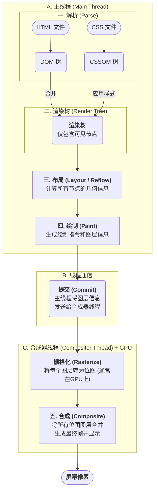
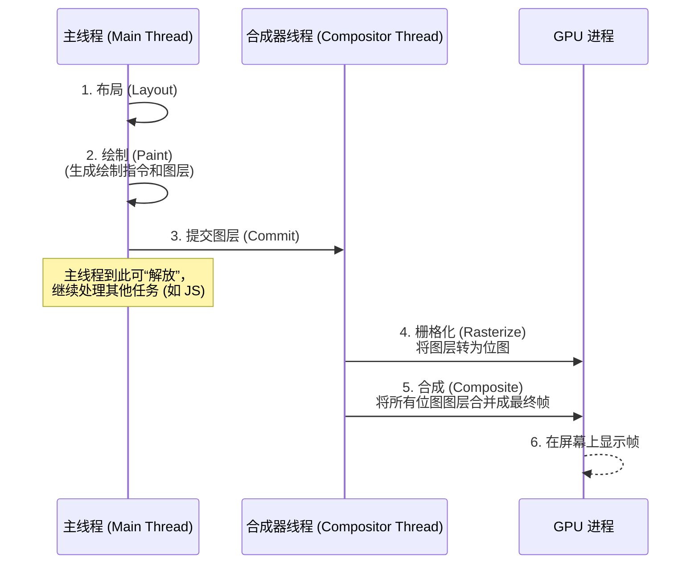

浏览器将我们编写的 HTML、CSS 和 JavaScript 代码转换为用户屏幕上可交互的、可视化的像素，这个过程遵循着一套定义明确、高度优化的流水线，通常被称为**渲染管线 (Rendering Pipeline)**。这套流程在浏览器内核（以 C++ 为主实现）中被精细编排，确保每一帧都能高效、稳定地送达屏幕。

# 渲染管线的核心阶段概览

整个过程可以被清晰地分解为几个连续的核心阶段，每个阶段都以上一阶段的输出作为输入。

# 阶段详解

## 阶段一：解析 (Parse) — 构建内容与样式树

- **DOM (Document Object Model) 构建**: 浏览器首先解析接收到的 HTML 文档，将其中的标签、属性和文本转换为一个树状结构。每个 HTML 标签都对应树中的一个节点。这个树就是 DOM。
- **CSSOM (CSS Object Model) 构建**: 与此同时，浏览器会解析所有 CSS 资源（包括外部 CSS 文件、`<style>` 标签内的样式和内联样式），构建出另一个树状结构——CSSOM。它包含了所有 DOM 节点最终计算得出的样式信息。CSS 的解析会**阻塞渲染**，在 CSSOM 构建完成前，浏览器不会进入后续阶段。

> [!attention] 并行与阻塞渲染
> DOM 和 CSSOM 的构建过程在很大程度上是**并行**的。但需要注意的是，如果 HTML 解析器遇到一个同步的 `<script>` 标签，它会暂停 DOM 构建，等待脚本执行完毕。而脚本的执行可能又依赖于 CSSOM，因此 CSS 的加载和解析有时会间接阻塞 DOM 的构建。

## 阶段二：渲染树构建 (Render Tree Construction) — 确定要绘制的节点

在此阶段，浏览器将 DOM 树与 CSSOM 树合并，以创建一个仅包含**可见内容**的**渲染树 (Render Tree)**。每个节点叫做 **RenderObject**。

- **合并规则**: 遍历 DOM 树的每个可见节点，并为其找到匹配的 CSSOM 规则并应用。
- **排除规则**: 渲染树不包含所有 DOM 节点，以下节点会被排除：
    - **非视觉元素**: 如 `<head>`, `<script>`, `<meta>`, `<link>` 等。
    - **被 CSS 隐藏的元素**: 设置了 `display: none;` 的元素。这些元素及其所有后代都会从渲染树中移除。
    - **关键细节**: 设置了 `visibility: hidden;` 的元素**会**被包含在渲染树中。虽然它们不可见 (在后续的绘制阶段被跳过)，但它们仍然占据着布局空间，因此需要被包含在布局计算中。

## 阶段三：布局 (Layout / Reflow) — 计算节点的几何信息

渲染树构建完成后，虽然知道了要渲染哪些节点以及它们的样式，但还不知道它们在页面上的确切位置和尺寸。布局阶段就是为了计算这些几何信息。

- **过程**: 浏览器从渲染树的根节点开始遍历，计算每个节点在视口（viewport）内的**几何信息**——包括它的确切位置（x, y 坐标）和尺寸（宽度、高度）。这个过程的输出是一个包含了所有节点几何信息的“盒模型 (Box Model)”。
- **重排 (Reflow)**: 任何可能影响元素几何信息的变动（如改变 `width`, `height`, `margin`，或 DOM 结构的增删），都会触发一次**重排**。重排具有“牵一发而动全身”的特性：对某一个元素进行重排时，浏览器可能需要同步重新计算其父元素及其所有子元素的布局，最终导致整个渲染树中大量节点的几何信息被重新确定，因此是开销非常大的渲染操作，应尽量避免。

> [!warning] Layout Thrashing（布局抖动）
> 当 JavaScript 在短时间内**交替读取**（如 `offsetHeight`、`getBoundingClientRect()`）和**写入**（修改样式或 DOM）**几何相关属性**时，会迫使浏览器在**同一帧内多次强制同步重排**，造成“读-写-读-写”的恶性循环，显著拖慢性能。
> 
> 最简洁的解决方案：把**所有读取**先收集到一个 `requestAnimationFrame` 回调里统一执行，再把**所有写入**收集到同一个或下一个 `requestAnimationFrame` 回调里统一执行，利用浏览器的帧同步机制实现**批量读、批量写**，即可天然避免 Layout Thrashing。

## 阶段四与五：绘制与合成 (Paint & Composite) — 将节点转换为像素

布局阶段之后，浏览器最终开始将节点绘制到屏幕上。这个过程在现代浏览器中通常被细分为“绘制”和“合成”两个步骤，以实现更高的性能。

- **绘制 (Paint / Repaint)**：主线程在完成布局后，会为布局树中的每个节点生成一系列的**绘制指令 (Paint Records)**，并确定哪些部分可以被提升为独立的**合成层 (Compositor Layer)**。例如，拥有 `transform`, `opacity`, `will-change` 等 CSS 属性的元素，或 `<video>`, `<canvas>` 元素通常会拥有自己的图层。
- **提交 (Commit)**: 主线程将这些图层信息和绘制指令“提交”给一个独立的**合成器线程 (Compositor Thread)**。
- **栅格化 (Rasterize)** 与 **合成 (Composite)**: 合成器线程接管这些信息，它会将每个图层转化为位图（这个过程称为栅格化，通常会利用 GPU 加速），然后像处理 Photoshop 图层一样，将它们正确地合并、叠加在一起，最终在屏幕上呈现出我们看到的完整页面。

> [!tip] 性能优化的关键
> 由于合成操作在一个独立的线程中进行，它可以不被主线程的 JavaScript 或其他布局、绘制任务阻塞。这就是为什么只改变 `transform` 或 `opacity`（仅触发合成）的动画，远比改变 `width` 或 `left`（会触发**一整套渲染管线**）的动画要流畅得多的根本原因。

