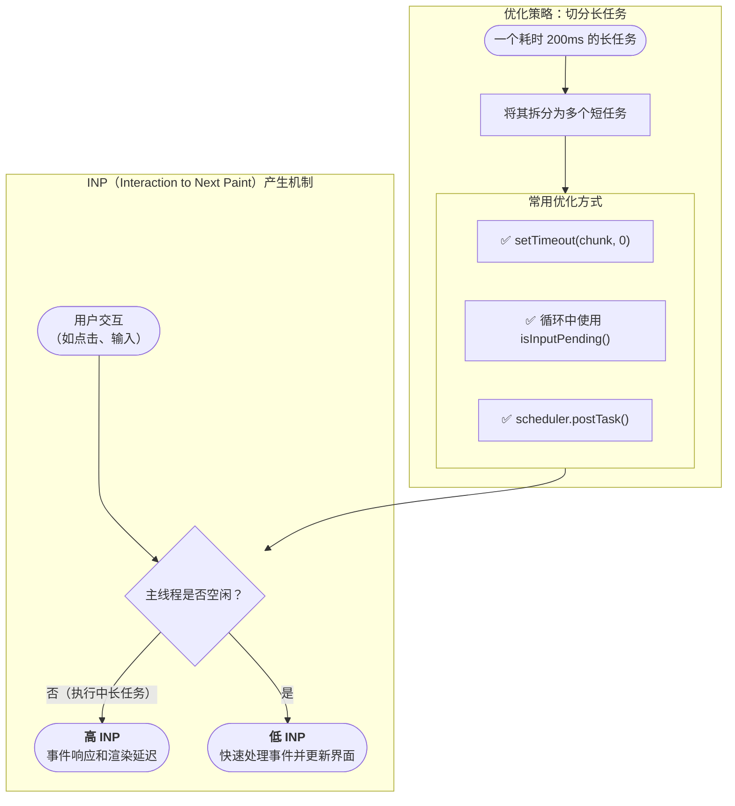

在现代 Web 性能优化的版图中，`LCP` 与 `FCP` 解决了“加载快不快”的问题，而 **CLS (Cumulative Layout Shift)** 与 **INP (Interaction to Next Paint)** 则回答了“用起来流不流畅”这一更深层次的用户体验问题。CLS 衡量页面的**视觉稳定性**，确保用户不会因内容意外跳动而感到困扰；INP 则衡量页面的**交互响应性**，确保用户的每一次点击或输入都能得到及时的视觉反馈。

# 优化 CLS (Cumulative Layout Shift) — 追求视觉稳定性

CLS 的优化核心思想极其明确：**在内容实际渲染前，为其在布局中预留出确切的空间**，防止后续加载的内容“推开”现有内容。

## 策略一：为动态加载内容预留空间

- **问题场景**: 广告位、第三方嵌入内容 (如 YouTube 视频)、或由 JavaScript 动态渲染的组件（如评论区），它们在加载完成前不占用空间，一旦加载完成就会突然出现，造成下方内容整体位移。
- **优化方案**:
    1. **使用占位符 (Placeholder)**: 在内容即将出现的位置，预先放置一个样式与最终内容尺寸相仿的骨架屏或占位符。
    2. **设置最小尺寸**: 通过 CSS 的 `min-height` 或 `min-width` 为容器预留出足够的空间，确保即使内容后到，容器也不会坍缩。

## 策略二：对叠加层与动画的审慎处理

- **问题场景**: 页面顶部突然弹出的 Cookie 通知、促销横幅等，如果没有正确处理，会将整个页面的内容向下推移，产生严重的布局偏移。
- **优化方案**:
    1. **脱离文档流**: 使用 `position: fixed` 或 `position: absolute` 将这类叠加层 UI 脱离正常的文档流。这样它的出现和消失，就如同一个浮层，完全不会影响下方静态内容的布局。
    2. **使用 `transform` 进行动画**: 如果需要对元素进行位移动画，应**优先使用 CSS 的 `transform` 属性** (`translate`, `scale` 等)，而不是改变 `top`、`left`、`margin` 等会触发布局计算的属性。`transform` 动画通常由合成层处理，不会引起重排 (reflow)，因此不会影响 CLS。

## 策略三：为媒体资源（图片、视频）指定尺寸

这是**最常见也最重要**的 CLS 优化点。浏览器在渲染 `` 或 `<video>` 标签时，如果不知道其尺寸，就不会为其预留空间。

**优化方案**：

1. **明确设置 `width` 和 `height` 属性**: 为所有媒体元素提供明确的宽高属性，让浏览器可以在图片下载完成前就计算出其在布局中应占的空间。

```html

```

2. **使用 CSS `aspect-ratio` (现代推荐)**: 这个 CSS 属性允许你在只知道宽度（例如 `width: 100%`）的情况下，让浏览器自动计算出正确的高度来预留空间，完美适配响应式设计。

```css
.responsive-image {
  width: 100%;
  aspect-ratio: 16 / 9; /* 定义宽高比 */
}
```

# 优化 INP (Interaction to Next Paint) — 保证交互响应性

优化 INP 的核心原则只有一个：**保持主线程的响应能力，通过“让出 (Yielding)”来避免长时间任务的阻塞**。当用户交互时，如果主线程正忙于执行一个耗时很长的 JavaScript 任务，它就无法及时处理用户的输入并进行下一帧的绘制，从而导致高 INP。



## 策略一：`setTimeout(fn, 0)` (经典方法)

这是最传统的“让出”方法。通过 `setTimeout` 将一个长任务分割成多个小任务块 (chunk)，每执行完一个块，就将下一个块的执行安排到**下一个宏任务**中，从而在任务块之间给予浏览器处理用户输入和渲染的机会。

```js
function processLongTask(tasks) {
  if (tasks.length > 0) {
    const task = tasks.shift();
    process(task); // 执行一小块任务
    setTimeout(() => processLongTask(tasks), 0);
  }
}
```

## 策略二：`isInputPending()` (协作式调度)

这是一个更智能的方法，适用于难以分割的长循环。它允许你在代码中**主动检查**是否有待处理的用户输入。

```js
async function processArray(array) {
  while (array.length > 0) {
    // 如果检测到用户输入正在等待，就主动让出主线程
    if (navigator.scheduling.isInputPending()) {
      await new Promise(resolve => setTimeout(resolve, 0));
    }
    const item = array.shift();
    process(item);
  }
}
```

## 策略三：`scheduler.postTask()` (现代终极方案)

这是 Web 标准中最新的 **Scheduler API**，它提供了最精细的任务调度能力。可以将任务以后台、用户可见或用户阻塞等不同优先级进行调度，让浏览器智能地在主线程空闲时执行非紧急任务。

```js
// 将一个非紧急的分析任务以“后台”优先级调度，确保不影响用户交互
if ('scheduler' in window) {
    scheduler.postTask(() => {
      sendAnalyticsData();
    }, { priority: 'background' });
} else {
    setTimeout(sendAnalyticsData, 0); // 作为回退
}
```