Web Vitals 是由 Google 发起的一项旨在量化并改善网页用户体验的计划。其核心是 **Core Web Vitals (核心 Web 指标)**，这是一套聚焦于用户真实感受的性能指标，涵盖了页面的**加载速度**、**交互响应性**和**视觉稳定性**。这些指标不仅是衡量网站性能的黄金标准，也直接影响着用户留存和搜索引擎排名。

# Core Web Vitals (CWV)：衡量用户体验的三大支柱

## Largest Contentful Paint (LCP)：加载性能

- **核心目标**: 回答用户问题：“这个页面加载速度快吗？”
- **精确定义**: LCP 测量的是从用户请求页面开始，到视口（viewport）内**最大的可见内容元素**（通常是图片、视频或大块的文本）被渲染（绘制完成）到屏幕上所需的时间。LCP 是一个动态指标，随着页面加载，如果一个更大的元素出现，LCP 的值就会被更新，直到用户开始与页面交互。
- **性能阈值**:
  - **良好 (Good)**: ≤ 2.5 秒
  - **需要改进 (Needs Improvement)**: > 2.5 秒且 ≤ 4.0 秒
  - **差 (Poor)**: > 4.0 秒

## Cumulative Layout Shift (CLS)：视觉稳定性

- **核心目标**: 回答用户问题：“这个页面用起来稳定吗，会不会有元素突然跳动？”
- **精确定义**: CLS 衡量的是页面在整个生命周期内所有**意外布局偏移**的累加得分。单次偏移的得分由两个因素决定：发生位移的元素在视口中的面积（**影响分数**）以及这些元素移动的距离（**距离分数**）。 `布局偏移得分 = 影响分数 × 距离分数`
- **性能阈值**:
  - **良好 (Good)**: ≤ 0.1
  - **需要改进 (Needs Improvement)**: > 0.1 且 ≤ 0.25
  - **差 (Poor)**: > 0.25

> [!info] 影响分数与距离分数
>
> - **影响分数 (Impact Fraction)**: `max(元素在前后两帧中可见区域的并集面积 / 视口总面积)`。这个分数衡量了不稳定元素在视口中占据的可见区域的比例。
> - **距离分数 (Distance Fraction)**: `元素在水平或垂直方向上移动的最大距离 / 视口的最大维度 (宽度或高度)`。这个分数衡量了不稳定元素移动的距离。

## Interaction to Next Paint (INP)：交互响应性

- **核心目标**: 回答用户问题：“我对页面的操作（点击、输入等）能得到及时的反馈吗？”
- **精确定义**: INP 测量的是从用户发起交互（如点击、点按或按键）到**下一帧被绘制到屏幕上**所经过的时间。它会观察页面生命周期内的所有交互，并报告**延迟最长**的那一次（或接近最差的值），以此代表页面的整体响应能力。INP 取代了之前的 FID 指标，因为它能更全面地反映从输入到视觉反馈的完整过程。
- **性能阈值**:
  - **良好 (Good)**: ≤ 200 毫秒
  - **需要改进 (Needs Improvement)**: > 200 毫秒且 ≤ 500 毫秒
  - **差 (Poor)**: > 500 毫秒

# 关键诊断指标：问题的根源定位

这些指标虽然不是 CWV，但对于诊断 CWV 问题至关重要。

## Time to First Byte (TTFB) - 首字节时间

- **定义**: 从浏览器发起页面请求到接收到服务器响应的**第一个字节**之间的时间。
- **诊断价值**: TTFB 是所有后续加载指标的起点，它纯粹反映了服务器响应速度和网络延迟。过高的 TTFB 会直接导致 FCP 和 LCP 指标恶化。

## First Contentful Paint (FCP) - 首次内容绘制

- **定义**: 浏览器首次将**任何**内容（文本、图片、SVG、非白色 `<canvas>`）**开始**绘制到屏幕上的时间点。
- **诊断价值**: FCP 是用户感知到页面“活了”的第一个信号。**FCP 与 LCP 之间的时间差**是一个关键的诊断区间，如果这个差距过大，通常意味着主要内容资源（如主图、大段文本）的加载被延迟或阻塞了。

## First Input Delay (FID) - 首次输入延迟

- **定义**: 已被 INP 取代的旧指标。它衡量从用户首次与页面交互到浏览器**能够开始处理**该事件之间的时间。
- **诊断价值**: FID 只测量了主线程的“繁忙延迟”，而 INP 覆盖了从输入到最终视觉呈现的完整链路，更能反映用户的真实感受。

# 指标生命周期与相互关系

所有这些指标并非孤立存在，而是在页面加载的时间线中相互关联、依次发生。

```mermaid
gantt
    title 页面加载与性能指标时间线
    dateFormat x
    axisFormat %L ms

    section 服务器与网络阶段
    请求发出 (request start)       : 0, 20
    等待响应 (TTFB)                : 20, 150
    内容下载 (content download)   : 150, 200

    section 浏览器解析与渲染
    HTML解析与首次绘制 (FCP)      : 200, 230
    最大内容渲染 (LCP)            : 230, 260
    页面完全加载 (load 事件)      : 260, 300

    section 用户交互与性能
    用户点击（示例）             : 320, 320
    事件处理与渲染 (INP 测量)     : 320, 380
```

1. **TTFB** 是最早的指标，是后续所有渲染性能的基础。
2. **FCP** 紧随其后，标志着页面开始呈现内容。
3. **LCP** 通常在 FCP 之后（在简单页面上可能同时发生），标志着页面的核心内容对用户可见。
4. **INP** 则是在页面加载后，对真实用户交互响应性的持续测量。
