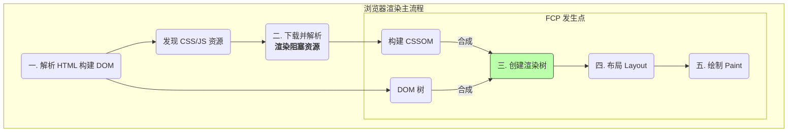

FCP (First Contentful Paint) 是一项以用户为中心的性能指标，它测量的是从用户请求页面到浏览器首次将**任何** DOM 内容（包括文本、图片、SVG 或非白色 `<canvas>`）**开始**绘制到屏幕上所需的时间。FCP 是用户感知页面“正在加载”的第一个明确信号，一个快速的 FCP 能有效降低跳出率。

# 理解 FCP 的瓶颈：关键渲染路径 (CRP)

关键渲染路径是指浏览器将 HTML、CSS 和 JavaScript 转换为屏幕上像素所必须经历的一系列步骤。只有当所有**渲染阻塞资源 (Render-Blocking Resources)** 被下载、解析和处理完毕后，FCP 才会发生。

这个流程可以被可视化为：



从上图可见，优化 FCP 的本质就是**尽可能地缩短、简化和优化步骤二和构建 CSSOM 的耗时**，让浏览器能尽快地到达步骤五。所有优化策略都围绕此目标展开。

# 核心优化策略详解

## 策略一：缩短并优化关键渲染路径

此策略的核心是**减少关键资源的数量、大小和请求深度**。

1. **消除串行请求链**: 渲染阻塞资源之间的串行依赖是性能杀手。一个典型的反面模式是在 CSS 文件中使用 `@import`

> [!example] 一个例子
> ```css
> /* anti-pattern.css */
> @import url('other.css'); /* 浏览器必须等待此文件下载解析后，才能发现并下载 other.css */
> ```
> **解决方案**: 使用现代前端构建工具（如 Vite, Webpack）将所有初始渲染必需的 CSS 和 JavaScript **打包 (bundle)** 成一个或少数几个文件，并将多个串行请求转变为单个或并行的请求。

2. **压缩与精简资源**: 对 CSS、JavaScript 和 HTML 文件进行**压缩 (Minify)**，移除所有不必要的字符。启用服务器的 **Gzip** 或 **Brotli** 压缩，大幅减小网络传输体积。

## 策略二：优先加载关键资源

此策略确保那些对首次绘制至关重要的资源，能够被浏览器尽早发现并以高优先级下载。

- **问题背景**: 某些深埋在 CSS 或 JS 文件中的关键资源（例如主视觉图、品牌字体），浏览器需要等到解析到相关代码时才能发现它们，这会造成延迟。
- **解决方案**: 使用 `<link rel="preload">`。它向浏览器提供了一个强大的声明性提示，强制浏览器立即以高优先级开始下载指定资源，而无需等待其被自然发现。

```html
<link rel="preload" href="/images/hero-image.webp" as="image">
<link rel="preload" href="/fonts/myfont.woff2" as="font" type="font/woff2" crossorigin>
```

> [!important] `crossorigin`
> 根据规范，对于字体和 fetch 请求的预加载，即使它们与主文档同源，也必须加上 `crossorigin` 属性，以匹配它们最终被使用时的 CORS 策略。

## 策略三：推迟与懒加载非关键资源

此策略的目的是将所有对于**首次内容绘制非必需**的资源移出关键渲染路径。

1. **推迟执行 JavaScript (`defer`)**: 这是优化 FCP 最有效的手段之一。为 `<script>` 标签添加 `defer` 属性，会使其**异步下载**（不阻塞 HTML 解析），并将其**执行**推迟到整个文档解析完毕之后。

```html
<script src="analytics.js" defer></script>
```
  
2. **懒加载 (Lazy Loading)**: 仅当资源（通常是图片或 `iframe`）即将进入用户的视口时，才开始加载它。
   
	- **与 `defer` 的区别**: `defer` 推迟的是**执行**，而懒加载更进一步，它推迟的是**下载和执行**。
	- **现代实现**: 对于图片和 `iframe`，可以直接使用浏览器原生的 `loading="lazy"` 属性，这是最简单高效的方式。对于其他资源，可以使用 `Intersection Observer` API 来实现自定义的懒加载逻辑。

```html

```

