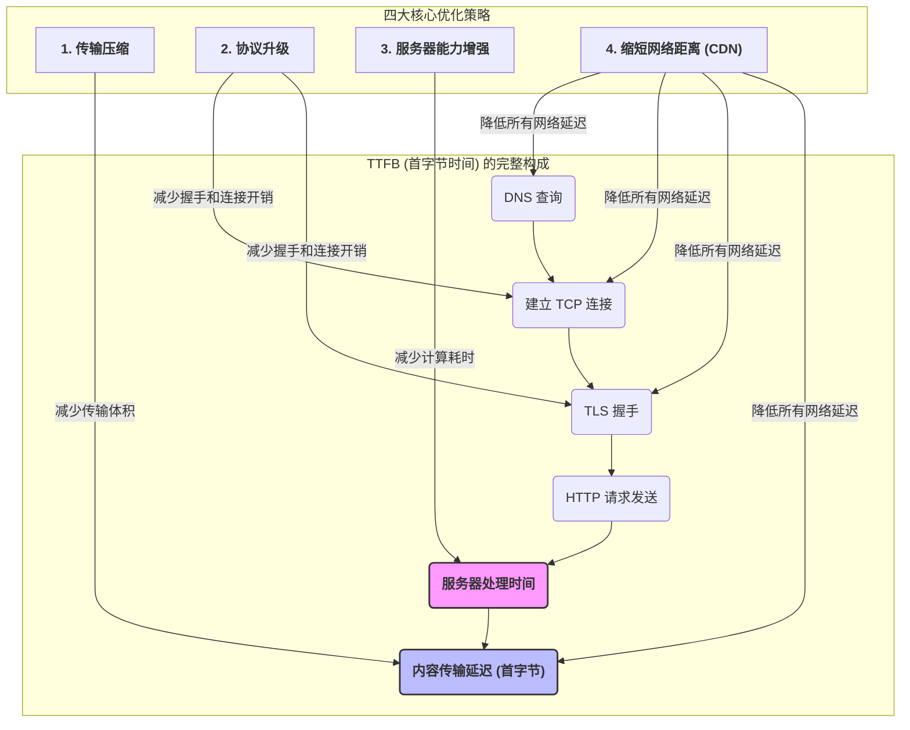
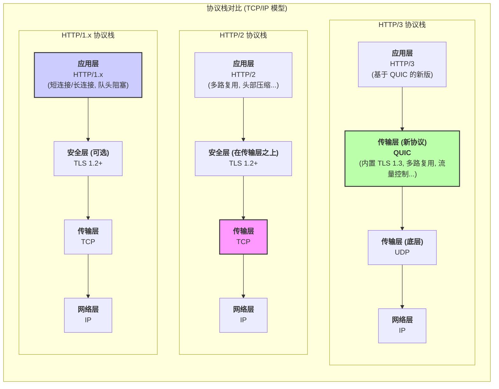

TTFB (Time To First Byte) 是衡量 Web 服务器响应能力和网络延迟的核心指标，也是所有后续页面加载性能指标（如 FCP, LCP）的基石。它精确记录了从浏览器发起页面请求到接收到服务器响应的**第一个字节**所花费的全部时间。一个过高的 TTFB 意味着用户需要更长的“白屏”等待时间。因此，优化 TTFB 是提升网站性能和用户体验的第一道，也是最关键的一道关卡。

# TTFB 的构成与优化概览

要优化 TTFB，首先必须理解其时间的构成。TTFB 的总时长主要由**网络往返延迟 (Round-Trip Time, RTT)** 和**服务器处理时间 (Server Processing Time)** 两大部分组成。如下图所示，我们可以将其进一步分解，并看到各项优化策略的精确作用点。

# 四大核心优化策略详解

## 策略一：传输压缩 (Transfer Compression)

这是最直接、性价比最高的优化手段之一，其核心是减小需要通过网络传输的数据体积。

- **机制**: 服务器在发送 HTML、CSS、JavaScript 等文本类资源前，使用 **Gzip** 或 **Brotli**（由 Google推出，通常比 Gzip 有更高的压缩率）算法对其进行动态压缩。浏览器接收到数据后再进行解压。
- **作用**: 直接、显著地降低**内容传输延迟**。对于现代 CPU 而言，解压缩的开销远小于在网络中长距离传输大量数据的开销。

## 策略二：协议升级 (Protocol Upgrades)

采用更现代的网络协议可以从根本上减少连接建立的耗时和开销。

- **HTTP/1.1 vs HTTP/2**: HTTP/1.1 存在“队头阻塞”问题。HTTP/2 通过**多路复用 (Multiplexing)** 机制，允许在**一个 TCP 连接**上同时并行处理多个请求-响应流，大幅提升了传输效率。
- **HTTP/2 vs HTTP/3**: HTTP/2 虽解决了应用层的队头阻塞，但其本身基于的 TCP 协议依然存在传输层的队头阻塞。HTTP/3 则更进一步，它基于 **UDP** 协议和其上的 **QUIC** 协议。QUIC 将加密（TLS 1.3）和传输控制整合在一起，不仅解决了 TCP 队头阻塞问题，还能实现更快的连接建立（0-RTT 或 1-RTT），进一步降低了连接和握手延迟。

> [!note] 队头阻塞
> - **应用层队头阻塞**：在 **HTTP/1. X** 的单个 TCP 连接中，如果前一个请求或响应未完成，会阻塞后续所有请求和响应的发送或接收，降低传输效率。
> - **传输层队头阻塞 **： **TCP 协议**为保证可靠性进行**乱序重排**时，若有数据包丢失或延迟，即使后续数据包已抵达，也必须等待丢失包重传并按序抵达后才能向上层应用交付，导致数据阻塞。

## 策略三：服务器能力增强 (Enhancing Server Capacity)

此策略直接针对**服务器处理时间**进行优化。如果服务器本身处理请求的速度很慢，那么无论网络多快，TTFB 都会很高。

- **硬件层面**: 升级服务器的 CPU、增加内存 (RAM)、使用更快的 SSD 硬盘。
- **软件与架构层面**:
    - **代码优化**: 优化后端应用程序逻辑，减少不必要的计算和阻塞操作。
    - **数据库优化**: 为数据库查询建立高效索引；优化慢查询。
    - **缓存策略**: 引入 Redis、Memcached 等内存缓存系统，对高频访问的数据或数据库查询结果进行缓存，避免重复的密集计算和 I/O 操作。

## 策略四 ：缩短物理与网络距离 (CDN & Proximity)

网络延迟（Latency）与物理距离正相关。缩短用户与服务器之间的距离是降低 TTFB 的关键。**CDN (Content Delivery Network)** 是解决此问题的最佳方案。

**对动态 HTML 文档 TTFB 的优化原理**:

1. **缩短连接建立时间**: 用户的请求首先到达离他物理位置最近的 CDN 边缘节点。TCP/TLS 的握手过程在用户和这个近距离的边缘节点之间完成，其延迟远低于直接连接源服务器。
2. **中间一英里加速 (Middle-Mile Acceleration)**: 从 CDN 边缘节点到你的源服务器之间的网络路径，通常由 CDN 服务商通过专线或高度优化的路由进行加速，这远比数据在公共互联网上传输要快且稳定。
3. **边缘计算与缓存**: 现代 CDN 允许在边缘节点上运行代码（Edge Functions）或对 API 响应进行短时缓存。这意味着某些动态请求可以直接在边缘处理并返回，完全无需访问源服务器，从而将 TTFB 降至最低。