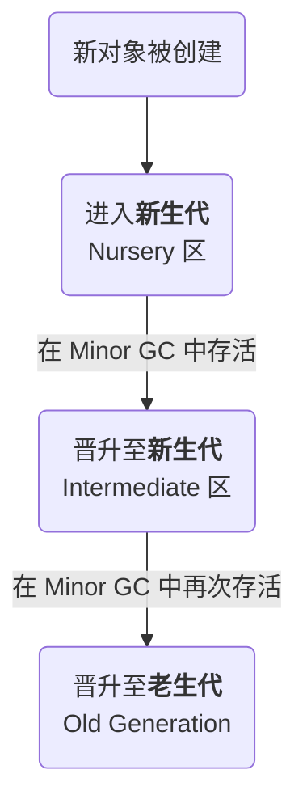

JavaScript 是一门自动进行内存管理的语言，开发者无需像在 C++ 等语言中那样手动分配和释放内存。这一便利性的背后，是一套复杂而高效的**垃圾回收 (Garbage Collection, GC)** 机制在默默工作。在 V8 引擎中，GC 的核心使命是在不显著影响应用性能的前提下，自动识别并回收不再被使用的内存，防止内存泄漏，保证应用的健康运行。理解 V8 的 GC 原理，对于编写高性能、内存友好的 JavaScript 代码至关重要。

# 核心原理与分代假说

V8 的垃圾回收策略建立在两个核心概念之上：可达性分析和分代假说。

## 可达性与标记 (Reachability and Marking)

GC 判断一个对象是否为“垃圾”的依据是其**可达性 (Reachability)**。

- **根 (Roots)**: V8 将一些对象定义为“根”，它们是必然存活的，主要包括调用栈中的局部变量、全局对象（如 `window`）等。
- **标记 (Marking)**: GC 的工作始于“标记”阶段。它从根对象出发，递归地遍历所有可以从根访问到的对象，并为这些**可达对象**打上“存活”标记。
- **清除 (Sweeping)**: 标记阶段结束后，所有未被打上标记的对象都被认为是不可达的“垃圾”，它们所占用的内存将在后续被回收。

## 分代假说 (The Generational Hypothesis)

V8 的 GC 策略基于一个在多种编程语言中都被验证过的观察——**分代假说**。

> [!info] 分代假说
> 1. **绝大多数对象的生命周期都非常短暂** (Most objects die young)。
> 2. **存活时间较长的对象，其继续存活的可能性也更大**。

基于此假说，V8 将其管理的**堆内存 (Heap)** 划分为两个主要区域：**新生代 (Young Generation)** 和**老生代 (Old Generation)**，并针对不同区域的特点，采用不同的回收策略。新生代和老生代的大小会根据运行时内存压力和应用程序行为**动态调整**，例如新生代通常为 1-8MB，但具体大小因环境而异。

# Minor GC (Scavenge): 新生代的快速回收

新生代空间较小（通常为 1-8MB），存放着新创建的、生命周期短暂的对象。针对该区域的垃圾回收被称为 **Minor GC**，其算法称为 **Scavenge**，特点是执行频率高、速度快。

- **机制**: 新生代被分为两个等大的空间：**From-Space**（或称为 Nursery）和 **To-Space**（或称为 Intermediate）。
	1. 所有新创建的对象都被分配在 From-Space。
	2. 当 From-Space 写满，触发 Minor GC。
	3. GC 从根出发，将 From-Space 中所有**存活**的对象**复制并紧凑地排列**到 To-Space 中。

	

	4. 复制完成后，From-Space 中剩下的所有对象都是“垃圾”，GC 直接**清空整个 From-Space**。
	5. 最后，**交换 From-Space 和 To-Space 的角色**。原来的 To-Space 成为新的 From-Space，用于下一次的对象分配；原来的 From-Space 则成为新的 To-Space，等待下一次 GC。
	6. 在复制过程中，如果一个对象已经是第二次在 Minor GC 中存活（即从 Intermediate 区存活），它将被**晋升 (promote)** 到老生代。

	

- **优点**：Scavenge 算法速度快，适合短生命周期对象，且通过紧凑排列有效避免**内存碎片**。
- **局限性**：半空间设计导致空间利用率较低（一半空间始终空闲），且当存活对象较多时，复制开销会显著增加。

# Major GC (Mark-Sweep-Compact): 老生代的深度清理

老生代 (Old Generation) 空间容量较大，用于存放多次 **Minor GC** 仍然存活、生命周期较长的对象。该区域的垃圾回收称为 **Major GC**，触发频率低，但单次耗时显著高于 Minor GC。其核心机制是 **标记–清除–整理 (Mark–Sweep–Compact)** 算法。

1. **标记 (Marking)**: 与 Minor GC 类似，从根出发，标记所有老生代中的存活对象。 
2. **清除 (Sweeping)**: 在标记阶段完成后，清除阶段会遍历整个堆内存。此过程**并不会立即物理移除**垃圾对象的数据，而是执行**逻辑回收 (Logical Deallocation)**：将这些对象所占用的内存标记为可用，并记录到一个称为**空闲链表 (freelist)** 的数据结构中。`freelist` 按内存块大小组织，方便内存分配器在为新对象分配空间时快速定位到合适的块，而无需扫描整个堆。只有当新的对象被分配到该空闲块时，原有的残留数据才会在写入过程中被**物理覆盖 (Physical Overwriting)**。

3. **整理 (Compacting)**: 在清除阶段结束后，堆内存中可能出现大量不连续的小块空闲区域，这种现象称为**内存碎片化 (Memory Fragmentation)**。碎片化会导致一个问题：即使总的空闲内存容量足够，也可能因为缺乏足够大的连续空间而无法为新对象分配内存。为解决这一问题，垃圾回收器会**按需触发**整理阶段。在整理过程中，所有存活对象会被移动到内存的一端，使其排列得更加紧凑，从而将零散的空闲块合并为一个大的连续空闲区。该过程有效消除了碎片，但由于需要更新所有指向已移动对象的引用指针，因此**计算开销较高**。

# Orinoco: V8 垃圾回收的现代化演进

## 传统垃圾回收 (GC) 的挑战

传统的垃圾回收 (Garbage Collection, GC) 算法在执行时，需要将 JavaScript **主线程 (Main Thread)** 完全暂停，这一现象被称为“**停止世界 (Stop-the-World)**”。

对于耗时较长的**主垃圾回收 (Major GC)**，这种长时间的停顿会阻塞应用的响应，导致用户可感知的延迟或“卡顿 (Jank)”。为了解决这一性能瓶颈，V8 的现代 GC 项目 **Orinoco** 引入了一系列先进技术，旨在将 GC 工作从主线程中解耦或分片，以最大限度地减少主线程的停顿时间。

## Orinoco 的核心技术

Orinoco 的优化策略主要围绕以下三种技术展开，它们在不同阶段协同工作。

- **并行 (Parallelism)**：在**主线程暂停期间**，V8 会启动多个**辅助线程 (Helper Threads)** 来协同完成 GC 的任务。虽然主线程依然被阻塞，但通过多线程并行处理，总的停顿时间被显著缩短。

- **增量 (Incrementalism)**：将一项耗时很长的 GC 任务 (如完整的标记过程) 分解成许多小的步骤。这些小步骤**穿插**在 JavaScript 主线程的执行中进行，主线程执行一小段 JS 代码，然后执行一小步 GC，如此交替，避免了单次长时间的停顿。

- **并发 (Concurrency)**：最高级的优化。GC 的辅助线程在**后台**独立工作，与 JavaScript **主线程同时执行**，几乎不产生停顿。这需要通过**写屏障 (Write Barriers)** 等复杂技术来保证数据一致性，即拦截主线程在并发标记期间对对象引用进行的修改，并通知后台的 GC 线程。

## 技术在 GC 类型中的具体应用

Orinoco 将上述技术精妙地应用在 Minor GC 和 Major GC 中：

> [!note] Minor GC (Scavenge) 的并行化
> 新生代的 Scavenge 算法本身速度很快，其“停止世界”的暂停时间很短。因此，Orinoco 在此主要应用**并行 (Parallelism)** 技术。
> 
> 

> [!note] Major GC 的并发与增量化
> 老生代的 Major GC 耗时最长，是优化的重点。Orinoco 在此采用了一套复杂的组合：
> 1. **并发标记 (Concurrent Marking)**: 耗时最长的标记阶段，主要由后台辅助线程**并发**执行，此时 JS 主线程可以继续运行。
> 2. **增量标记 (Incremental Marking)**: 主线程也会**增量地**参与到标记工作中，进一步加快进度。
> 3. **并行清除与整理 (Parallel Sweeping & Compacting)**: 在最终需要短暂“停止世界”的清除和整理阶段，则采用**并行**技术，由多个辅助线程协同完成，以最大限度缩短最后的暂停时间。
> 
> 

# GC 的触发与控制

- **触发时机**：垃圾回收（GC）由系统自动触发，通常取决于**内存分配阈值**（如新生代空间写满）或**堆内存大小的动态增长率**等因素。
- **空闲时间回收**：现代浏览器通过 `requestIdleCallback` 等机制感知页面空闲时段，优先在这些时段“见缝插针”地执行部分 GC 任务，以减少对用户体验的影响。
- **不可控性**：开发者**无法**通过 JavaScript 代码（如 `gc()`，仅用于开发和调试环境）手动触发或精确控制垃圾回收。

