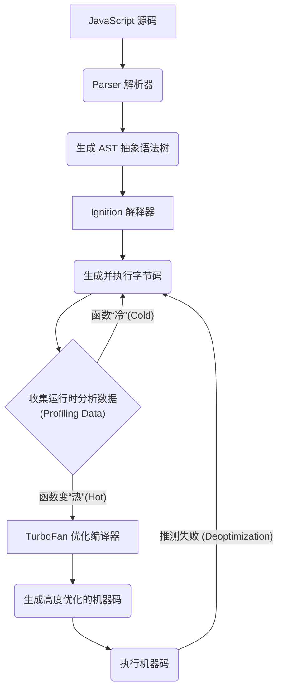

V8 是由 Google 开发的、用于 Chrome 浏览器和 Node. Js 等环境的开源、高性能 JavaScript 和 WebAssembly 引擎。其卓越性能的核心在于采用了**即时编译 (Just-In-Time, JIT)** 技术，它巧妙地结合了解释器（启动速度快）和编译器（运行效率高）的优点，使得动态类型的 JavaScript 也能获得接近原生编译语言的执行速度。整个引擎由 C++ 实现，从字节码解释到机器码生成，均通过精细的 C++ 模板与手写汇编完成。


# V8 的核心编译管线

V8 将 JavaScript 代码转换为可执行的机器码，其过程是一个精密的多阶段管线。



## 解析 (Parsing) 与 AST 的生成

- **源码解析 (Parsing)**: 当 V8 接收到 JavaScript 源码时，**Parser** 会首先对其进行词法和语法分析。为优化启动性能，Parser 采用了两种模式：
    - **贪婪解析 (Eager Parsing)**: 对立即需要的代码进行全量解析。
    - **懒惰解析 (Lazy Parsing)**: 对于函数或类，**一个被称为 Pre-Parser 的预解析器会先生效**，它只解析其签名（函数名、参数列表）**和函数作用域范围**，而**跳过函数体内部的具体实现**。直到该函数首次被调用时，其函数体才会被真正的 **Lazy Parser** 解析。这种方式显著加快了初始加载速度，但如果一个懒解析的函数被立即调用，会产生一次额外解析的开销。
- **抽象语法树 (AST)**: 解析阶段的产物是一个结构化的、树状的数据结构——**AST (Abstract Syntax Tree)**，它是源代码语法结构的精确表示。

## Ignition (解释器) 与字节码

AST 会被传递给 **Ignition**，V8 的解释器。Ignition 的核心职责是：

1. 将 AST 转换为一种更紧凑、更易于执行的**字节码 (Bytecode)**。
2. **执行字节码**，并在此过程中收集关于代码执行模式的分析数据（Profiling Data），例如函数被调用的频率、传入参数的类型等。**这些数据被存储在一个名为“反馈向量 (Feedback Vector)”的结构中，直接服务于后续的优化决策。**

# TurboFan (优化编译器) 与核心优化策略

当 Ignition 发现某个函数被频繁调用（成为“热函数”）且其参数类型相对稳定时，它会将该函数的字节码连同**反馈向量 (Feedback Vector)**，发送给 **TurboFan**——V8 的优化编译器。TurboFan 会基于这些信息，进行一系列激进的优化，生成高度优化的机器码。

> [!tip] 核心思想：化动态为静态
> TurboFan 的所有优化策略，其核心思想都是**将动态、不可预测的 JavaScript 代码，转化为静态、可预测的、高效的机器码**。为了实现这一目标，它主要依赖于以下三种相互关联的关键技术：**推测性优化**负责对代码行为进行大胆的预测，**隐藏类**为这种预测提供了对象结构稳定性的依据，而**函数内联**则通过简化调用来降低复杂性。

## 推测性优化 (Speculative Optimization)

这是 JIT 编译的精髓。TurboFan 会根据已收集的分析数据，对代码未来的行为做出“推测”。

- **机制**: 例如，一个函数 `function add(a, b) { return a + b; }` 在过去100次调用中，参数 `a` 和 `b` 的类型始终是 `number`。TurboFan 会**推测**这个函数未来也只会处理 `number`，并据此生成一个专门处理整数加法的、极快的机器码版本。
- **去优化 (Deoptimization)**: 如果推测失败（例如，`add` 函数突然被传入了一个字符串），V8 会执行**去优化**，抛弃已优化的机器码，回退到执行 Ignition 的字节码，以保证程序的正确性。

> [!info] 类型特化
> 推测性优化这个过程依赖于类型的稳定性，分为三种状态：
> - **单态 (Monomorphism)**: 函数始终接收相同类型或结构的对象。这是最优状态，极易被优化。
> - **多态 (Polymorphism)**: 函数接收多种（但数量有限，通常为 2-4 种）不同类型或结构的对象。V8 仍能进行有效优化。
> - **超多态 (Megamorphism)**: 函数接收大量不同类型或结构的对象。优化变得非常困难，性能接近未优化状态。

## 隐藏类 (Hidden Classes / Shapes)

JavaScript 对象的属性可以在运行时动态添加或删除，这迫使引擎在默认情况下像处理字典一样，通过字符串匹配来进行属性查找，远比静态语言慢。为了解决这个性能瓶颈，V8 引擎引入了一项关键的底层技术——**隐藏类**（在 V8 内部也称为 `Map`）。

隐藏类的核心思想是为拥有相同“形状”的对象创建一个共享的内部蓝图

> [!example] 共享隐藏类的条件
> V8 对“形状”的定义是极其严格的。两个对象只有在**属性名、属性顺序、属性类型、构造函数、原型链**等完全一致时，才会共享同一个隐藏类。
> ```js
> // --- 1. 基线：创建两个满足所有条件的对象 ---
> // 属性名、顺序、类型、构造函数、原型链都相同
> const objA = { x: 1, y: 2 };
> const objB = { x: 10, y: 20 };
> console.Log (`1. 形状完全相同? ${%HaveSameMap(objA, objB)}`);
> // 1. 形状完全相同? True
> 
> 
> // --- 2. 违反条件并进行对比 ---
> 
> // a) 违反【属性顺序】
> const objC = { y: 30, x: 40 }; 
> console.Log (`2. 属性顺序相同? ${%HaveSameMap(objA, objC)}`);
> // 2. 属性顺序相同? False
> 
> // b) 违反【属性类型】
> const objD = { x: 50, y: "hello" }; // y 的类型是 string
> console.Log (`3. 属性类型相同? ${%HaveSameMap(objA, objD)}`);
> // 3. 属性类型相同? False
> 
> // c) 违反【构造函数】
> function MyConstructor () {
>   this. X = 70;
>   this. Y = 80;
> }
> const objE = new MyConstructor ();
> console.Log (`4. 构造函数相同? ${%HaveSameMap(objA, objE)}`);
> // 4. 构造函数相同? False
> 
> // d) 违反【原型链】
> const customProto = { z: 90 };
> const objF = { x: 100, y: 200 };
> object.setPrototypeOf (objF, customProto); // 改变原型
> console.Log (`5. 原型链相同? ${%HaveSameMap(objA, objF)}`);
> // 5. 原型链相同? False
> 
> // e) 违反【属性数量/名称】
> const objG = { x: 1, y: 2, z: 3 }; // 多一个 z 属性
> console.Log (`6. 属性数量/名称相同? ${%HaveSameMap(objA, objG)}`);
> // 6. 属性数量/名称相同? False
> 
> ***注意：`%HaveSameMap` 是 V8 内部用于调试的函数，需要在启动 Node.js 或 Chrome 时添加 `--allow-native-syntax` 标志才能使用。***
> ```

这个机制带来了两大互相促进的核心优势：

1. **将动态查找转换为静态偏移量访问（加速访问）**：这是隐藏类的**直接目的**。当 V8 确认一组对象共享同一个隐藏类时，它就知道了这些对象在内存中的布局是完全一致的。因此，当访问一个属性（如 `obj.y`）时，V8 不再需要进行慢速的字符串查找，而是可以直接通过隐藏类中记录的**内存偏移量 (offset)**，一步到位地找到属性值。这使得动态语言的属性访问速度，能够逼近静态编译语言。
2. **为推测性优化提供形状判断依据（确定形状是否相同）**：这是隐藏类的**间接收益**，也是 JIT 编译的关键。当 TurboFan 准备对一个函数（例如 `function process(obj) {...}`）进行优化时，它需要判断这个函数是否处于“单态 (Monomorphism)”，即传入的 `obj` 是否总是具有相同的形状。得益于隐藏类机制，这个判断变得极其高效：**V8 只需要比较前后传入的几个 `obj` 的隐藏类地址是否相同即可**。如果地址始终一致，TurboFan 就可以大胆地进行推测性优化，生成一段专门处理该特定形状对象的高速机器码。

## 函数内联 (Function Inlining)

这是一种经典的编译器优化技术。如果一个函数（调用者）内部调用了另一个**小型函数**（被调用者），TurboFan 可能会直接将被调用者的函数体代码**复制并粘贴**到调用者的代码中，从而消除函数调用本身带来的开销（如堆栈帧的建立和销毁）。然而，并非所有函数都适合内联，例如，过大的函数、包含 `try-catch` 语句的函数、或者多态性过高的函数，通常不会被内联。