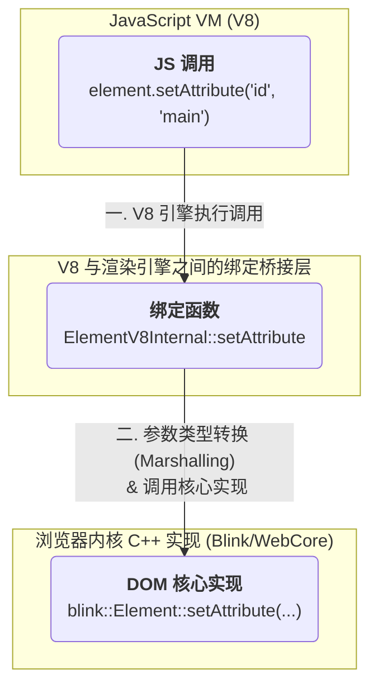

JavaScript 赋予 Web 开发者操控文档内容、样式和用户交互的强大能力。然而，JavaScript 语言本身并不包含 `document.getElementById` 或 `appendChild` 等方法。这些强大的 Web API 功能，实际上是由浏览器内核中一个独立的、高性能的**渲染引擎 (Rendering Engine)**（如 WebKit 的 WebCore 或 Chromium 的 Blink）提供的。由于渲染引擎通常由 C++ 编写，而 JavaScript 由 V8 等引擎执行，两者之间存在语言壁垒。**WebIDL (Web 接口定义语言)** 正是为打破这一壁垒而生的关键技术，它充当了连接这两个世界的“通用翻译器”。

# JS 引擎与渲染引擎的协作机制

要理解 WebIDL 的作用，首先必须认识到浏览器内部存在两个**独立**但需要**紧密协作**的核心组件：

- **JavaScript 引擎 (JavaScript Engine)**: 如 V8，其核心职责是解析、编译和执行 JavaScript 代码。它管理着 JS 的调用栈、内存堆、事件循环等。
- **渲染引擎 (Rendering Engine)**: 如 WebCore 或 Blink，其核心职责是处理所有与渲染相关的工作，包括解析 HTML 和 CSS 以构建 **DOM 树**和 **CSSOM 树**，并最终将内容绘制到屏幕上。DOM 节点在这一层本质上是复杂的 C++ 对象。

这两个核心组件需要频繁通信。例如，当 JS 代码执行 `document.body.style.color = 'red';` 时，JS 引擎需要一种方式来通知渲染引擎，去修改那个代表 `<body>` 的 C++ 对象的样式属性。

> [!warning] 语言壁垒
> JavaScript 是一种动态类型的、由垃圾回收机制管理内存的语言。而 C++ 是一种静态类型的、需要手动管理内存的语言。两者在内存模型、类型系统和调用约定上完全不同，因此 JavaScript 引擎**无法直接跨语言调用**渲染引擎中的 C++ 函数。

# WebIDL：跨语言的“接口合约”

为了解决上述语言壁垒，W3C 标准化了一种中立的**接口定义语言 (Interface Definition Language, IDL)**，即 **WebIDL**。

WebIDL 本身并**不是**一门编程语言，而是一种**接口规范语言**。它的作用类似于一份“合约”或“蓝图”，以一种与具体编程语言无关的方式，**清晰地定义 Web API 的接口边界**——包括对象的属性、方法、参数类型和返回值类型。它确保 JavaScript 能够以一种类型安全的方式使用由其他语言（如 C++）实现的底层功能。

```webidl
// 一个简化的 WebIDL 接口定义示例（来自 DOM 规范）
interface Element : Node {
  readonly attribute DOMTokenList classList;
  void setAttribute(DOMString name, DOMString value);
  // ... 其他属性和方法
};
```

# 从“合约”到“实现”：绑定的生成

WebIDL (Web 接口定义语言) 本身只是一份描述接口的静态规范。为了让 JavaScript 引擎能够实际调用由 C++ 实现的浏览器功能，必须存在一个中间层来连接这两个异构的编程环境。这个中间层被称为**绑定 (Bindings)**。

1. **在 C++ 中实现接口**: 在渲染引擎（如 Blink）的 C++ 代码中，编写 `Element` 类的具体实现，包括 `setAttribute` 方法的底层逻辑。
2. **生成绑定 (Bindings)**: 浏览器的构建系统包含一个**绑定生成器 (Bindings Generator)** 工具。该工具以 `.idl` 文件为输入，输出自动生成的 C++ 绑定代码。这些绑定代码精确地定义了 V8 与 Blink/WebCore 渲染引擎之间的**应用程序二进制接口 (ABI)**，从而实现语言间的安全通信。

这个完整的通信流程可以被可视化为：



**详细步骤分解**:

1. **V8 引擎执行**: V8 在执行 JavaScript 代码时，遇到 `element.setAttribute(...)`。此时，`element` 是一个 **V8 包装的、绑定到底层 C++ DOM 对象的 JS 对象**。
2. **调用绑定函数**: V8 调用由绑定生成器创建的绑定函数（例如 `ElementV8Internal::setAttribute`），这个函数是连接 JS 和 C++ 的桥梁。
3. **参数类型转换 (Marshalling)**: 绑定函数将传入的 JavaScript 类型（如 V8 的 `v8::String`）转换为 Blink 可识别的 C++ 类型（如 `WTF::String`）。
4. **调用核心实现**: 完成类型转换后，绑定函数调用 C++ 层中真正由工程师实现的 DOM 方法（如 `blink::Element::setAttribute(...)`），从而完成对文档的修改。

> [!tip] `console.log(element)` 显示 HTML
> 当 `console.log` 接收到一个 DOM 节点对象时，DevTools 的实现会调用一个内部接口来获取该对象的“开发者友好”的表示形式。根据规范，对于 DOM 节点，这个表示形式被定义为其**序列化后的 HTML 字符串** (`outerHTML`)。这个过程同样通过 WebIDL 绑定层实现，它调用了渲染引擎内部的序列化逻辑，而不是暴露底层的 C++ 对象结构。

> [!info] Getter/Setter 也是通过 WebIDL 生成
> 当你写 `element.textContent = 'foo'` 或 `const str = element.textContent` 时，看似是给 JS 属性赋值/取值，实则 V8 会立即调用由 WebIDL 生成的 **C++ setter/getter 绑定函数**（`ElementV8Internal::textContentSetter/Getter`），完成类型转换后再真正修改或读取底层 C++ DOM 对象。

