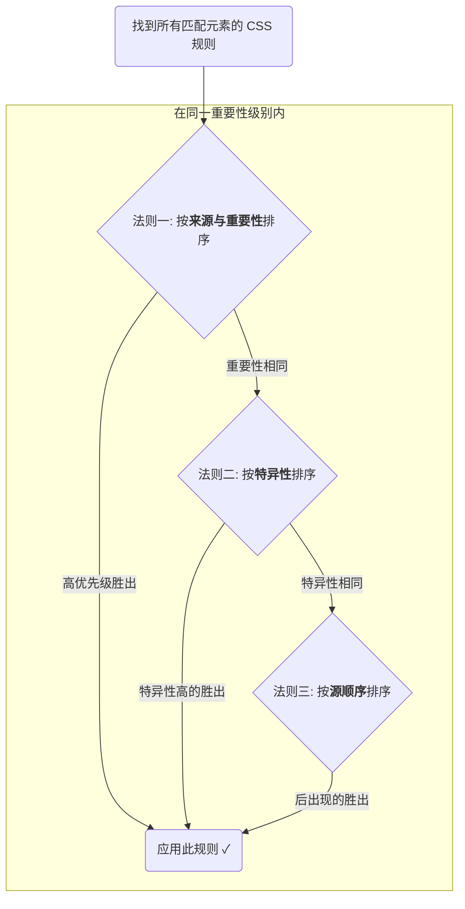

# CSS 层叠三大法则

浏览器决定最终应用哪个样式的过程，严格遵循以下三个步骤（法则），优先级依次递减。



## 法则一：来源与重要性 (Origin and Importance)

浏览器首先会根据样式规则的来源及其是否被标记为 `!important` 来进行第一轮筛选。其优先级从高到低排序如下：

1. **过渡与动画 (Transitions & Animations)**: 应用于活动状态的 `transition` 和 `animation` 中的样式。
2. **用户代理 `!important`**: 浏览器开发者工具中用户自己设置的 `!important` 样式（非常罕见）。
3. **用户 `!important`**: 网站用户通过浏览器插件等方式设定的 `!important` 样式。
4. **开发者 `!important`** (`Author !important`): **开发者在 CSS 文件中设置的 `!important` 样式。这是我们最常接触的最高优先级。**
5. **开发者普通样式** (`Author normal`): 正常写在 CSS、style 标签、行内 `style=""` 中的规则。
6. **用户普通样式**: 用户插件设置的普通样式（无 `!important`）。
7. **用户代理普通样式**: 浏览器的默认样式（例如 `<h1>` 的默认字号和 `margin`）。

> [!note] `!important`：一个独立的考量维度
> `!important` **不参与特异性计算**。它是一个“开关”，用于将一个普通规则的**重要性**提升到极高的级别，使其能够直接在“法则一”的比较中胜出。它应被视为解决特定问题的最后手段，滥用会导致样式表难以维护。

## 法则二：特异性 (Specificity) 深度解析

当规则的重要性级别相同时（例如，两个都是开发者编写的普通样式），浏览器就会通过计算选择器的**特异性**来决定胜负。

**计算模型：四元组 `(A, B, C, D)`**，这是一种比传统数字法更严谨的表示法，它不存在“进位”问题，能更准确地反映优先级。比较时，从左到右依次比较，数值大的胜出。

**特异性等级与计算**：

| **类别**     | **选择器示例**                           | **四元组贡献 (A, B, C, D)** |
| ---------- | ----------------------------------- | ---------------------- |
| A: 行内样式    | `<div style="...">`                 | (1, 0, 0, 0)           |
| B: ID 选择器  | `#my-id`                            | (0, 1, 0, 0)           |
| C: 类、属性、伪类 | `.class`, `[type="text"]`, `:hover` | (0, 0, 1, 0)           |
| D: 元素、伪元素  | `div`, `::before`                   | (0, 0, 0, 1)           |

> [!example] 示例计算
> `div #main .list:hover` 的特异性为 `(0, 1, 2, 1)`。

> [!important] 现代伪类的特异性
> - **`:is(selectorList)` 和 `:not(selectorList)`**: 其自身的特异性等于其**参数列表中特异性最高的那个选择器**的特异性。    
> - **`:where(selectorList)`**: 它的特异性**永远为 0** `(0,0,0,0)`。它允许你编写可被轻松覆盖的、无特异性的样式规则，非常适合用于基础库或重置样式。

## 法则三：源顺序 (Source Order)

如果经过前两轮比较，多个规则的**重要性和特异性完全相同**，那么最后出场的规则将胜出。

```css
p { color: blue; }
p { color: red; } /* 生效的是这个 */
```

# 继承 (Inheritance)：最低的优先级

某些 CSS 属性（如 `color`, `font-family`, `line-height`）是可继承的。当一个元素没有为这些属性设置任何直接的样式规则时，它会从其父元素那里继承计算值。

- **优先级**: **继承来的样式的特异性永远为零**。
- **规则**: 任何直接作用于该元素的选择器（哪怕是特异性为 `(0,0,0,0)` 的 `:where()` 或 `*`）所定义的样式，都会覆盖从父级继承来的样式。