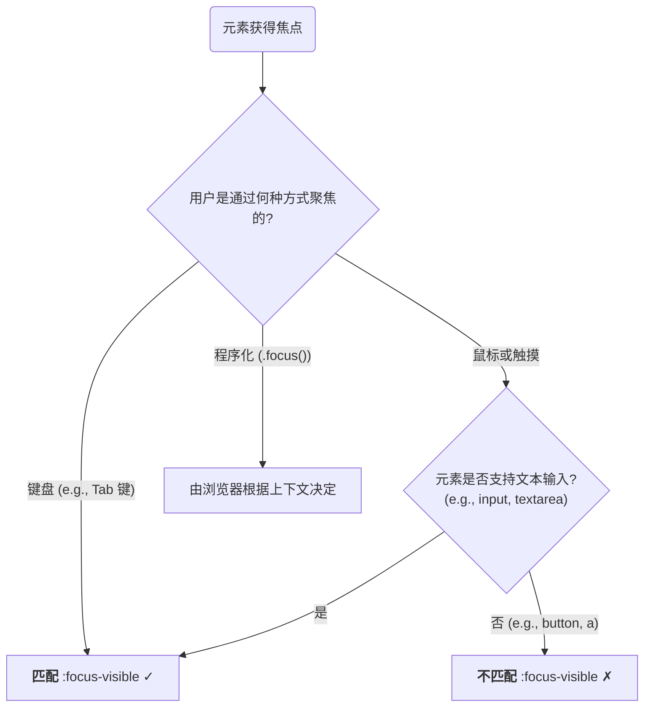

在 Web 可访问性 (Accessibility, a11y) 和用户体验 (UX) 设计中，为可交互元素提供清晰的**焦点 (focus)** 状态是至关重要的。焦点指示器告知键盘和辅助技术用户，他们当前在页面上的确切位置。然而，传统 `outline` 样式在美学上常与设计冲突。为解决这一矛盾，现代 CSS 提供了一套精密的伪类—— `:focus`, `:focus-visible`, 和 `:focus-within` ——允许开发者以前所未有的粒度，精确地控制焦点样式的应用时机与范围。

# `:focus`：传统的通用焦点

`:focus` 伪类是 W3C 标准中历史最悠久的焦点选择器。任何能够接收焦点的元素，在通过**所有方式**获得焦点时，都会匹配 `:focus`。这包括：

- **键盘导航**: 用户使用 `Tab` 键或方向键导航到该元素。
- **鼠标点击**: 用户用鼠标点击该元素。
- **程序化聚焦**: 通过 JavaScript 调用 `element.focus()` 方法。

> [!warning] “丑陋的焦点环”问题与可访问性反模式
> 历史上，由于浏览器默认的 `outline` 样式（通常是蓝色或黑色的虚线框）不符合许多视觉设计，开发者普遍采用 `*:focus { outline: none; }` 来全局禁用它。
> 
> 这是一个严重的**可访问性反模式**。因为它在为鼠标用户移除不必要的视觉干扰的同时，也完全移除了键盘用户赖以导航的视觉线索。这使得纯键盘用户无法知道自己当前操作的是哪个元素。

# `:focus-visible`：智能的启发式焦点

为了解决上述 `:focus` 的两难困境，`focus-visible` 伪类应运而生。它的核心思想是：**仅在浏览器认为用户需要看到焦点指示器时，才应用焦点样式**。浏览器会根据用户的输入方式，通过一套启发式算法 (heuristics) 来决定是否匹配 `:focus-visible`。



> [!important] 现代焦点样式的最佳实践
> `focus-visible` 允许我们将视觉上强烈的焦点样式（如轮廓）专门提供给键盘用户，同时为鼠标用户保持一个更简洁的界面。
> ```css
> /* 1. 为所有元素设置一个默认的、细微的焦点样式 (可选) */
> *:focus {
>   /* 例如，一个非常柔和的阴影 */
>   box-shadow: 0 0 0 2px rgba(0, 123, 255, 0.1);
> }
> 
> /* 2. 仅在浏览器认为有必要时（如键盘导航），才显示一个清晰、高对比度的轮廓 */
> :focus-visible {
>   outline: 3px solid dodgerblue;
>   outline-offset: 2px;
>   box-shadow: none; /* 覆盖掉通用的 :focus 样式 */
> }
> 
> /* 3. (可选) 明确移除鼠标点击 button 时的默认轮廓，同时不影响 :focus-visible */
> button:focus:not(:focus-visible) {
>   outline: none;
> }
> ```
> 这种策略在保证**可访问性**的同时，也满足了**视觉设计**的需求。

# `:focus-within`：结构化的父级焦点

`:focus-within` 伪类提供了一种全新的、基于 DOM 结构的能力：当一个元素的**任何后代**元素获得焦点时，该元素自身也会匹配 `:focus-within`。

- **触发机制**: 只要焦点位于其 DOM 子树内部，该选择器就会一直保持匹配状态。
- **核心优势**: 它允许我们基于用户的焦点位置，来动态地改变**父级或容器元素**的样式。这在过去只能通过复杂的 JavaScript 事件监听来实现。

> [!example] 高亮整个表单组
> 这是一个典型的应用场景。当用户聚焦到表单组内的 `input` 或 `label` 时，整个表单组的容器 `div` 会改变样式，为用户提供更清晰的上下文感知。
> ```html
> <div class="form-group">
>   <label for="username">用户名:</label>
>   <input type="text" id="username" name="username" />
> </div>
> ```
> ```css
> .form-group {
>   padding: 1rem;
>   border: 1px solid #ccc;
>   border-radius: 8px;
>   transition: all 0.2s ease-in-out;
> }
> 
> /* 当 .form-group 内部的任何元素被聚焦时，应用此样式 */
> .form-group:focus-within {
>   border-color: dodgerblue;
>   box-shadow: 0 0 0 3px rgba(30, 144, 255, 0.2);
>   background-color: #f0f8ff;
> }
> ```

