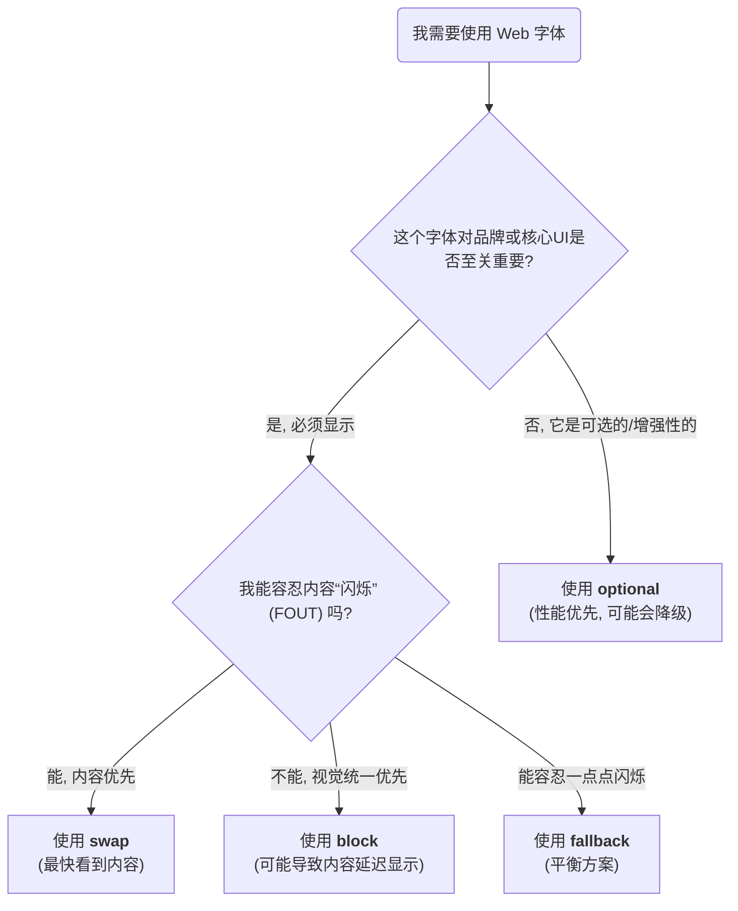

Web 字体（Web Fonts）极大地丰富了网页的设计表现力，但它们的加载过程是异步的，这会引发两个核心的用户体验问题：**FOIT (Flash of Invisible Text)**，即在字体下载完成前文本完全不可见；以及 **FOUT (Flash of Unstyled Text)**，即文本先以系统后备字体显示，下载完成后再“闪烁”变为自定义字体。CSS 的 `font-display` 属性正是为了让开发者能够精细地控制这一行为，在性能与视觉保真度之间做出权衡。

# 核心机制：字体显示时间线

`font-display` 的所有策略都围绕着一个三阶段的时间线模型来工作：

1. **字体阻塞期 (Font Block Period)**：这是字体加载开始后的一个短暂时期。如果在此期间自定义字体加载完成，则立即使用它。否则，文本将保持**不可见**（或使用 `font-display` 指定的后备行为）。
2. **字体交换期 (Font Swap Period)**：在阻塞期之后，如果自定义字体仍未加载完成，浏览器会显示**后备字体 (fallback font)**。交换期就是从显示后备字体开始，到浏览器决定是否应该用下载好的自定义字体“交换”掉后备字体的这段时间。
3. **字体失败期 (Font Failure Period)**：如果在交换期结束时，自定义字体依然未能加载，浏览器会判定此次加载失败，并**永久地**使用后备字体。

# `font-display` 五大策略详解

不同的 `font-display` 值，本质上是为上述三个时期的时长设置了不同的“预设”。

## `auto`

- **行为**: 完全由浏览器（用户代理）自行决定采用何种策略。在绝大多数现代浏览器中，其行为与 `block` 非常相似。

## `block`

- **行为**: 给予自定义字体一个**较长的阻塞期**（通常为 3 秒）和一个**无限的交换期**。
    - **0-3秒 (阻塞期)**: 文本不可见，等待自定义字体。如果在此期间加载完成，则直接显示自定义字体。
    - **3秒后**: 如果字体仍未加载，则显示后备字体。一旦后续自定义字体加载完成，立即“交换”为自定义字体。
- **效果**: 优先保证了视觉的统一性，但可能以较长时间的**FOIT**为代价。

## `swap`

- **行为**: 提供一个**几乎为零的阻塞期**（≤100ms）和一个**无限的交换期**。
    - **几乎立即**: 浏览器立即显示后备字体。
    - **后续**: 一旦自定义字体加载完成，立即“交换”为自定义字体。
- **效果**: 优先保证了内容的**可读性**，是解决 FOIT 的最直接方法，但会产生明显的 **FOUT**。这是目前最流行的策略之一，Google Fonts 也默认使用它。

## `fallback`

- **行为**: 在 `block` 和 `swap` 之间的折中方案。它有一个**极短的阻塞期**（≤100ms）和一个**较短的交换期**（通常为 3 秒）。
    - **0-100ms (阻塞期)**: 文本不可见。
    - **100ms - 3秒 (交换期)**: 显示后备字体。如果在此期间自定义字体加载完成，则进行“交换”。
    - **3秒后 (失败期)**: 如果自定义字体仍未加载，浏览器将**放弃等待**，并在当前页面的生命周期内**永久使用后备字体**，即使自定义字体后来加载完成了也不会再进行交换。
- **效果**: 试图在减少 FOIT 的同时，限制 FOUT 对视觉稳定性的影响。

## `optional`

- **行为**: 这是最看重性能和用户体验连贯性的策略。它有一个**极短的阻塞期**（≤100ms）和**几乎为零的交换期**。
    - **0-100ms (阻塞期)**: 文本不可见。
    - **100ms 后**: 浏览器会检查自定义字体是否已下载完成。
        - **如果已完成**，则直接使用它。
        - **如果未完成**，则**立即使用后备字体，并且不再进行交换**。浏览器可能会在后台继续下载该字体，以备**下一次**页面加载时使用（此时它可能已被缓存）。
- **效果**: 几乎完全避免了 FOUT。它告诉浏览器：“如果这个字体不能瞬时加载，那就别用了”。适用于装饰性或非核心的字体。

# 决策指南

选择哪种策略，取决于字体对于设计有多重要，以及个人对 FOIT/FOUT 的容忍度。

