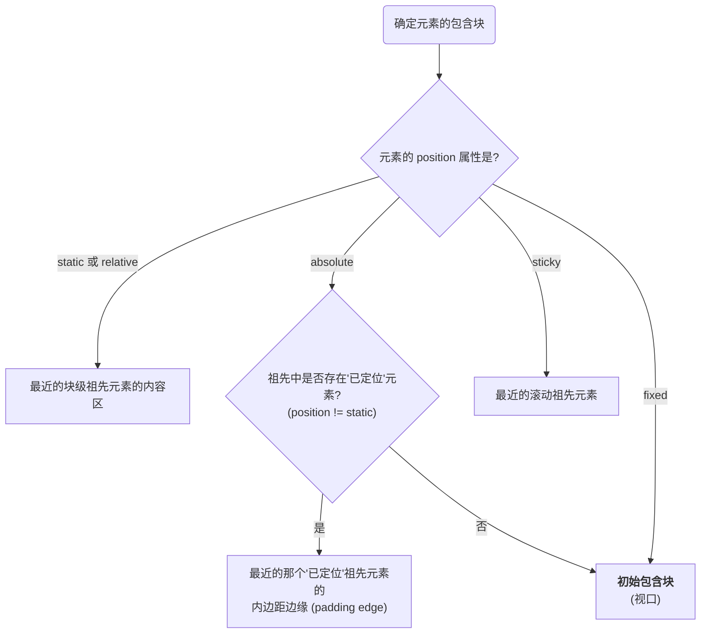

CSS 布局的本质是控制元素盒 (box) 在页面上的位置和排列。默认情况下，所有元素都遵循**常规流 (Normal Flow)** 进行布局。然而，通过 `position` 属性，开发者可以精确地控制元素的定位方式，将其从常规流中脱离，或相对于特定参考物进行偏移，从而实现复杂的、富有创造性的用户界面。

# 基石：常规流与包含块

## 常规流 (Normal Flow)

在任何定位介入之前，页面元素会遵循一个自然的排列规则，即常规流。块级元素（如 `
`, `
`）从上到下垂直排列，行内元素（如 ``, `<a>`）则在其包含块中从左到右水平排列。

## 包含块 (Containing Block)

包含块是元素进行定位和尺寸计算的“**参考系**”或“坐标系”。一个元素的包含块由其**祖先元素**的 `position` 属性等因素决定，而非其直接父元素。

> [!note] 初始包含块 (Initial Containing Block)
> 页面根元素 (`<html>`) 的包含块被称为初始包含块，其尺寸和位置与浏览器的**视口 (viewport)** 完全相同。

# `position` 属性的五种模式

## `static` (静态定位)

- **行为**: 这是所有元素的**默认值**。`position: static;` 的元素完全遵循常规流。任何 `top`, `right`, `bottom`, `left` 和 `z-index` 属性对其**均无效**。

## `relative` (相对定位)

- **行为**: 相对定位是一个双重角色。首先，元素依然在**常规流中占据其原始空间**，如同 `static` 定位一样。其次，它可以在不影响周围元素布局的前提下，通过 `top`, `right`, `bottom`, `left` 属性相对于其**原始位置**进行视觉上的偏移。
- **关键特性**:
    - **空间保留**: 即使元素发生了视觉偏移，它在常规流中**原始占据的空间仍然被保留**，不会被其他元素填充。
    - **建立定位上下文**: 将一个元素的 `position` 设为 `relative`，会使其成为其后代中 `position: absolute;` 元素的**包含块**。

## `absolute` (绝对定位)

- **行为**: 绝对定位的元素会**完全从常规流中脱离**。这意味着它不再占据任何空间，周围的元素会无视它的存在并填充其原始位置。
- **包含块规则**: 它的定位参考系（包含块）是离它**最近的、`position` 值不为 `static` 的祖先元素**。如果向上遍历所有祖先都找不到这样的元素，它的包含块最终会是**初始包含块**（即视口）。
- **偏移**: 通过 `top`, `right`, `bottom`, `left` 属性相对于其包含块的内边距边缘 (padding edge) 进行定位。

## `fixed` (固定定位)

- **行为**: 固定定位与绝对定位类似，元素也会**完全从常规流中脱离**。
- **包含块规则**: 它的包含块**始终是视口 (viewport)**。这意味着它不会随页面的滚动而移动，而是“固定”在屏幕的某个位置。
- **偏移**: 通过 `top`, `right`, `bottom`, `left` 属性相对于视口进行定位。

## `sticky` (粘性定位)

- **行为**: 这是一种 `relative` 和 `fixed` 的混合模式。在默认情况下，元素表现为**相对定位**（遵循常规流）。当页面滚动，使得该元素即将移出其**滚动容器 (scrolling ancestor)** 时，它会“粘”在由 `top`, `right`, `bottom`, `left` 属性定义的位置，表现得像**固定定位**一样 (但**不会**脱离正常流)。
- **包含块规则**: 其偏移的参考系是**最近的、具有滚动机制的祖先元素**（例如，`overflow` 属性值为 `auto` 或 `scroll` 的元素），而非视口。

