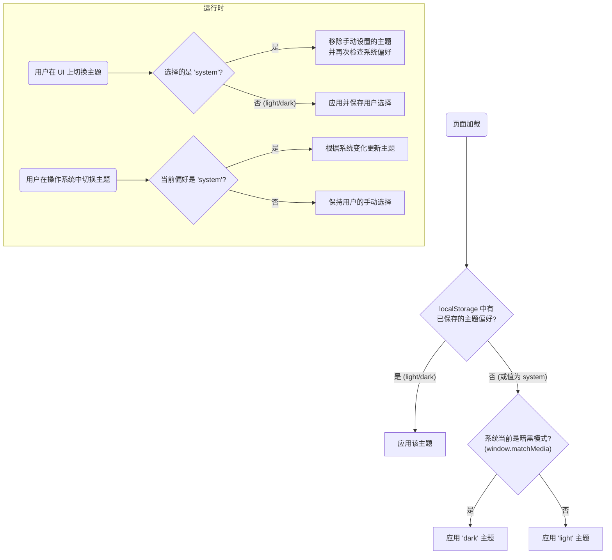

# 暗黑模式的两种策略

Tailwind CSS 的 `dark:` 变体是实现暗黑模式的核心工具，其触发机制主要分为自动和手动两种策略。

## 自动模式：基于媒体查询 (Media Query Strategy)

这是 Tailwind CSS 的**默认行为**。在这种模式下，所有 `dark:` 前缀的功能类都会被自动包裹在 `@media (prefers-color-scheme: dark)` 媒体查询中。

- **机制**: 浏览器会根据用户操作系统的颜色方案设置，自动应用或移除 `dark:` 变体对应的样式。
- **优点**: 零配置，能够直接响应用户的系统级偏好。
- **缺点**: 无法为用户提供手动切换主题的功能。

## 手动模式：基于 Class 或 Attribute (Selector Strategy)

为了给予用户手动控制权，Tailwind 允许开发者自定义 `dark:` 变体的触发选择器。

> [!note] Tailwind v4 的 `@custom-variant`
> 在 Tailwind CSS v4 中，通过 `@custom-variant` at-rule 来定义自定义变体。旧版本（v3）则是在 `tailwind.config.js` 文件中通过 `darkMode: 'class'` 或 `darkMode: 'selector'` 来配置。

通过在主 CSS 文件中添加以下代码，即可将 `dark:` 变体的触发条件从媒体查询切换为选择器：

```css
/* tailwind.css */
@import "tailwindcss";

/* 策略一：当 <html> 或任何祖先元素有 .dark 类时，启用暗黑模式 */
@custom-variant dark {
  :where(.dark) &
}

/* --- 或者 --- */

/* 策略二：当 <html> 或任何祖先元素有 data-theme="dark" 属性时，启用暗黑模式 */
@custom-variant dark {
  :where([data-theme="dark"]) &
}
```

配置完成后，`dark:` 变体将不再响应系统设置，而是仅当 `<html>` 标签（或任何父元素）上存在 `.dark` 类或 `data-theme="dark"` 属性时，才会激活。这使得我们可以通过 JavaScript 来动态地添加或移除这个类/属性，从而实现手动切换。

# 实践：构建三态主题切换器 (Light/Dark/System)

一个优秀的主题切换器应该同时尊重用户的系统偏好和手动选择。以下是实现这一功能的完整逻辑流程和代码实践。



> [!example] 完整实现代码
> 这段脚本应被放置在 HTML 的 `<head>` 标签中，并位于加载任何 CSS 之前，以**避免页面加载时的颜色闪烁 (FOUC)**。
> 
> **HTML 结构 (示例)**:
> ```html
> <fieldset>
>   <legend>Switch Theme</legend>
>   <input type="radio" name="theme" id="light" value="light"> <label for="light">Light</label>
>   <input type="radio" name="theme" id="dark" value="dark"> <label for="dark">Dark</label>
>   <input type="radio" name="theme" id="system" value="system"> <label for="system">System</label>
> </fieldset>
> ```
> 
> **JavaScript 逻辑**:
> ```js
> const THEME_KEY = 'theme-preference';
> 
> // 负责将主题应用到  元素的函数
> const applyTheme = (theme) => {
>   if (theme === 'dark') {
>     document.documentElement.classList.add('dark');
>   } else {
>     document.documentElement.classList.remove('dark');
>   }
> };
> 
> // 负责根据系统偏好更新主题的函数
> const updateFromSystem = () => {
>   const systemPrefersDark = window.matchMedia('(prefers-color-scheme: dark)').matches;
>   applyTheme(systemPrefersDark ? 'dark' : 'light');
> };
> 
> // 1 & 2: 检查已保存的偏好并应用
> let savedPreference = localStorage.getItem(THEME_KEY);
> 
> if (savedPreference) {
>   applyTheme(savedPreference);
> } else {
>   // 3 & 4: 如果没有偏好或为 'system'，则根据系统设置应用
>   updateFromSystem();
>   savedPreference = 'system';
> }
> 
> // 更新 UI 状态以匹配当前主题
> document.querySelector(input[name="theme"][value="${savedPreference}"]).checked = true;
> 
> // 5. 监听系统主题变化
> const mediaQuery = window.matchMedia('(prefers-color-scheme: dark)');
> mediaQuery.addEventListener('change', () => {
>   if (localStorage.getItem(THEME_KEY) === 'system') {
>     updateFromSystem();
>   }
> });
> 
> // 6. 为 UI 切换器添加事件监听
> document.querySelectorAll('input[name="theme"]').forEach(input => {
>   input.addEventListener('change', (e) => {
>     const newTheme = e.target.value;
>     localStorage.setItem(THEME_KEY, newTheme);
>     if (newTheme === 'system') {
>       updateFromSystem();
>     } else {
>       applyTheme(newTheme);
>     }
>   });
> });
> ```

