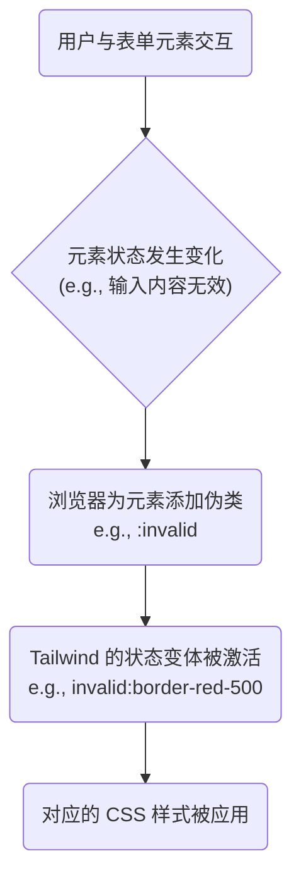

在 Web 开发中，为 HTML 表单提供清晰、即时的状态反馈是提升用户体验和可访问性的关键。传统 CSS 中，处理 `valid`, `invalid`, `focus`, `disabled` 等多种状态通常需要编写大量嵌套的、复杂的选择器。Tailwind CSS 通过其 **Utility-First (功能类优先)** 的哲学和强大的**状态变体 (State Variants)** 系统，极大地简化了这一过程。它允许开发者直接在 HTML 标记中，以声明式的方式为表单元素的各种状态定义样式，从而无需编写任何条件判断的 JavaScript 代码，显著提升了开发效率和代码的可维护性。

# 核心机制：状态变体 (State Variants)

Tailwind 的状态变体是一种特殊的前缀（如 `hover:`, `focus:`），当它被添加到一个功能类前面时，该功能类将只在特定状态下生效。对于表单元素，Tailwind 支持所有相关的 CSS 伪类作为变体。



## 验证状态

- **`valid:` / `invalid:`**: 基于 HTML5 的约束验证（如 `required`, `type="email"`, `pattern`）的结果来应用样式。
- **`user-invalid:` / `user-valid:`**: 这是 `:invalid` 和 `:valid` 伪类的变体，是更智能的验证。样式只在用户**已经与表单控件进行过显著交互**（例如，输入后失焦）且其值为无效/有效时才会应用。这避免了在用户刚看到表单时就显示一堆红色错误提示的糟糕体验。
- **`in-range:` / `out-of-range:`**: 针对设置了 `min` 和 `max` 属性的数字或日期输入框。

## 交互状态

- **`disabled:` / `enabled:`**: 应用于被禁用的或可用的表单控件。
- **`focus:`**: 当元素获得焦点时应用。
- **`focus-visible:`**: 仅在浏览器认为需要显示焦点指示器时（如键盘导航）应用，是实现可访问性焦点样式的最佳实践。
- **`checked:`**: 应用于被选中的复选框 (`<input type="checkbox">`) 或单选框 (`<input type="radio">`)。
- **`placeholder-shown:`**: 当输入框的占位符当前可见时（即用户还未输入任何内容）应用。
- **`autofill:`**: 应用于被浏览器自动填充的输入框。

> [!example] 状态变体的综合应用
> ```html
> <input 
>   type="email" 
>   required 
>   placeholder="you@example.com"
>   class="
>     border-gray-300 rounded-md
>     focus:border-blue-500 focus:ring-2 focus:ring-blue-200
>     disabled:bg-gray-100 disabled:cursor-not-allowed
>     user-invalid:border-red-500 user-invalid:text-red-700
>   "
> />
> ```
> 上述代码中，输入框在聚焦时边框变蓝，在禁用时背景变灰，在用户交互后如果输入内容无效，则边框和文字变红。

# 表单元素专用样式

Tailwind 还提供了一系列针对表单元素特定部分的功能类。

- **占位符 (`placeholder:`)**: 用于设置输入框占位符文本的样式。

```html
<input class="placeholder:italic placeholder:text-slate-400" placeholder="搜索..." type="text" />
```

- **文件输入按钮 (`file:`)**: 专用于美化 `<input type="file">` 元素中那个通常难以自定义的“选择文件”按钮。

```html
<input type="file" class="
  file:mr-4 file:py-2 file:px-4
  file:rounded-full file:border-0
  file:text-sm file:font-semibold
  file:bg-violet-50 file:text-violet-700
  hover:file:bg-violet-100
"/>
```

- **文本光标 (`caret-*`)**: 用于定义输入框中光标的颜色，如 `caret-blue-500`。

# 表单通用工具类与 v4 更新

## 通用工具类

- **样式重置**: 为了在不同浏览器中获得一致的表单外观，通常会使用官方的 `@tailwindcss/forms` 插件，它提供了一套合理的默认样式重置。
- **文本选择 (`select-*`)**: 通过 `select-all` (点击全选) 或 `select-none` (不可选) 等类控制文本的选中行为。
- **尺寸调整 (`resize-*`)**: 针对 `<textarea>`，用 `resize-none` (不可调整)、`resize-y` (仅垂直调整) 等控制其拉伸行为。

> [!info] Tailwind v4 的重要更新
> Tailwind v4 针对表单元素引入了一些新的特性和默认行为变更，以优化开发者体验和 UI 表现：
> - **字段尺寸**: 新增了 `field-sizing-content` 功能类，它映射到 `field-sizing: content` CSS 属性，可以让文本框（`input` 或 `textarea`）根据其内容自动增长。
> - **占位符颜色**: 默认的占位符颜色不再是固定的灰色，而是继承当前文本颜色的 50% 透明度，使其能更好地与自定义的文本颜色融合。
> - **按钮光标**: `button` 元素的默认光标从 `cursor-pointer` 变为了 `cursor-default`，鼓励开发者为**链接式**按钮（如 `<a>` 标签）保留 `pointer`，而为**操作式**按钮使用默认光标。
> - **轮廓可见性**: `outline-hidden` 在 Windows 高对比度等强制颜色模式下会保留轮廓，以保证可访问性。

