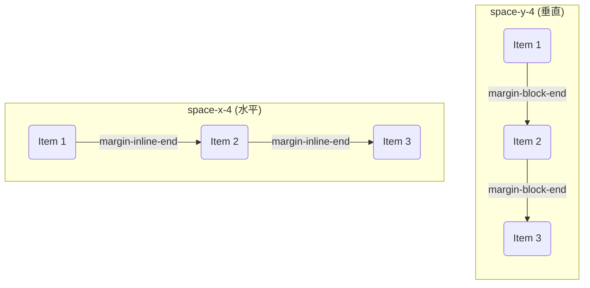

在 UI 开发中，为一组同级元素添加一致的间距或分隔线是一项核心任务。Tailwind CSS 提供了 `space` 和 `divide` 这两套功能类，旨在以一种优雅、声明式的方式解决此类问题。在 v4 版本中，这些工具的底层实现经过了重构，采用了更现代的 CSS 特性，如 CSS Nesting 和 `:where()` 伪类，使其在保持强大功能的同时，

# 底层实现机制：现代 CSS 特性的融合

Tailwind CSS v4 的 `space` 和 `divide` 功能类利用了一系列现代 CSS 特性，其逻辑更加精确和高效。

> [!note] v4 核心实现剖析
> 当使用 `space-y-4` 这样的类时，Tailwind v4 生成的 CSS 逻辑如下：
> ```css
> .space-y-4 {
>   :where(& > :not(:last-child)) {
>     --tw-space-y-reverse: 0;
>     margin-block-start: calc(1rem * var(--tw-space-y-reverse));
>     margin-block-end: calc(1rem * calc(1 - var(--tw-space-y-reverse)));
>   }
> }
> ```
> - **CSS Nesting (`& > ...`)**: 使用现代 CSS 嵌套语法，`&` 指代父选择器（`.space-y-4`）。
> - **`:not(:last-child)`**: 选择器精确地定位到**除最后一个之外的所有**直接子元素。
> - **`:where()` 伪类**: 这是关键的优化。`:where()` 内的选择器**特异性 (Specificity) 永远为零**。这意味着这些由 `space` 生成的 `margin` 规则，可以被任何带有哪怕最低特异性的自定义样式轻松覆盖，极大地提升了灵活性。
> - **逻辑属性 (Logical Properties)**: 使用 `margin-block-start` 和 `margin-block-end` 替代了 `margin-top` 和 `margin-bottom`，使布局能更好地适应不同的书写模式（如垂直文本）。

# `space` 功能类：智能的外边距

`space` 功能类用于在同级元素之间自动添加外边距，通过为除最后一个元素外的所有子元素添加“后置”外边距来实现。

- **`space-y-{amount}`**: 在垂直堆叠的元素之间，为**除最后一个之外的所有**直接子元素添加 `margin-block-end` (在水平书写模式下等同于 `margin-bottom`)。
- **`space-x-{amount}`**: 在水平排列的元素之间，为**除最后一个之外的所有**直接子元素添加 `margin-inline-end` (在从左到右模式下等同于 `margin-right`)。



> [!tip] 与 `gap` 的对比
> - **`gap`**: 必须在父容器上设置 `display: flex` 或 `display: grid`。这会**改变其内部的格式化上下文 (Formatting Context)**，所有子元素都会变为 flex 项或 grid 项，其布局行为会发生根本性变化。
> - **`space`**: **不要求父容器有特定的 `display` 类型**。它可以作用于任何遵循常规流的块级元素堆叠，而不会改变它们的格式化上下文。这使得 `space` 功能类更加通用和灵活。

# `divide` 功能类：优雅的分隔线

- **`divide-y-{amount}`**: 为**除最后一个之外的所有**直接子元素添加 `border-bottom-width`。
- **`divide-x-{amount}`**: 为**除最后一个之外的所有**直接子元素添加 `border-inline-end-width` (在从左到右模式下等同于 `border-right-width`)。
- **样式化**:
    - **颜色**: 分隔线的颜色由 **`divide-{color}`** 功能类控制，例如 `divide-slate-200`。
    - **样式**: 分隔线的样式由 `divide-solid` (默认), `divide-dashed` 等功能类控制。

