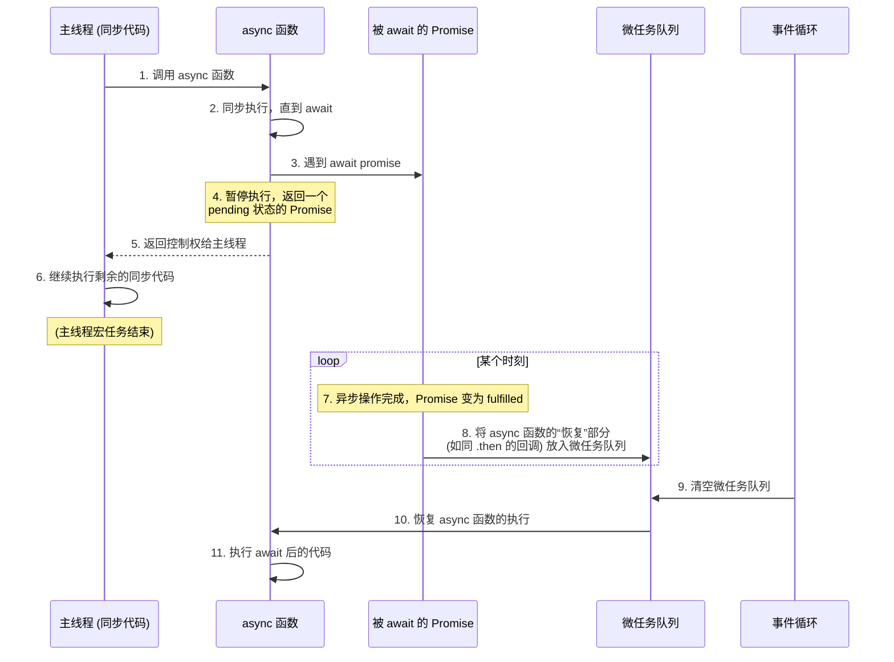

ES2017 引入的 `async/await` 是 JavaScript 异步编程的革命性特性。它并非一项全新的技术，而是建立在 `Promise` 和 `Generator` 之上的**语法糖**，旨在让我们能够以一种更接近同步代码的、更直观的方式来编写和理解异步逻辑。

# `async` 函数的基本规则

## `async` 函数的返回值

一个 `async` 函数**总是隐式地返回一个 `Promise` 对象**。其最终状态和值由函数体的执行结果决定：

- **正常返回**: 如果函数 `return` 了一个值 `x`，`async` 函数会返回一个 `fulfilled` 状态的 Promise，其值为 `x`。
- **无返回值**: 如果函数没有显式 `return`，会返回一个 `fulfilled` 状态的 Promise，其值为 `undefined`。
- **抛出异常**: 如果函数内部抛出了一个错误，会返回一个 `rejected` 状态的 Promise，其 reason 就是抛出的那个错误。
- **返回 Promise**: 如果函数 `return` 了一个 Promise，那么 `async` 函数的返回值就是那个 Promise。

## `await` 的使用环境

`await` 关键字只能在 `async` 函数内部使用。

> [!attention] 一个例外：顶层 `await`
> 在现代 JavaScript 模块 (`type="module"`) 的顶层作用域中，可以使用**顶层 `await` (Top-Level Await)**，而无需将其包裹在 `async` 函数中。
> ```js
> // 假设有一个返回 Promise 的函数，模拟获取数据
> async function fetchData() {
>   return new Promise((resolve) => {
>     setTimeout(() => resolve("从服务器获取的数据"), 1000);
>   });
> }
> 
> // 顶层 await 直接在模块顶层使用
> const data = await fetchData();
> console.log(data); // 1秒后输出: 从服务器获取的数据
> ```

# `await` 的核心执行机制：暂停与恢复

`await` 类似于 `Generator` 中的 `yield`，是一个暂停点，但其行为与 Promise 和微任务队列紧密相连。

## 暂停与控制权交还

当 `async` 函数的执行流遇到 `await expression` 时：

1. **执行表达式**: 引擎会**首先同步地执行** `await` 右侧的 `expression`。
2. **暂停函数**: 在 `expression` 执行完毕并返回一个值（通常是一个 Promise）后，`async` 函数的执行才会**暂停**。
3. **交还控制权**: 控制权被立即交还给调用 `async` 函数的上层执行上下文，允许主线程继续执行后续的同步代码，**因此它不会阻塞主线程**。

## 恢复与微任务队列

当 `await` 一个 `Promise` 时，JavaScript 引擎在后台实际上为这个 `Promise` 注册了一个回调 (通过 `.then()`)。`async` 函数中 `await` 语句之后的**所有代码**，都被置于这个回调中。因此，`async` 函数的“恢复”执行部分，会被放入**微任务队列**，等待当前宏任务及其所有同步代码执行完毕后，由事件循环负责处理。



> [!example] 代码示例与执行分析
> ```js
> // 一个返回 Promise 的函数，模拟异步操作
> function delay(ms) {
>   return new Promise(resolve => {
>     // setTimeout 会将 resolve 的调用安排到未来的一个宏任务中
>     setTimeout(() => resolve(`Resolved after ${ms}ms`), ms);
>   });
> }
> 
> async function asyncFunction() {
>   // 对应图中的步骤 2
>   console.log('B: async 函数开始');
> 
>   // 对应图中的步骤 3 & 4
>   const result = await delay(0); 
>   // await 让函数在此暂停，并将后续代码放入微任务
> 
>   // 对应图中的步骤 11
>   console.log(`D: ${result}`);
>   console.log('E: async 函数结束');
> }
> 
> console.log('A: 主线程脚本开始');
> 
> // 对应图中的步骤 1
> asyncFunction();
> 
> // 对应图中的步骤 5 & 6
> console.log('C: 主线程脚本结束');
> ```
> **代码的实际输出顺序**：
> ```
> A: 主线程脚本开始 
> B: async 函数开始 
> C: 主线程脚本结束 
> D: Resolved after 0ms 
> E: async 函数结束
> ```
> **执行顺序分解**：
> 1. **`A: 主线程脚本开始`** 被打印。
> 2. `asyncFunction()` 被调用 (图步骤1)，进入函数体，打印 **`B: async 函数开始`** (图步骤2)。
> 3. 遇到 `await delay(0)` (图步骤3)。`delay(0)` 被执行，一个 `setTimeout` 被安排到宏任务队列。`asyncFunction` 在此**暂停**，并将控制权交还给主线程 (图步骤4 & 5)。
> 4. 主线程继续执行，打印 **`C: 主线程脚本结束`** (图步骤6)。至此，**第一个宏任务（即主脚本）执行完毕**。
> 5. 事件循环检查微任务队列（当前为空），然后去宏任务队列取出 `setTimeout` 的回调并执行。
> 6. `setTimeout` 的回调执行 `resolve()`，`delay` 函数返回的 Promise 状态变为 `fulfilled` (图步骤7)。
> 7. Promise 的 `fulfilled` 状态，将 `asyncFunction` 中 `await` 后续的代码作为一个**微任务**推入微任务队列 (图步骤8)。
> 8. `setTimeout` 宏任务执行完毕。事件循环检查微任务队列，发现有一个任务。
> 9. 事件循环取出该微任务并执行，**恢复 `asyncFunction` 的执行** (图步骤9 & 10)。
> 10. `await` 表达式“解包”Promise 的结果，`result` 被赋值。
> 11. 打印 **`D: Resolved after 0ms`** 和 **`E: async 函数结束`** (图步骤11)。

## `await` 的返回值与错误处理

- **“解包” Promise**: `await` 表达式会“解开”或“提取” Promise 的结果。
    - 如果 Promise 变为 `fulfilled`，`await` 表达式的值就是那个 `fulfilled` 的**值**。
    - 如果 `await` 右侧不是一个 Promise，它会像 `Promise.resolve()` 一样，将其值直接返回。
- **抛出错误**: 如果 Promise 变为 `rejected`，`await` 表达式会**抛出**那个 `rejected` 的**原因 (reason)**。

> [!example] `try...catch`
> 这个“抛出错误”的特性，使得我们可以用非常自然的、同步风格的 `try...catch` 块来捕获和处理异步操作中发生的错误，这是对 `.then().catch()` 链式写法的重大改进。
> ```js
> async function fetchData() {
>   try {
>     // await 会暂停函数，等待 Promise 完成
>     const response = await fetch('/api/data');
>     if (!response.ok) {
>       throw new Error('Network response was not ok');
>     }
>     // await 会“解包” response.json() 返回的 Promise
>     const data = await response.json();
>     return data;
>   } catch (error) {
>     // 如果 fetch 或 .json() 任何一个环节的 Promise 被 reject,
>     // await 会将其作为异常抛出，被这里的 catch 捕获。
>     console.error('Fetch error:', error);
>   }
> }
> ```

