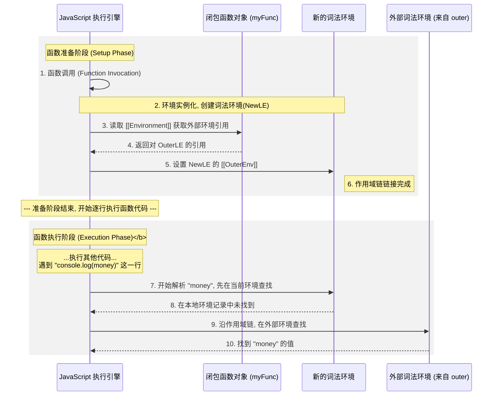
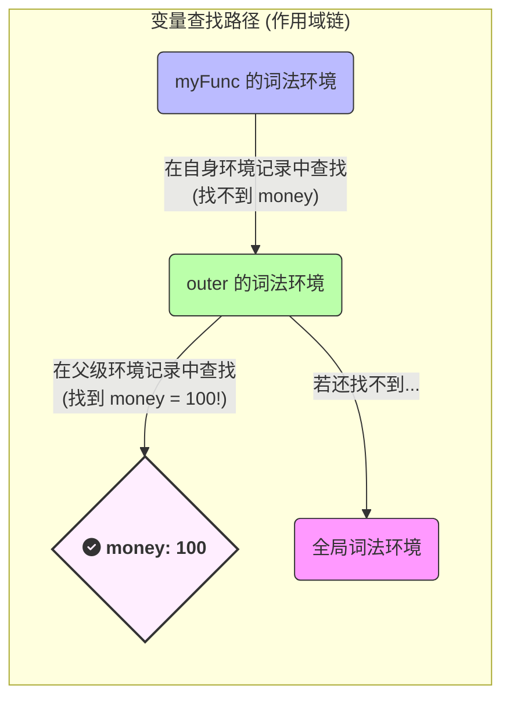

# 闭包与词法环境

**闭包 (Closure)** 的核心思想是：一个函数和它被创建时所处的**词法环境 (Lexical Environment)** 的绑定关系。这个函数“记住”了它被创建时的环境，因此即使在其他地方执行，也依然能访问那个环境中的变量。

> [!note] Lexical Environment (词法环境)
>
> **词法环境 (Lexical Environment)** 是在执行上下文中专门管理变量和作用域的部分，由两样东西组成：
>
> 1. **环境记录 (Environment Record)**：一个“字典”，存储当前作用域中所有的局部变量、函数等。
> 2. **外部词法环境的引用 (Outer Reference)**：一个“指针”，指向父级作用域的词法环境，从而将作用域链接起来。
>
> ```mermaid
> graph TD
>    subgraph "词法环境 (Lexical Environment)"
>        A["<b>环境记录 (Environment Record)</b><br/>存储 money, a, b 等变量"]
>        B("<b>外部词法环境的引用 (Outer)</b>") --> C["(指向父级词法环境)"]
>    end
> ```

# 闭包的生命周期

```js
function outer() {
  let money = 100;

  // 步骤 1: inner 函数被创建
  function inner() {
    console.log(money);
  }

  return inner;
}

// 步骤 2: outer() 执行完毕, outer 的环境被 inner 引用
const myFunc = outer();

// 步骤 3 & 4: myFunc 被调用，形成作用域链并开始查找变量
myFunc();
```

## 步骤 1: 函数创建 (定义时)

当 JavaScript 引擎读取到 `function inner() {...}` 时，会创建一个函数对象。这个函数对象内部会包含一个隐藏属性（规范中称为 `[[Environment]]`），该属性**引用**了它被**创建**时所处的词法环境，也就是 `outer` 的词法环境。

> [!info] 创建方式的特例：`new Function()`
> 需要注意的是，通过 `new Function(...)` 构造函数创建的函数是一个例外。它的 `[[Environment]]` **永远只会引用全局词法环境**，而不会引用它被定义时所在的局部环境。
>
> ```js
> function createFunc() {
>   let localValue = 100;
>   // 这个函数无法访问到 localValue，因为它的父级作用域是全局作用域
>   let dynamicFunc = new Function('return localValue');
>   try {
>     dynamicFunc();
>   } catch(e) {
>     console.error(e); // ReferenceError: localValue is not defined
>   }
> }
> createFunc();
> ```

## 步骤 2: 环境的幸存 (返回时)

`outer()` 函数执行完毕并返回 `inner` 函数。通常，`outer` 的执行上下文会从调用栈中弹出。**但是**，由于返回的 `inner` 函数的 `[[Environment]]` 属性仍然引用着 `outer` 的词法环境，垃圾回收机制发现这个环境仍被需要，所以**不会销毁它**。`money` 因此得以幸存。

## 步骤 3: 作用域链的形成 (调用时)

当 `myFunc()` (即 `inner`) 被调用时，一个新的执行上下文和新的词法环境为 `myFunc` 的本次调用而创建。这个新词法环境的“外部引用”指针，会被设置为 `myFunc` 函数对象“背包”里的那个引用——即 `outer` 的词法环境。

此刻，内存中的关系如下所示，一条**作用域链**就形成了：



## 步骤 4: 变量的查找

执行 `console.log(money)` 时，JavaScript 引擎会沿着刚刚形成的作用域链开始查找 `money`：



# `[[Environment]]` vs `[[Scopes]]`

这里有一个关键点需要区分理论和实际工具的展示：

- **`[[Environment]]`**: 这是 **ECMAScript 规范**中的官方术语。它是函数对象内部一个**单一的、底层的引用**，指向其被定义时的词法环境。它是闭包形成的“**因**”。

- **`[[Scopes]]`**: 这是在**浏览器开发者工具**（如 Chrome DevTools）中 `console.dir` 一个函数时看到的属性。它不是 `[[Environment]]` 本身，而是浏览器为了方便开发者调试，**解析** `[[Environment]]` 引用后，将整个**作用域链**以一个可视化的列表形式呈现出来的结果。它是闭包作用的“**果**”。

