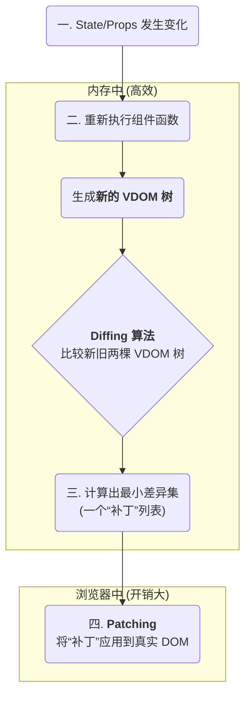

现代前端框架（如 React, Vue）的出现，标志着 UI 开发范式从命令式的 DOM 操作，向声明式的组件化架构演进。这一转变的核心在于引入了两大关键抽象：**UI 组件 (UI Component)** 和**虚拟 DOM (Virtual DOM)**。组件将 UI 划分为独立的、可复用的单元，而虚拟 DOM 则提供了一个高效的、内存中的 UI 表示，极大地优化了状态变更时的渲染性能。

# UI 组件：状态到视图的映射函数

在现代 UI 架构中，一个 UI 组件本质上可以被视为一个函数，其核心职责是根据输入的状态 (State) 和属性 (Props)，返回一个对用户界面的**声明式描述**。

> [!note] UI as a Function
> 这一核心思想可以用一个纯函数公式来表达：
> 
> `UI = f(State)`。 
> 
> 在此模型中，开发者只需关注如何根据当前的状态来“声明”UI 应该是什么样子，而无需关心如何通过一步步的 DOM 操作来“实现”这个样子。

这个由组件函数返回的“声明式描述”并非真实的 DOM 节点，而是一个轻量级的 JavaScript 对象，即虚拟 DOM 节点。

# 虚拟 DOM (Virtual DOM)：UI 的内存表示

虚拟 DOM (VDOM) 是一种编程概念，它将 UI 的结构、属性和内容以一个轻量级的、树状的 JavaScript 对象结构保存在内存中。这个对象树是对真实 DOM 树的一个抽象副本。

- **声明式**: 开发者通过编写 JSX 或模板语法，以声明式的方式描述 UI 结构，这些语法最终会被编译成创建 VDOM 树的函数调用（例如 `React.createElement()`）。
- **结构**: VDOM 树的每个节点都是一个 JavaScript 对象，精确地描述了对应真实 DOM 节点的类型、属性和子节点。

```js
// JSX 声明
const vdomNode = (
  <div id="container" className="parent">
    <h1>Hello, Virtual DOM</h1>
    <p>This is a paragraph.</p>
  </div>
);

// 上述 JSX 实际对应的 VDOM 对象结构 (简化示例)
const vdomObject = {
  type: 'div',
  props: {
    id: 'container',
    className: 'parent',
    children: [
      { type: 'h1', props: { children: 'Hello, Virtual DOM' } },
      { type: 'p', props: { children: 'This is a paragraph.' } }
    ]
  }
};
```

> [!tip] 为什么需要虚拟 DOM？
> 直接操作真实 DOM 的开销是巨大的。每次对 DOM 的修改都可能触发浏览器的**重排 (Reflow)** 和**重绘 (Repaint)**，这是导致性能瓶颈的主要原因。虚拟 DOM 通过在内存中进行计算，将多次状态变更合并为一次最小化的真实 DOM 操作，从而极大地提升了渲染性能。

# 协调 (Reconciliation)：从 VDOM 到真实 DOM

当组件的状态发生变化时，框架会重新执行组件函数，生成一棵**新的 VDOM 树**。此时，**协调 (Reconciliation)** 算法便开始工作，它负责高效地将新旧两棵 VDOM 树的差异计算出来，并以最小的代价更新到真实的 DOM 上。这个过程通常被称为“**Diffing and Patching**”。



协调算法遵循一套启发式规则以保证比较的高效性，例如：

- **同层比较**: 只对同一层级的节点进行比较，不会跨层级移动节点。
- **类型不同则销毁重建**: 如果两个节点的类型不同（例如 `<div>` 变为 `<p>`），则直接销毁旧节点及其所有子节点，创建新节点。
- **key 属性**: 对于列表等动态节点，通过唯一的 `key` 属性来高效地识别节点的移动、增删，避免不必要的销毁和重建。

> [!example] 协调过程示例
> 假设状态变化导致 `<p>` 标签的文本内容改变。
> 1. **旧 VDOM**: `{ type: 'p', props: { children: '旧文本' } }`
> 2. **新 VDOM**: `{ type: 'p', props: { children: '新文本' } }`
> 3. **Diffing**: 算法比较后发现，只有 `children` 属性发生了变化。
> 4. **Patching**: 生成一个补丁，如 `element.textContent = '新文本'`，并只对这一个真实 DOM 节点执行更新操作。

