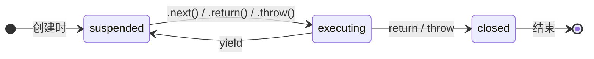
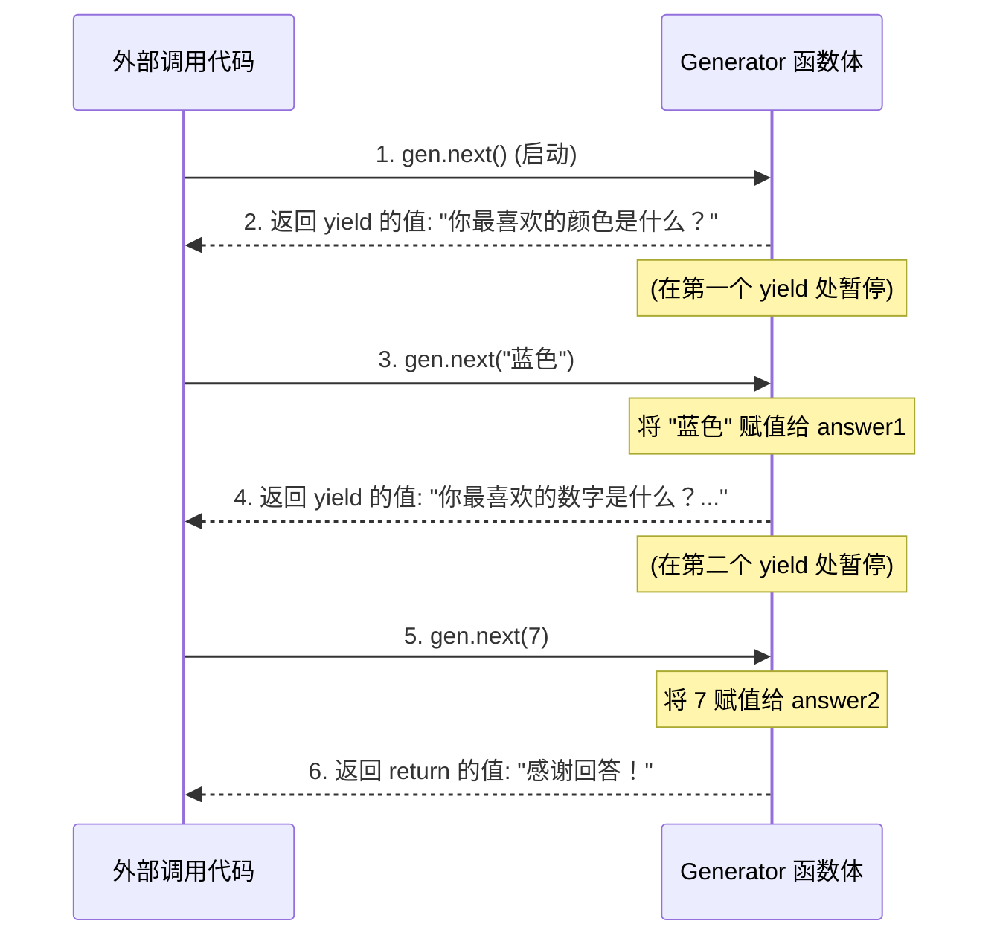

ES6 引入的**生成器函数 (Generator Function)** 是 JavaScript 中一个革命性的特性。它通过 `function*` 和 `yield` 关键字，为我们提供了一种可以**暂停和恢复执行**的函数。这使得 JavaScript 首次拥有了“协程 (Coroutine)”级别的能力，允许开发者在函数执行过程中交出和恢复控制权，是理解迭代器协议、乃至现代 `async/await` 语法的基石。

# Generator 的核心机制

## 创建与激活

Generator 函数通过在 `function` 关键字后添加星号 `*` 来定义。调用一个生成器函数并**不会立即执行其函数体**，而是会**立刻返回一个迭代器对象 (Iterator)**，我们通常称之为**生成器对象**。

```js
function* myGenerator() {
  console.log("Generator body started");
  yield 'first pause';
  console.log("Generator body resumed");
}

// 调用生成器函数，立即返回一个生成器对象
const gen = myGenerator(); // "Generator body started" 不会在此处打印

// 直到第一次调用 .next()，函数体才开始执行
gen.next(); // 输出: "Generator body started"
// 返回 { value: 'first pause', done: false }
```

> [!note] 执行上下文 (Execution Context) 与调用栈 (Call Stack)
> 第一次调用 `.next()` 会创建并压入一个新的**执行上下文 (Execution Context)** 到**调用栈 (Call Stack)** 中，生成器函数体开始执行。但随后调用 `.next()` **不会**创建新的执行上下文或压入新的调用栈帧，而是**复用**之前为该生成器创建的执行上下文，从暂停处恢复执行。

## 状态与控制

生成器对象内部维护着一个**状态机**。其核心状态（规范中称为 `[[GeneratorState]]`）包括：

- `suspended`: 暂停状态。在 `yield` 表达式处暂停，等待下一次 `next()` 调用。
- `executing`: 正在执行状态。
- `closed`: 已关闭状态。函数已执行完毕（遇到 `return` 或执行到末尾）或被提前终止。

我们可以通过生成器对象的三个核心方法来控制这个状态机：`next()`, `return()`, `throw()`。



# `yield`：暂停与双向通信

`yield` 关键字是 Generator 的核心，它提供了暂停执行和双向通信的能力。

## `yield` 的暂停与输出

当执行流遇到 `yield` 表达式时，它会暂停函数的执行，并将 `yield` 右侧表达式的值作为返回的迭代器结果对象 `{ value, done }` 中的 `value`。

```js
function* counter() {
  yield 1;
  yield 2;
}
const gen = counter();
console.log(gen.next()); // { value: 1, done: false }
console.log(gen.next()); // { value: 2, done: false }
console.log(gen.next()); // { value: undefined, done: true }
```

## `next(value)` 的输入与双向通信

`yield` 表达式本身是有返回值的。它的返回值由**下一次**调用 `next()` 时传入的参数决定。这实现了从外部向生成器内部传递数据的双向通信。

> [!attention] 关键点
> **首次**调用 `next()` 传入的参数会被忽略，因为它仅用于启动生成器。

```js
function* questionAsker() {
  const answer1 = yield "你最喜欢的颜色是什么？"; // yield 表达式
  console.log(`你的回答是: ${answer1}`);
  
  const answer2 = yield `你最喜欢的数字是什么？ (基于 ${answer1})`;
  console.log(`你的回答是: ${answer2}`);
  
  return "感谢回答！";
}

const gen = questionAsker();

// 启动生成器，并获取第一个问题
const question1 = gen.next().value; 
console.log(question1); // "你最喜欢的颜色是什么？"

// 传入 "蓝色" 作为上一个 yield 表达式的返回值
const question2 = gen.next("蓝色").value;
// "你的回答是：蓝色"
console.log(question2); // "你最喜欢的数字是什么？ (基于 蓝色)"

// 传入 7 作为上一个 yield 表达式的返回值
const finalResult = gen.next(7).value;
// "你的回答是：7"
console.log(finalResult); // "感谢回答！"
```



# 控制 Generator 的生命周期

## `generator.return(value)`: 提前终止

调用 `return(value)` 会使生成器立即进入 `closed` 状态，如同在当前 `yield` 的位置执行了 `return value`。

```js
const gen = counter();
console.log(gen.next());          // { value: 1, done: false }
console.log(gen.return('提前结束')); // { value: "提前结束", done: true }
console.log(gen.next());          // { value: undefined, done: true }
```

## `generator.throw(error)`: 注入异常

调用 `throw(error)` 会在生成器当前暂停的 `yield` 处，向其内部注入一个异常。如果生成器内部没有 `try...catch` 块来捕获这个异常，异常会沿着调用栈向外抛出。

# Generator 与迭代协议

生成器对象天生就实现了**可迭代协议 (Iterable Protocol)** 和**迭代器协议 (Iterator Protocol)**。这意味着：

- 它可以被 `for...of` 循环直接消耗。
- 它可以被 `...` 展开运算符、`Array.from()` 等接受可迭代对象的原生语法使用。

> [!tip] `return` 值在 `for...of` 中的行为
> 当生成器通过 `return` 语句结束时，`return` 的值会作为最后一次 `next()` 调用的结果对象中的 `value`，此时 `done` 为 `true`。例如 `return 'done'` 会产生 `{ value: 'done', done: true }`。
> 
> 然而，`for...of` 循环的迭代条件是 `!result.done`。因此，它**会自动忽略** `done: true` 的这次结果，不会处理其 `value`。
> 
> ```js
> function* myGenWithReturn() {
>   yield 'a';
>   yield 'b';
>   return 'c';
> }
> 
> for (const val of myGenWithReturn()) {
>   console.log(val); // 只会依次输出 "a", "b"
> }
> 
> console.log(...myGenWithReturn()); // 只会展开 "a", "b"
> ```

