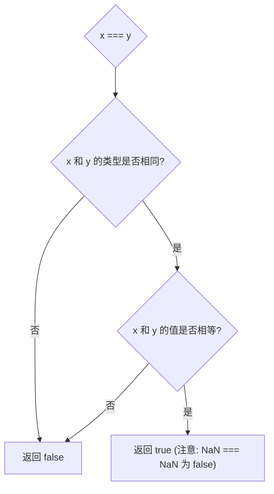
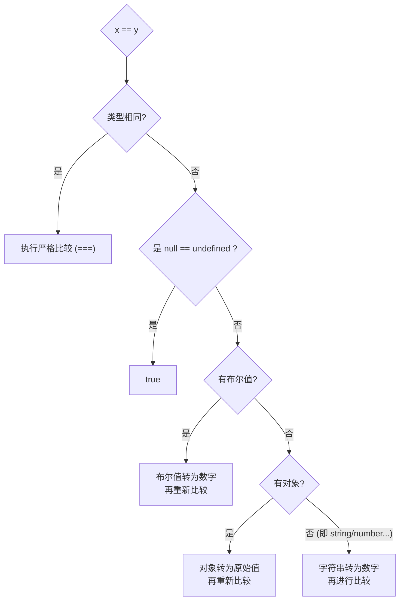

# 严格相等 (`===`)：可预测的“全等”准则

`===` 被称为严格相等运算符或“全等”运算符。它的核心是**拒绝任何类型转换**，追求简单、可预测的结果，是代码健壮性的首选。

## 严格相等比较算法 (Strict Equality Comparison)

其算法可以概括为两个核心步骤：



1. **类型检查**：如果比较的两个值 `x` 和 `y` 的**类型不同**，则**直接返回 `false`**。
2. **值比较**：如果类型相同，则进行同类型的值比较。
    - **原始类型**：比较值是否完全相等。 (**特殊情况**：`NaN === NaN` 返回 `false`。这是 `NaN` 的特性，它不等于任何值，包括它自身。)
	- **对象类型**：比较**引用 (内存地址)** 是否指向同一个对象。两个独立创建、内容相同的对象，它们的引用不同，因此比较结果为 `false`。

```js
// 类型不同
'10' === 10;         // false

// 类型相同，值不同
10 === 20;           // false

// 类型相同，值相同 (引用类型)
const arr1 = [];
const arr2 = [];
arr1 === arr2;       // false (它们在内存中的地址不同)

const refArr = arr1;
arr1 === refArr;     // true (引用同一个对象)
```

# 抽象相等 (`==`)：隐式转换的艺术

`==` 被称为抽象或宽松相等运算符。它的复杂性源于其在比较不同类型的值时，会遵循一套精密的**隐式类型转换**规则。

## 抽象相等比较算法 (Abstract Equality Comparison)

下面是 ECMAScript 规范中定义的、`x == y` 的核心比较流程（按优先级顺序）：



1. **类型相同？** 如果 `x` 和 `y` 类型相同，则直接执行严格相等比较 (`===`)。
2. **`null` 与 `undefined`？** 如果 `x` 是 `null` 而 `y` 是 `undefined`（或反之），则返回 `true`。这是规范中的一条特殊规则。
3. **字符串与数字？** 如果一个是字符串，一个是数字，则将**字符串**通过内部的 `ToNumber()` 操作转换为数字，然后再次进行比较。
    - `'10' == 10` → `10 == 10` → `true`
4. **布尔值参与比较？** 如果其中一个是布尔值，则先将**布尔值**通过 `ToNumber()` 转换为数字（`true` → `1`, `false` → `0`），然后再次进行比较。
    - `true == '1'` → `1 == '1'` → `1 == 1` → `true`
5. **对象与原始类型？** 如果一个是对象，另一个是原始类型，则将**对象**通过内部的 `ToPrimitive()` 操作转换为原始值，然后再次进行比较。
    - `[10] == '10'` → `'10' == '10'` → `true` (数组 `[10]` 通过 `ToPrimitive` 变为字符串 `'10'`)

> [!note] 递归算法
> 这个算法是**递归**的。例如，在第4步中，布尔值转换为数字后，可能会产生一个新的“字符串与数字”的比较，此时会再次应用第3步的规则。

# 经典案例深度剖析

## 案例一：`[] == ![]` 为什么是 `true`？

这个看似怪异的结果，是抽象相等算法多步骤应用的完美体现。

1. **`!` 逻辑非运算符 (优先级最高)**
    
    - `[]` 是一个对象，在布尔上下文中为“真值 (truthy)”。
    - 因此 `![]` 首先被求值为 `false`。
    - 表达式变为: `[] == false`
  
2. **布尔值参与比较 (规则 #4)**
    
    - `false` 被 `ToNumber()` 转换为 `0`。
    - 表达式变为: `[] == 0`
  
3. **对象与原始类型 (规则 #5)**
    
    - 左侧的 `[]` 对象需要通过 `ToPrimitive()` 转换为原始值。
    - 数组的 `ToPrimitive` 默认行为是调用其 `toString()` 方法，得到一个空字符串 `''`。
    - 表达式变为: `'' == 0`
  
4. **字符串与数字 (规则 #3)**
    
    - 空字符串 `''` 被 `ToNumber()` 转换为 `0`。
    - 表达式变为: `0 == 0`

## 案例二：`[] == []` 为什么是 `false`？

这遵循**规则 #1**。由于两边的类型相同（都是 `object`），比较会退化为严格相等 (`===`)。因为它们是两个在内存中独立创建的数组对象，其引用地址不同，所以返回 `false`。

