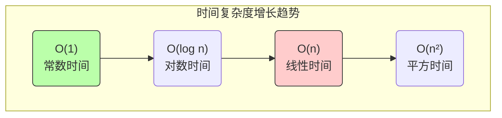
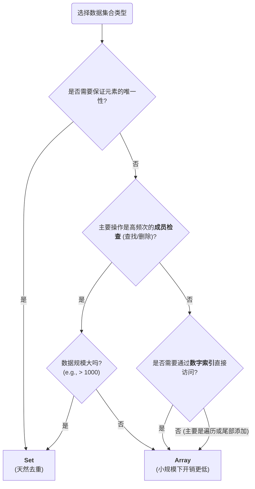

在 JavaScript 中，`Array` 和 `Set` 都是用于存储数据集合的核心内置对象。从理论上的时间复杂度分析，`Set` 在元素的查找、添加和删除操作上具有 O(1) 的显著优势，而 `Array` 的相应操作则为 O(n)。然而，在真实的 V8 等 JavaScript 引擎中，性能表现并非仅由理论复杂度决定。底层数据结构、内存布局以及操作的固定开销（constant factor）共同影响着它们在不同场景下的实际性能。

# 理论基础：时间复杂度 (Time Complexity)

时间复杂度是衡量算法执行时间随输入数据规模增长而增长的趋势。

`Array` 和 `Set` 在常见操作上的理论复杂度差异显著：

| 操作 (Operation)                            | `Array`       | `Set`         |
| ----------------------------------------- | ------------- | ------------- |
| **添加 (尾部)**: `arr.push(v)` / `set.add(v)` | **O(1)** (摊销) | **O(1)** (平均) |
| **添加 (头部)**: `arr.unshift(v)`             | **O(n)**      | (不适用)         |
| **查找**: `arr.includes(v)`                 | **O(n)**      | **O(1)** (平均) |
| **删除**: `arr.splice(i,1)`                 | **O(n)**      | **O(1)** (平均) |
| **按索引访问**: `arr[i]`                       | **O(1)**      | (不适用)         |

从理论上看，`Set` 在处理需要频繁增、删、查的动态集合时，具有压倒性的算法优势。

# 底层实现与性能权衡

`Set` 并非在所有情况下都比 `Array` 快，结论来源于它们截然不同的底层实现。

## `Array`：连续内存与直接访问

`Array` 在 V8 等现代引擎中通常被实现为**连续的内存空间**。

- **优势**:
    - **内存局部性 (Memory Locality)**: 数据紧凑地存储在一起，可以被 CPU 缓存高效地读取，遍历操作极快。
    - **索引访问**: 通过索引 `arr[i]` 访问元素是 O(1) 的，因为引擎可以直接通过数学计算 (`基地址 + i * 元素大小`) 定位到内存地址。
- **劣势**:
    - **查找/删除/头部插入**: 这些操作需要遍历数组来找到目标或移动元素以填补/创造空间，导致 O (n) 的时间复杂度。

## `Set`：哈希表与间接访问

`Set` 的核心是**哈希表 (Hash Table)** 数据结构。

- **优势**:
    - **O(1) 查找**: 通过哈希函数，可以将一个值直接映射到其在内存中的存储位置，从而实现近乎常数时间的查找、添加和删除。
- **劣势**:
    - **固定开销 (Constant Factor)**: `Set` 的每一次操作都伴随着相对较高的固定开销，包括：
        1. **哈希计算**: 需要为被操作的值计算哈希值。
        2. **去重检查**: 需要检查该位置是否已有元素，并处理哈希冲突。
        3. **内存分配**: 其内存是非连续的，可能导致更多的缓存未命中 (cache miss)。

> [!note] 常数因子 K 的影响
> 算法复杂度中的 `O(1)` 或 `O(n)` 隐藏了一个**常数因子 k**。对于 `Set` 的 O (1) 操作，其真实开销是 `k_set * 1`；对于 `Array` 的 O (n) 查找，其开销是 `k_array * n`。
>
> `k_set`（哈希计算等开销）远大于 `k_array`（简单的指针移动和比较）。因此，当 `n` 非常小时，`k_array * n` 的总开销**可能小于** `k_set * 1`。

# 决策指南：何时选择 Array 或 Set

