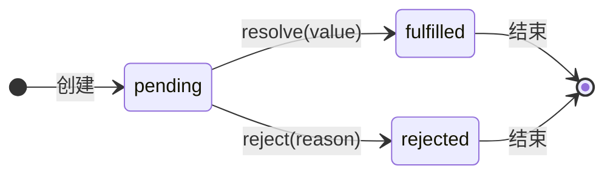

# Promise

**Promise** 是 JavaScript 中处理异步操作的核心对象。它代表一个尚未完成但最终会完成（或失败）的操作及其结果值。可以将它理解为一个“承诺”或一个未来值的“占位符”。

以 `fetch` 为例，当我们调用 `fetch('/api')` 时，会执行两件事：

1. **浏览器层面**：浏览器的网络模块（通常底层是通过 **XMLHttpRequest (XHR)** 或更新的 **Fetch API** 实现）接收指令，在后台发起一个真实的 HTTP 网络请求。
2. **JS 层面**：`fetch` 函数会**立即、同步地**返回一个 **Promise 对象**。这个对象此时的状态是 **`pending` (进行中)**，它承诺在未来网络请求有结果时通知我们。

> [!hint] XHR/Fetch
>
> - `XMLHttpRequest (XHR)` 是较早的浏览器 API，支持几乎所有浏览器版本，底层稳定可靠。
> - `Fetch API` 是现代浏览器提供的更简洁 Promise 风格封装，语法更直观，但在较旧的浏览器（如 IE）中不支持，通常需使用 [polyfill](https://github.com/github/fetch)。
> - 实际中，许多浏览器内部实现的 `fetch` 仍可能**基于 `XHR`**，但它们的接口和使用体验是完全不同的。

## Promise 的内部结构

一个 Promise 对象在内部维护着它的状态和结果，可以通过一个心智模型来理解其核心构成：

- **`[[PromiseState]]`**: 内部状态，**状态一旦改变，就不能再变**。有三种可能：
  - `pending`：进行中，初始状态。
  - `fulfilled`：已成功，操作成功完成。
  - `rejected`：已失败，操作失败。



- **`[[PromiseResult]]`**: 内部结果，存储着操作成功后的**值 (value)** 或失败后的**原因 (reason)**。

- **`[[PromiseFulfillReactions]]` / `[[PromiseRejectReactions]]`**: 两个内部列表，用于存放通过 `.then()` 或 `.catch()` 注册的、将在 Promise 状态变为 `fulfilled` 或 `rejected` 后执行的**回调函数**。

> [!tip] 注册回调
>
> 我们通过 `.then()` 和 `.catch()` 方法来“订阅” Promise 的最终结果。
>
> - `.then(onFulfilled, onRejected)`: 分别注册成功和失败的回调。
> - `.catch(onRejected)`: 只是 `.then(null, onRejected)` 的语法糖，专门用于注册失败回调。

> [!example] `new Promise` 的执行器是同步的
>
> 传递给 `new Promise` 的执行器函数 `(resolve, reject) => { ... }` 会在 Promise 实例被创建时**立即、同步地**执行，并不会被放入任何异步队列。
> ```js
> console.log('1. Script start');
> new Promise((resolve, reject) => {
>  console.log('2. Promise executor executed synchronously');
>  resolve();
> });
> console.log('3. Script end');
> // 输出顺序: 1, 2, 3
> ```

## 链式调用

每当调用 `.then` 或 `.catch` 时，它都会**返回一个全新的 Promise 对象**。这个特性是实现链式调用的基础，它允许我们将多个异步操作优雅地串联起来。

```js
const promise1 = fetch('/api/data');

// promise2 是 .then() 返回的一个全新的 Promise
const promise2 = promise1.then(data => {
  console.log(data);
  return 'some new value'; // 这个返回值会成为 promise2 的成功结果
});

// promise3 是第二个 .then() 返回的又一个全新的 Promise
const promise3 = promise2.then(newValue => {
  console.log(newValue); // 输出 'some new value'
});
```

## 静态组合方法

`Promise` 对象提供了一系列强大的静态方法，用于处理多个 Promise 的组合情况，以满足复杂的并发或竞争需求。

### `Promise.all()`

`Promise.all(iterable)` 方法用于处理多个 Promise 的**并行**执行，并等待**所有** Promise 都成功。

- **成功条件**: 传入的所有 Promise 都变为 `fulfilled`。最终 `Promise.all` 返回的 Promise 会 `fulfilled`，其值为一个包含了所有输入 Promise 结果的**数组**（顺序与输入顺序一致）。
- **失败条件**: 只要有一个 Promise 变为 `rejected`，`Promise.all` 会**立即 `rejected`**，其原因就是第一个失败的 Promise 的原因。所有其他 Promise 的结果都会被忽略。

### `Promise.allSettled()`

`Promise.allSettled(iterable)` 同样并行执行多个 Promise，但它会等待**所有** Promise 都“尘埃落定”（`settled`），无论其最终状态是成功还是失败。

- **行为**: 它**永远不会 `rejected`**。它总是在所有输入的 Promise 都完成后 `fulfilled`。
- **返回值**: 其成功的值是一个对象数组，每个对象都描述了对应 Promise 的最终结果，格式为：
  - 成功: `{ status: 'fulfilled', value: result }`
  - 失败: `{ status: 'rejected', reason: error }`

### `Promise.race()`

`Promise.race(iterable)` 方法会返回一个 Promise，这个 Promise 的状态会与第一个“尘埃落定”的 Promise 的状态**保持一致**。

- **行为**: 就像一场赛跑，谁第一个到达终点（无论是成功 `fulfilled` 还是失败 `rejected`），`Promise.race` 就采纳谁的结果，并忽略所有其他“跑得慢”的 Promise。
- **平局规则**: 如果多个 Promise 在同一时间点 `settle`（在代码层面，通常指同步的 Promise），则会选择在传入的迭代器中**排序靠前**的那个。

### `Promise.any()`

`Promise.any(iterable)` 类似于 `race`，但它只关心“成功”。

- **成功条件**: 等待第一个 `fulfilled` 的 Promise。一旦有一个 Promise 成功，`Promise.any` 就会立即 `fulfilled`，其值就是那个成功 Promise 的值。
- **失败条件**: 只有当**所有**传入的 Promise 都 `rejected` 时，`Promise.any` 才会 `rejected`。
- **特殊的失败原因**: 其失败的原因不是一个普通的错误，而是一个 `AggregateError` 对象，这个对象的 `errors` 属性是一个数组，包含了所有 Promise 的失败原因。


# Event Loop：异步的调度中心

当一个 Promise 准备就绪（例如，网络请求已返回），它的回调函数并不会立即执行。相反，它会被放入一个特定的队列，等待 Event Loop 的调度。

JavaScript 的异步机制由**宏任务 (Macrotask)** 和 **微任务 (Microtask)** 共同驱动：

- **宏任务 (Macrotask)**: 包括 `script` (整个脚本)、`setTimeout`、`setInterval`、I/O 操作、UI 事件等。
- **微任务 (Microtask)**: 包括 `Promise.prototype.then/catch/finally`、`queueMicrotask` 等。

> [!important] 执行一个宏任务 -> 清空所有微任务
>
> 在任意一个事件循环周期 (tick) 中，引擎会先从**宏任务队列**中取**一个**任务执行 (第一个是 `script`)。在该宏任务执行完毕后，引擎会**立即**检查并**清空整个微任务队列**，然后才可能进行UI渲染，并接着开始下一个宏任务。
>
> ```mermaid
> graph TD
>     subgraph Event Loop 循环
>         direction LR
>         A(开始) --> B{宏任务队列有任务?}
>         B -- "有" --> C[取一个宏任务执行]
>         C --> D{微任务队列有任务?}
>         D -- "有" --> E[循环清空所有微任务]
>         E --> F[UI 渲染]
>         F --> B
>         D -- "没有" --> F
>         B -- "没有" --> G(等待新任务)
>         G --> B
>     end
> ```

