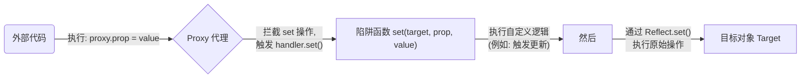
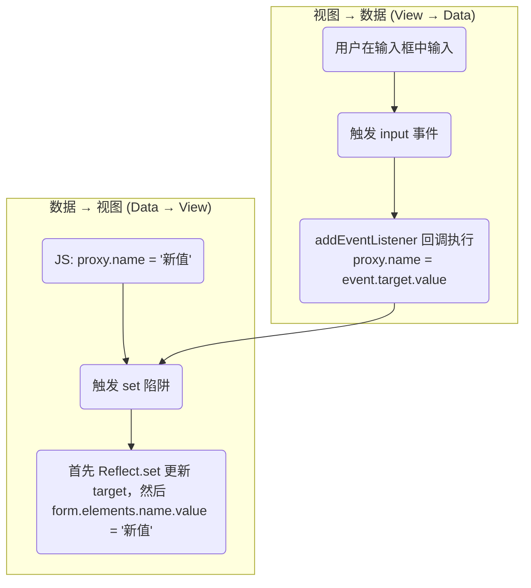

ECMAScript 2015 (ES6) 引入的 `Proxy` 对象，是 JavaScript 元编程（Metaprogramming）能力的革命性体现。它允许我们创建一个“代理”，从而拦截并自定义对目标对象的基本操作（如属性查找、赋值、枚举、函数调用等）。这种强大的拦截能力，使其成为实现数据绑定、响应式系统、验证、日志记录等高级模式的基石。

# `Proxy` 与 `Reflect`：核心机制

`Proxy` 的基本语法是 `new Proxy(target, handler)`，它接收两个参数：

- **`target`**: 被代理的目标对象。可以是任何类型的对象，包括数组、函数等。
- **`handler`**: 一个配置对象，其属性是用于拦截具体操作的“陷阱 (trap)”函数。

`Reflect` 是一个与 `Proxy` 配套使用的内置对象，它提供了一套与 `Proxy` 陷阱同名、行为与原始操作一致的静态方法（如 `Reflect.get()`、`Reflect.set()`）。在 `Proxy` 陷阱中使用 `Reflect` 方法来执行原始操作，被认为是最佳实践，因为它能正确处理 `this` 指向和返回值等复杂情况。



> [!example] 正确处理 `this`（getter 示例）
> ```js
> const target = {
>   _name: 'Alice',
>   get name() {
>     return this._name.toUpperCase();
>   }
> };
> const handler = {
>   get(target, property, receiver) {
>     return Reflect.get(target, property, receiver);
>   }
> };
> const proxy = new Proxy(target, handler);
> 
> console.log(proxy.name); // 输出: ALICE
> ```
> 
> - 如果直接用 `return target[property]`，`this` 可能指向 `target` 而不是 `proxy`，导致 getter 行为异常。
> - `receiver` 是 JavaScript 中 `Proxy` 和 `Reflect` 上下文中用于指定属性操作时 this 指向的对象，通常由 Proxy ` ` 自动传递给陷阱函数（如 `get` 或 `set` ， 其值一般是 `Proxy` 实例本身或其继承对象。
> - `Reflect.get` 的 `receiver` 参数确保 `this` 指向 Proxy 实例，正确触发 getter。

# 应用一：构建响应式系统

`Proxy` 的 `set` 陷阱是现代前端框架（如 Vue 3）响应式系统的核心。其原理是在数据被修改时，自动触发一个通知，从而驱动依赖该数据的视图或其他逻辑进行更新。

**实现机制**：

1. 使用 `Proxy` 包装一个状态对象 `state`。
2. 在 `handler` 的 `set` 陷阱中，首先通过 `Reflect.set` 更新目标对象的值。
3. 如果更新成功，则执行一个“更新通知”函数（`onUpdate`），将变更的属性和新值传递出去。
4. 外部系统（如 UI 组件）可以订阅这些通知，以进行响应式更新。

```html
<!DOCTYPE html>
<html>
<head>
  <title>Reactive Web Component</title>
</head>
<body>
  <!-- 定义 template 用于 Custom Element 的 Shadow DOM -->
  <template id="reactive-display-template">
    <style>
      .container {
        border: 1px solid #ccc;
        padding: 10px;
        border-radius: 5px;
      }
      .property {
        font-weight: bold;
      }
    </style>
    <div class="container">
      <p>属性: <span class="property">等待更新...</span></p>
      <p>值: <span class="value">等待更新...</span></p>
    </div>
  </template>

  <!-- 使用自定义元素 -->
  <reactive-display></reactive-display>

  <script>
    /**
     * 创建一个响应式代理对象
     * @param {object} obj - 被代理的目标对象
     * @param {function} onUpdate - 数据更新时触发的回调
     * @returns {Proxy} - 响应式代理对象
     */
    function createReactive(obj, onUpdate) {
      return new Proxy(obj, {
        set(target, property, value, receiver) {
          // 使用 Reflect.set 执行原始赋值操作，确保 this 绑定正确
          const success = Reflect.set(target, property, value, receiver);
          if (success) {
            // 调用传入的 onUpdate 回调
            onUpdate({ property, value });
            // 分发 stateUpdate 事件
            window.dispatchEvent(new CustomEvent('stateUpdate', {
              detail: { property, value }
            }));
          }
          return success; // set 陷阱必须返回布尔值
        }
      });
    }

    // 定义 Custom Element
    class ReactiveDisplay extends HTMLElement {
      constructor() {
        super();
        // 创建 Shadow DOM
        const shadow = this.attachShadow({ mode: 'open' });
        // 获取 template 并克隆内容
        const template = document.getElementById('reactive-display-template');
        const templateContent = template.content.cloneNode(true);
        // 将 template 内容插入 Shadow DOM
        shadow.appendChild(templateContent);
      }

      connectedCallback() {
        // 监听 stateUpdate 事件，更新 Shadow DOM
        window.addEventListener('stateUpdate', (event) => {
          const { property, value } = event.detail;
          // 更新 Shadow DOM 中的 UI
          const propertySpan = this.shadowRoot.querySelector('.property');
          const valueSpan = this.shadowRoot.querySelector('.value');
          propertySpan.textContent = property;
          valueSpan.textContent = JSON.stringify(value);
        });
      }

      disconnectedCallback() {
        // 可选：移除事件监听器以避免内存泄漏
        // 由于使用 window 作为事件目标，这里无需移除，除非绑定到其他 EventTarget
      }
    }

    // 注册 Custom Element
    customElements.define('reactive-display', ReactiveDisplay);

    // ---- 使用示例 ----
    const state = createReactive({ count: 0, user: null }, (update) => {
      console.log(`[Reactivity] 属性 '${update.property}' 更新为 ${update.value}。准备更新UI...`);
      // 分发事件已在 createReactive 中处理
    });

    // 测试
    state.count++; // 输出: [Reactivity] 属性 'count' 更新为 1。准备更新UI...
    // Shadow DOM 更新为: 属性: count, 值: 1
    state.user = { name: 'Alice' }; // 输出: [Reactivity] 属性 'user' 更新为 [object Object]。准备更新UI...
    // Shadow DOM 更新为: 属性: user, 值: {"name":"Alice"}
  </script>
</body>
</html>
```

# 应用二：实现表单双向数据绑定

双向数据绑定确保了数据模型（JS 对象）与视图（HTML 表单）之间的同步：任何一方的变更都会自动反映到另一方。

**实现步骤**：

1. **数据驱动视图 (Data → View)**：在 `set` 陷阱中，增加一步DOM操作，将新值同步到对应的表单输入框。
2. **视图驱动数据 (View → Data)**：为表单输入框添加 `input` 事件监听器，当用户输入时，在回调中更新 `Proxy` 对象。



```js
// HTML: <form id="myForm"><input name="username"><input name="email"></form>
const form = document.getElementById('myForm');
const data = { username: 'Alice', email: 'alice@example.com' };

// 1. 创建 Proxy
const state = new Proxy(data, {
  set(target, prop, value) {
    const success = Reflect.set(...arguments);
    // 数据 -> 视图
    if (success && prop in form.elements) {
      form.elements[prop].value = value;
    }
    return success;
  }
});

// 2. 绑定事件监听
for (let element of form.elements) {
  if (element.name) {
    // 视图 -> 数据
    element.addEventListener('input', (e) => {
      state[e.target.name] = e.target.value;
    });
    // 初始同步
    element.value = state[element.name];
  }
}
```

> [!attention] 不会无限循环
>
> 在上述 `视图 → 数据` 的流程中，`state[e.target.name] = e.target.value` 会触发 `set` 陷阱，而 `set` 陷阱内部又会执行 `form.elements[prop].value = value`。但这并不会再次触发 `input` 事件，从而导致无限循环。
>
>
> 其严谨的原因在于浏览器事件模型的规范：**通过 JavaScript 程序化地设置 DOM 元素的 `.value` 属性，并不会触发该元素的 `input` 或 `change` 事件。** 这些事件是为响应**用户的物理交互**（如键盘输入、鼠标操作）而设计的。因此，当 `set` 陷阱更新输入框的值时，数据流在此处被正确地终止，不会形成循环。

