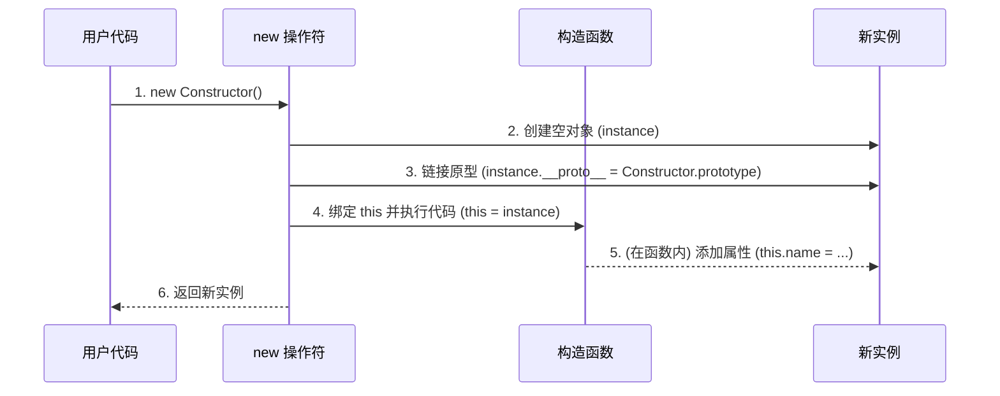

# `this`：动态的执行上下文指针

`this` 是一个特殊的关键字，它的值并**不是**在函数定义时确定，而是在**函数被调用时**根据其“调用方式”来确定的。我们可以遵循一套优先级规则来判断 `this` 的指向。

> [!important] 箭头函数
> **箭头函数是例外**，它没有自己的 `this`，它的 `this` 是在**定义时**由其外层词法作用域决定的，且不可更改。

对于普通函数，`this` 的绑定规则优先级如下：

## `new` 绑定 (优先级最高)

当函数作为构造函数通过 `new` 关键字调用时，`this` 会被绑定到新创建的对象实例上。

```js
function Person(name) {
  // 这里的 this 指向新创建的 p1 对象
  this.name = name;
}
const p1 = new Person('Alice');
```

## 显式绑定 (Explicit Binding)

通过 `call()`, `apply()`, 或 `bind()` 方法可以明确地、强制地指定函数内部的 `this` 指向。

```js
function greet() {
  console.log('Hello, ' + this.name);
}
const user = { name: 'Bob' };
greet.call(user); // 输出: Hello, Bob
```

## 隐式绑定 (Implicit Binding)

这是最常见的场景。当函数作为对象的一个方法被调用时，`this` 指向调用该方法的对象本身（点 `.` 左边的对象）。

```js
const user = {
  name: 'Charlie',
  greet: function() {
    console.log('Hello, ' + this.name);
  }
};
user.greet(); // greet 的 this 是 user 对象
```

> [!tip] 隐式绑定的一个常见陷阱：“this 丢失”
> 如果一个对象的方法被当作**回调函数**传递给另一个函数，那么它与原始对象的隐式绑定就会丢失。
> 
> **根本原因**：传递的只是函数**本身的引用**，而 `this` 的指向取决于其**最终被调用时**的上下文。当作为回调被独立调用时，它将遵循“默认绑定”规则。
> 
> ```js
> function executeCallback(callback) {
>   // 在这里，callback() 是独立调用的，不依赖任何对象
>   callback();
> }
> 
> // 将 user.greet 函数的引用传递进去
> executeCallback(user.greet);
> // 非严格模式输出: Hello, undefined
> // 严格模式下会报错
> 
> // 解决方案：使用 .bind() 或箭头函数来固定 this
> executeCallback(user.greet.bind(user)); // 正确输出: Hello, Charlie
> executeCallback(() => user.greet()); // 正确输出: Hello, Charlie
> ```

## 默认绑定 (Default Binding) (优先级最低)

当一个函数独立调用，不符合以上任何规则时，`this` 的指向取决于代码是否运行在**严格模式 (strict mode)** 下。

- **非严格模式**: `this` 指向全局对象（浏览器中是 `window`，Node.js 中是 `global`）。
- **严格模式**: `this` 的值是 `undefined`，可以防止意外污染全局变量。

# 原型与原型链 (`__proto__` & `prototype`)

这是 JavaScript 实现继承的核心机制，关键在于区分两个非常相似但用途完全不同的属性。

| 特性 (Characteristic) | `__proto__`                                                                                             | `prototype`                                                               |
| :------------------ | :------------------------------------------------------------------------------------------------------ | :------------------------------------------------------------------------ |
| **拥有者**             | 几乎所有对象都有这个内部链接（技术上称为 `[[Prototype]]`）。                                                                  | 只有**函数**（非箭头函数）才有这个属性。                                                    |
| **作用**              | 构成**原型链**，当试图访问一个对象的属性时，如果在该对象自身上找不到，JavaScript 引擎就会顺着 `__proto__` 指向的原型（父对象）继续寻找，以此类推，直到链的末端 (`null`)。 | 它的值是一个对象，被称为“原型对象”。这个对象是作为“模具”或“设计蓝图”存在的，用于存放所有由该构造函数创建的**实例**需要共享的方法和属性。 |
| **指向**              | 一个实例的 `__proto__` 指向**构造它的那个函数的 `prototype` 属性**。                                                       | 它默认是一个普通对象，因此它的 `__proto__` 指向 `Object.prototype`。                        |

> [!example] 构造器、原型和实例的关系
>
> ```mermaid
> graph TD
>     subgraph "实例层"
>         Instance("<b>p1 实例</b><br/>{ name: 'Alice' }")
>     end
> 
>     subgraph "构造函数层"
>         Constructor("<b>Person 构造函数</b>")
>     end
> 
>     subgraph "原型层"
>         PersonProto("<b>Person.prototype</b><br/>{ sayHello, constructor }")
>         FuncProto("<b>Function.prototype</b><br/>{ call, apply, bind }")
>     end
>     
>     subgraph "根原型层"
>         ObjectProto("<b>Object.prototype</b><br/>{ toString, hasOwnProperty }")
>     end
>     subgraph "原型链终点"
>         N(null)
>     end
>     
>     Instance -- "\[\[Prototype]]<br/>(p1.\_\_proto__)" --> PersonProto
>     Constructor -- "\[\[Prototype]]<br/>(Person.\_\_proto__)" --> FuncProto
>     PersonProto -- "\[\[Prototype]]<br/>(Person.prototype.\_\_proto__)" --> ObjectProto
>     FuncProto -- "\[\[Prototype]]<br/>(Function.prototype.\_\_proto__)" --> ObjectProto
>     ObjectProto -- "\[\[Prototype]]<br/>(Object.prototype.\_\_proto__)" --> N
>     Constructor -- "拥有 .prototype 属性" --> PersonProto
> ```
> 
> - 实例 `p1` 的 `__proto__` 链接到了它的构造函数 `Person` 的 `prototype` 属性。因此 `p1` 可以调用 `sayHello` 方法。
> - `Person.prototype` 对象上有一个默认的 `constructor` 属性，它指回 `Person` 函数本身。因此，`p1` 可以通过原型链访问到 `p1.constructor`，其值就是 `Person` 函数。
> - 同时，`Person.prototype` 作为一个普通对象，它的 `__proto__` 指向 `Object.prototype`，这使得实例 `p1` 也能调用 `toString()` 这样的通用对象方法。
> - 与此同时，`Person` 构造函数自身也是一个对象，它的 `__proto__` 指向 `Function.prototype`，因此它可以访问 `.call()` 等函数方法。
> - 最终，图中所有路径都汇集到 `Object.prototype`，并终止于 `null`，构成了 JavaScript 中完整的原型继承图谱。

> [!info] 函数对象的内置属性：`.name`
> 几乎所有 JavaScript 函数对象都有一个内置的、只读的 `.name` 属性，其值为该函数的标识符字符串。这个属性对于调试和日志记录非常有用。
> 
> ```js
> function MyAwesomeFunc() {}
> const f = MyAwesomeFunc;
> console.log(f.name); // "MyAwesomeFunc"
> 
> // 结合上面的例子：
> console.log(p1.constructor.name); // "Person"
> ```

# `new`：调用构造函数

`new` 关键字并不仅仅是创建一个对象，它背后有一个严谨的、自动化的流程：

1. **创建新对象**：在内存中创建一个全新的、空的对象。
2. **链接原型**：将这个新对象的 `__proto__` 链接到构造函数的 `prototype` 属性。
   
   ```js
   // new 在背后做的第二步
   newInstance.__proto__ = Constructor.prototype;
   ```
   
3. **绑定 `this`**：在执行构造函数时，将新创建的对象作为 `this` 的上下文传入构造函数，使得构造函数内部对 `this` 的操作实际上作用于该新对象。
4. **执行构造函数代码**：执行在构造函数内部编写的代码（例如 `this.name = name;`），为新对象添加属性和值。
5. **返回新对象**：如果构造函数没有显式地 `return` 另一个对象，那么 `new` 操作符会自动、隐式地返回这个新创建的 `this` 对象。



