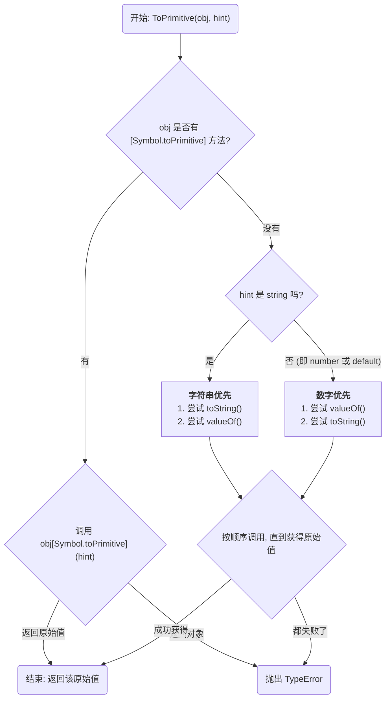

在 JavaScript 中，对象与原始值（string, number 等）的边界常常是模糊的。当我们执行 `10 + {}` 或 `alert([])` 时，对象会被“强制”转换为原始值。这个过程并非魔法，而是遵循着一套由 ECMAScript 规范定义的、严谨的内部算法——`ToPrimitive`。

# 关键的“提示 (Hint)”：转换的目标

`ToPrimitive` 算法的第一步，是接收一个来自引擎的“提示 (hint)”，这个提示告诉算法期望将对象转换成哪种类型的原始值。Hint 共有三种：

1. **`"string"`**
    
    - **触发场景**：当操作期望一个字符串时，例如模板字面量、`String()` 构造函数、`alert()` 等。
    - **示例**：`${myObj}`, `String(myObj)`
  
2. **`"number"`**
    
    - **触发场景**：当操作期望一个数字时，例如绝大多数数学运算、关系比较等。
    - **示例**：`+myObj`, `myObj - 10`, `myObj > 5`, `Math.abs(myObj)`
  
3. **`"default"`**
    
    - **触发场景**：当操作没有明确偏好时。这主要发生在 `+` 加法运算符和 `==` 等号比较运算符等少数情况。
    - **行为**：除了 `Date` 对象（其默认行为同 `"string"`）外，其他所有内置对象的默认行为都和 `"number"` 相同。
    - **示例**：`myObj + " some text"`, `myObj == true`

# `ToPrimitive` 的转换算法

引擎会严格按照以下优先级顺序来执行转换，一旦成功获得原始值，便会立即停止并返回。



## 最高优先级：`[Symbol.toPrimitive]` (现代模式)

这是 ES6 引入的特性，它允许开发者对一个对象的原始值转换过程进行完全的、精细的控制。

- **机制**：引擎首先检查对象自身或其原型链上，是否存在一个键为 `Symbol.toPrimitive` 的方法。
- **调用方式**：如果该方法**存在**，引擎会立即调用它，并将当前的 `hint` 字符串作为**唯一参数**传入。该方法的返回值将被直接用作最终的原始值。
- **要求**：此方法必须返回一个原始值，否则会抛出 `TypeError`。

```js
const user = {
  name: 'Alice',
  age: 30,

  // 定义一个方法来响应 ToPrimitive 操作
  [Symbol.toPrimitive](hint) {
    console.log(`Hint a "${hint}"`);

    // 在方法内部，我们根据传入的 hint 返回不同的值
    if (hint === 'string') {
      return `User: ${this.name}`;
    }
    if (hint === 'number') {
      return this.age;
    }
    // hint 为 "default" 时的回退值
    return true;
  }
};

console.log(`${user}`); // 触发 "string" hint, 输出 "User: Alice"
console.log(user * 2);  // 触发 "number" hint, 输出 60
```

## 后备方案：`valueOf()` 与 `toString()` (经典模式)

如果对象上**没有** `[Symbol.toPrimitive]` 方法，引擎则会退回到传统的转换模式。此时，`hint` 的值将决定 `valueOf()` 和 `toString()` 这两个方法的调用顺序。

| Hint (提示)                           | 第一步 (Step 1)                                   | 第二步 (Step 2)                                                               | 最终结果 (Final Result)           |
| :---------------------------------- | :--------------------------------------------- | :------------------------------------------------------------------------- | :---------------------------- |
| **"string"** (字符串优先)                | 首先尝试调用 `obj.toString()`。如果它返回一个原始值，则使用该值，流程结束。 | 如果 `toString()` 不存在或返回了一个对象，则接着尝试调用 `obj.valueOf()`。如果它返回一个原始值，则使用该值，流程结束。 | 如果两者都未能返回原始值，则抛出 `TypeError`。 |
| **"number"** 或 **"default"** (数字优先) | 首先尝试调用 `obj.valueOf()`。如果它返回一个原始值，则使用该值，流程结束。  | 如果 `valueOf()` 不存在或返回了一个对象，则接着尝试调用 `obj.toString()`。如果它返回一个原始值，则使用该值，流程结束。 | 如果两者都未能返回原始值，则抛出 `TypeError`。 |
> [!important] `valueOf()` 返回对象本身
> 默认情况下，普通对象的 `valueOf()` 返回对象自身，而 `toString()` 返回 `"[object Object]"`。这就是为什么 `10 + {}` 的结果是 `"10[object Object]"`：引擎先尝试 `valueOf()` (返回 `{}`，不是原始值)，再尝试 `toString()` (返回 `"[object Object]"`，是原始值)，然后进行字符串拼接。

