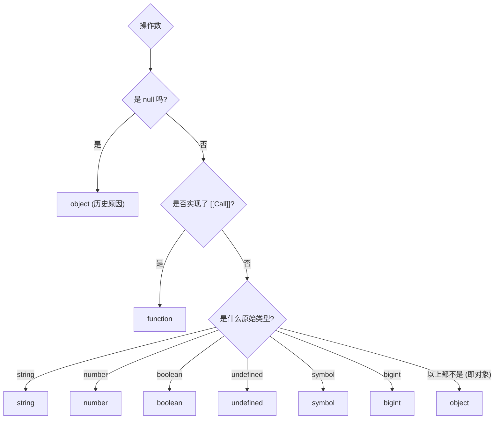

# `typeof` 运算符：不仅仅是类型检查

`typeof` 是一个一元运算符，用于返回一个表示其**操作数类型**的字符串。虽然它在大多数情况下表现得很直观，但在处理某些特殊值时，其行为需要特别注意。其决策流程可以被可视化：



## `typeof` 的特殊情况

1. **`typeof null`**
   
   ```js
   typeof null; // "object"
   ```
   
   这是一个从 JavaScript 诞生之初就存在的著名**历史遗留问题**。在逻辑上，`null` 代表一个原始的“空值”，但 `typeof` 却返回 `"object"`。由于修改这个行为会破坏大量现有网站，因此它被永久保留了下来。在检查一个值是否为 `null` 时，应始终使用 `value === null`。

2. `typeof function(){}`
   
   ```js
   typeof function() {}; // "function"
   ```
   
   虽然函数在 JavaScript 中本质上也是一种对象，但 `typeof` 为其返回了专属的 `"function"` 字符串。ECMAScript 规范定义，任何实现了内部 `[[Call]]` 方法的对象，`typeof` 都会返回 `"function"`。这使得我们可以方便地用它来判断一个变量是否为可调用的函数。

# `NaN`：一个不等于自己的“数字”

`NaN` (Not a Number) 是一个特殊的数值，它代表一个无法表示或未定义（但本应是数字）的计算结果。

## 定义与本质

`NaN` 通常在数学运算失败时出现，例如：

```js
Math.sqrt(-1);       // NaN
Number('hello');     // NaN
0 / 0;               // NaN
```

`NaN` 最违反直觉的特性是：**它虽然代表“不是一个数字”的失败状态，但它本身的类型却是 `number`**。可以将其理解为“不是一个**有效的**数字 (Not a **valid** number)”。

```js
typeof NaN; // "number"
```

## 独特的比较规则

`NaN` 是 JavaScript 中**唯一一个不等于其自身的值**。这一设定源于 IEEE 754 浮点数标准，其核心逻辑是：一个失败的运算结果（`NaN`）不应该等于另一个同样失败的运算结果，因为导致失败的原因可能是不同的（例如 `0/0` 和 `Number('abc')` 都得到 `NaN`，但其来源不同）。

```js
NaN === NaN; // false
NaN !== NaN; // true
```

这意味着你永远不能通过 `myVar === NaN` 来判断一个变量是否为 `NaN`。

## 正确的 `NaN` 判断方法

| 方法            | `Number.isNaN(value)` (ES6, 推荐)                     | `isNaN(value)` (全局函数, 慎用)             | `Object.is(value, NaN)`                |
| :------------ | :-------------------------------------------------- | :------------------------------------ | :------------------------------------- |
| **工作方式**      | **仅当** `value` 的值就是 `NaN` 时才返回 `true`。它不会对参数进行类型转换。 | 在判断前，会尝试将 `value` **强制转换**为 `Number`。 | 严格比较两个值是否都为 `NaN`，无类型转换。               |
| **`'hello'`** | `Number.isNaN('hello')` // **false**                | `isNaN('hello')` // **true**          | `Object.is('hello', NaN)` // **false** |
| **`NaN`**     | `Number.isNaN(NaN)` // **true**                     | `isNaN(NaN)` // **true**              | `Object.is(NaN, NaN)` // **true**      |

> [!important] 最佳实践
> 始终使用 `Number.isNaN()`。它能精确地告诉你一个值是否就是 `NaN` 本身，而不会因强制类型转换产生像 `isNaN('hello')` 返回 `true` 这样的意外结果。
> 
> ```mermaid
> graph TD
>     subgraph "判断流程对比"
>         A(传入 value) --> B{"Number.isNaN(value)"};
>         B -- "是 NaN 本身?" --> B_T[true];
>         B -- "不是 NaN" --> B_F[false];
> 
>         A --> C{"isNaN(value)"};
>         C -- "尝试 Number(value)" --> D{转换后是 NaN?};
>         D -- "是" --> D_T[true];
>         D -- "否" --> D_F[false];
>     end
> ```

# `-0`：带有方向的零

根据 IEEE 754 浮点数标准，JavaScript 同时存在 `+0`（或 `0`）和 `-0`。`-0` 的存在并非错误，而是一种有意义的设计，它主要用于表示数值**从负数方向无限趋近于零**的情况，这在一些科学计算和物理模拟中非常重要。

## `===` 与 `Object.is` 的差异

使用严格相等运算符 `===` 时，`0` 和 `-0` 被认为是相等的。因为它只比较数值大小，不考虑符号位。

```js
-0 === 0; // true
```

`Object.is()` 方法则被设计为能够区分它们，因为它不进行类型转换，而是进行更严格的值本身（包括其符号位）的比较。这是区分 `0` 和 `-0` 最直接的现代方法。

```js
Object.is(-0, 0); // false
```

## 如何确定一个值是否为 `-0`

区分 `0` 和 `-0` 的核心在于找到一个只对其中之一有特殊表现的操作。使用 `Infinity` 的技巧利用了浮点数除法的特性，是区分这两种零值的最可靠方法之一。

```js
function isNegativeZero(value) {
  // 只有当 value 是 -0 时，1 / value 才会得到 -Infinity
  return value === 0 && (1 / value) === -Infinity;
}

isNegativeZero(-0); // true
isNegativeZero(0);  // false
```

