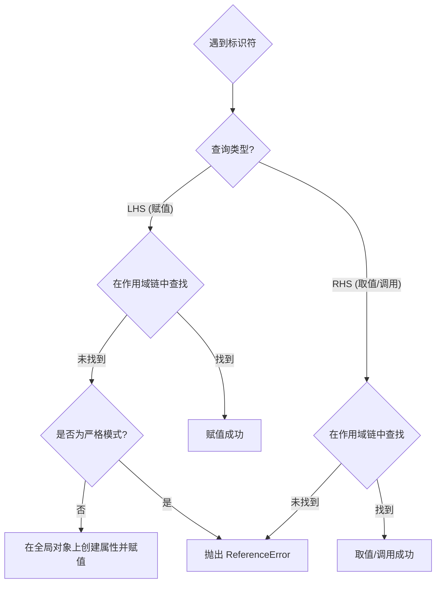

# LHS 与 RHS 查询

当 JavaScript 引擎在代码中遇到一个标识符（变量名/函数名）时，它会对这个标识符进行查询。查询的目的不同，决定了查询的类型。

1. **LHS (Left-Hand Side) 查询：寻找赋值的目标**
    
    - **目的**：查找一个变量引用，作为赋值操作的目标。其核心是确定一个合法的内存位置以供写入。
    - **场景**：标识符作为赋值操作符（如 `=`、`+=` 等）的**左侧**操作数。
    - **例子**：`myVariable = 'hello';` 引擎对 `myVariable` 执行 LHS 查询，因为它需要知道应该把 `'hello'` 这个值存放到哪里去。
  
2. **RHS (Right-Hand Side) 查询：获取源值**
    
    - **目的**：检索一个标识符的**源值**（source value）。
    - **场景**：标识符出现在任何非 LHS 的位置，包括作为源值、函数参数、函数调用等。
    - **例子**：`console.log(myVariable);` 或 `myFunction();` 引擎对 `myVariable` 和 `myFunction` 执行 RHS 查询，因为它需要它们的值来进行打印或执行。

> [!tip] 标识符解析流程
> 引擎通过遍历当前执行上下文的**作用域链 (Scope Chain)** 来执行 LHS 和 RHS 查询。此过程从当前词法环境开始，逐步向外部环境移动，直至到达全局环境。当引擎在整个作用域链中都未能解析到标识符时，其后续行为取决于执行模式和查询类型。
> 
> ```mermaid
> graph TD
>     subgraph "标识符解析流程"
>         A(引擎遇到标识符) --> B{查询类型是 LHS 还是 RHS?};
>         B -- "LHS (赋值目标)" --> C(沿作用域链查找该标识符的引用);
>         B -- "RHS (取值源头)" --> D(沿作用域链查找该标识符的声明);
>         C --> E{查找成功?};
>         D --> F{查找成功?};
>         E -- "是" --> G[执行赋值];
>         F -- "是" --> H[获取值/执行调用];
>         E -- "否 (未找到)" --> I(进入查询失败处理流程);
>         F -- "否 (未找到)" --> I;
>     end
> ```

# 非严格模式 (Non-Strict Mode)：不一致的“陷阱”

在默认的非严格模式下，LHS 查询和 RHS 查询在失败时的行为是**不一致的**，这也是许多“幽灵变量”的根源。

## LHS 查询失败：隐式的全局变量

当对一个从未声明的标识符进行赋值（LHS 查询）时：

- **引擎的行为**：引擎会从当前作用域开始，沿着作用域链一直查找到全局作用域，试图找到这个标识符。
- **非严格模式的“特殊处理”**：如果在所有作用域中都找不到，非严格模式不会抛出错误。相反，**全局对象**（在浏览器中是 `window`）会创建一个同名属性，并接受这个赋值。
- **结果**：一个未被声明的局部变量，在赋值后意外地变成了**全局变量**。

```js
// 非严格模式下
function createAutoGlobal() {
  // 对未声明的 a 进行 LHS 查询
  a = 100;
}

createAutoGlobal();
console.log(a); // 输出: 100，a 被意外地创建在了全局作用域
```

## RHS 查询失败：必然的 `ReferenceError`

当试图读取或调用一个从未声明的标识符（RHS 查询）时：

- **引擎的行为**：同样地，引擎会沿着作用域链查找这个标识符。
- **统一的处理**：如果在所有作用域中都找不到，引擎就无法获取到任何值来继续执行。此时，它别无选择。
- **结果**：**直接抛出一个 `ReferenceError`**。

```js
// 非严格模式下
function getValue() {
  // 对未声明的 b 进行 RHS 查询
  return b; 
}

try {
  getValue();
} catch (e) {
  console.log(e instanceof ReferenceError); // true
}
```

# 严格模式 (Strict Mode)：统一且安全的行为

启用严格模式 (`'use strict';`) 的主要目的之一，就是为了修复上述 LHS 查询失败时的“陷阱”，让引擎的行为更加可预测和安全。

在严格模式下：

- **LHS 查询失败**：对未声明的标识符进行赋值，将**不再创建全局变量**，而是和其他查询失败一样，**直接抛出一个 `ReferenceError`**。
- **RHS 查询失败**：行为不变，依然是抛出 `ReferenceError`。

> [!summary] 结论
> 严格模式统一了查询失败的行为。**无论对未声明的标识符进行读操作还是写操作，都会得到一个明确的 `ReferenceError`**。

# 总结与最佳实践

下图总结了引擎在遇到标识符时的完整决策逻辑：



| 操作类型             | 场景                       | 非严格模式 (Non-Strict) | 严格模式 (Strict)    |
| :--------------- | :----------------------- | :----------------- | :--------------- |
| **写 / 赋值 (LHS)** | `undeclaredVar = 10;`    | 在全局对象上创建该变量        | `ReferenceError` |
| **读 / 取值 (RHS)** | `let y = undeclaredVar;` | `ReferenceError`   | `ReferenceError` |
| **读 / 调用 (RHS)** | `undeclaredFunc();`      | `ReferenceError`   | `ReferenceError` |

> [!important] 最佳实践
> 1. **始终启用严格模式**：在你的所有 JS 文件或模块的顶部添加 `'use strict';`，这是现代 JavaScript 开发的黄金准则。
> 2. **始终声明变量**：在使用任何变量之前，都应使用 `const`、`let` 或 `var` 进行明确的声明。