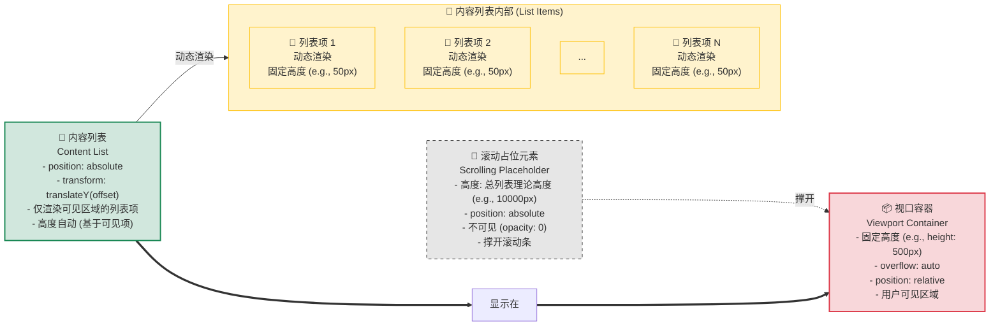

在处理海量数据的 Web 应用中，若直接渲染数千甚至数万条 DOM 节点，会带来极高的内存消耗，导致页面首次内容渲染（FCP，First Contentful Paint）和最大内容渲染时间（LCP，Largest Contentful Paint）延长，同时滚动操作卡顿（INP，Interaction to Next Paint 升高）。为了解决这一瓶颈，**虚拟滚动（Virtual Scrolling）**，又称**窗口化（Windowing）** 技术应运而生。它通过只渲染视口（viewport）内实际可见的列表项，大幅减少渲染的 DOM 数量，从而极大地降低渲染成本，实现海量数据的高性能展示。

# 虚拟滚动的核心原理与结构

虚拟滚动的基本原理是，在视觉上欺骗用户，让他们以为整个长列表都已被渲染。这背后是通过一个精巧的 DOM 结构和 JavaScript 计算来实现的。

## DOM 结构

一个典型的虚拟列表由三层 DOM 结构组成：

1. **视口容器 (Viewport Container)**: 一个具有固定高度、设置了 `overflow: auto;` 和 `position: relative;` 的外层容器。这是用户唯一可见并与之交互的区域。
2. **滚动占位元素 (Scrolling Placeholder)**: 视口容器内的一个不可见元素，其高度被动态设置为**整个列表的总理论高度**。它的唯一作用是“撑开”容器，以产生一个与完整列表长度相对应的、正确的滚动条。
3. **内容列表 (Content List)**: 实际承载和渲染**当前可见列表项**的容器。它通过 CSS `transform: translateY()` 属性在视口容器内进行绝对定位，以确保正确的列表项始终出现在用户的视野中。



## 核心算法思想

当用户滚动视口容器时，`scroll` 事件会被触发。在事件回调中，程序会执行一套计算，以确定：

- **应该渲染哪些数据项**：根据当前的滚动偏移量 (`scrollTop`)，计算出数据源数组中应该被渲染的起始索引 (`startIndex`) 和结束索引 (`endIndex`)。
- **应该渲染在哪里**：计算出一个 `offset` 值，通过 `translateY` 将内容列表精确地移动到视口内的正确位置。

# 固定高度项的实现算法

在列表项高度固定的前提下，虚拟列表的实现算法是确定性的，计算也相对简单。

## 关键参数计算

假设我们有以下已知条件：

- `totalItems`: 完整列表的数据数组。
- `itemHeight`: 每个列表项的固定高度（像素）。
- `containerHeight`: 视口容器的高度（像素）。
- `scrollTop`: 视口容器当前的滚动距离（像素）。

> [!note] 核心计算公式
> | 描述                     | 公式                                                         | 备注                                                                                                                            |
> | ---------------------- | ---------------------------------------------------------- | ----------------------------------------------------------------------------------------------------------------------------- |
> | 滚动占位元素总高度              | `totalHeight = totalItems.length * itemHeight`              |                                                           用于设置滚动占位元素高度，撑开滚动条                                                                    |
> | 视口内可渲染的列表项数量           | `visibleItemCount = Math.ceil(containerHeight / itemHeight)` | 使用 `Math.ceil` (向上取整) 是为了确保渲染的元素数量足以完全覆盖视口区域，即使最后一个元素只有部分可见。例如，如果容器能装下 10.5 个元素，我们必须渲染 11 个才能避免底部出现空白。                          |
> | 渲染区域的起始索引 (startIndex) | `startIndex = Math.floor(scrollTop / itemHeight)`            | 使用 `Math.floor` (向下取整) 是为了获取当前视口顶部所在的或刚刚滚过的那个元素的索引。例如，当滚动了 1.9 个元素的高度时，视口顶部的第一个元素应该是索引为 1 的元素（即第二个元素），`Math.floor(1.9)` 恰好得到 1。   |
> | 渲染区域的结束索引 (endIndex)   | `endIndex = startIndex + visibleItemCount`                   | 在实践中，通常会渲染额外的几个元素作为缓冲区 (buffer)，例如 `endIndex = startIndex + visibleItemCount + 2`。这可以有效防止在用户快速滚动时，因计算和渲染的微小延迟而出现短暂的白屏，从而提升用户体验。 |
> | 内容列表的 Y 轴偏移 (offset)   | `offset = startIndex * itemHeight` 或直接 `scrollTop`                                         |                                                                                        通过 `translateY(offset)` 使内容列表在视觉上与滚动条位置匹配                                       |
> 

## 渲染与定位

在 `scroll` 事件的回调中，根据上述计算结果更新视图。

```js
// 假设在一个 UI 框架的组件中
function onScroll(event) {
  const { scrollTop, clientHeight } = event.target;
  const itemHeight = 30; // 每个 item 高度为 30px
  
  // 1. 计算 startIndex 和 endIndex
  const startIndex = Math.floor(scrollTop / itemHeight);
  const visibleItemCount = Math.ceil(clientHeight / itemHeight);
  const endIndex = startIndex + visibleItemCount;

  // 2. 从完整数据源中“切片”出当前需要渲染的数据
  this.visibleItems = this.allItems.slice(startIndex, endIndex);

  // 3. 计算并设置内容列表的偏移量
  // 关键： translateY 的值需要与 scrollTop 保持一致，以抵消滚动效果
  const offset = scrollTop;
  this.contentListStyle = {
    transform: `translateY(${offset}px)`
  };
}
```

> [!tip] 关于 `translateY` 的作用
> 如果不设置 `translateY` 偏移，当用户向下滚动时，虽然渲染的列表项数据会更新（`slice` 切换），但内容列表的物理位置仍在容器的顶部。这会导致新渲染的项一闪而过，视觉上像是数据在向上“滚走”。
> 
> ![[../../!attachments/PixPin_2025-07-30_17-27-34.gif]]
> 
> 设置 `transform: translateY(scrollTop)` 的作用是，在滚动的同时，将内容列表容器**向下推**，其向下的距离**恰好等于**容器向上滚动的距离。这一“推”一“滚”相互抵消，使得用户看到的列表项在视觉上保持在了正确的位置。
> 
> ![[../../!attachments/PixPin_2025-07-30_17-29-48.gif]]

