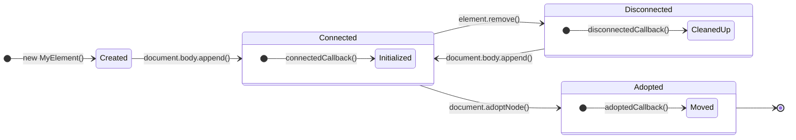

Web Components 并非某种框架，而是一套由浏览器原生支持的、用于构建可复用、封装良好 UI 组件的 W3C 标准技术。它使得开发者可以创建全新的 HTML 标签，并将其行为、样式和结构封装起来，不受外部环境影响。其核心由三项主要技术组成：**Custom Elements**（自定义元素）、**Shadow DOM**（影子 DOM）和 **HTML Templates**（HTML 模板）。

# Custom Elements: 创建自定义的 HTML

这是 Web Components 的基石，它赋予用户使用 JavaScript 定义新 HTML 元素的能力。

- **注册**: 通过全局的 `customElements.define(name, constructor)` 方法进行注册。
    
    - `name`: 自定义元素的标签名，规范要求**必须包含一个连字符**（例如 `my-profile-card`）。
    - `constructor`: 一个 ES6 class，用于定义元素的行为和生命周期。

- **构造器要求**: 此 class **必须继承自 `HTMLElement`** 或其子类（如 `HTMLParagraphElement`）。在其 `constructor` 函数中，**必须首先调用 `super()`** 以确保父类原型链的正确初始化。

```js
// my-profile-card.js
class MyProfileCard extends HTMLElement {
  constructor() {
    // 必须首先调用 super(), 这是子类构造器的硬性要求
    super(); 
    console.log('Custom element constructor called.');
  }
  // ... 其他生命周期方法
}

// 将 class 与 HTML 标签名关联起来
customElements.define('my-profile-card', MyProfileCard);
```

## 生命周期回调: 感知元素的状态

Custom Element 提供了一套生命周期回调方法，当元素经历不同状态时，这些方法会被浏览器自动调用，为我们提供了在正确时机执行代码的钩子。



- **`connectedCallback()`**: 当元素首次被**插入**到主文档的 DOM 中后调用。**这是执行初始化操作（如数据获取、DOM 渲染、事件监听）最安全、最常用的地方**。
- **`disconnectedCallback()`**: 当元素从 DOM 中**移除**后调用。用于执行清理工作，如取消订阅、移除事件监听器，防止内存泄漏。
- **`adoptedCallback()`**: 当元素被**移动**到新的 `document` 中时调用（例如在主文档和 `<iframe>` 之间移动）。
- **`attributeChangedCallback(name, oldValue, newValue)`**: 当元素的受监听属性（需通过静态 `observedAttributes` 数组指定）被添加、移除或更改时调用。

# 内容渲染与封装：两条核心路径

为自定义元素填充其内部结构和内容，主要有两种模式：

## Light DOM: 直接且开放的 DOM 结构

这是最传统的方式，即直接操作元素自身的子节点。这些子节点存在于主文档的全局 DOM 树中，其样式会受到全局 CSS 的影响，因此被称为“Light DOM”。

`<template>` 标签非常适合此模式。浏览器会解析 `<template>` 标签的内容但不会将其渲染到页面中，使其成为一种“惰性”的 HTML 结构。我们可以通过 JavaScript 高效地克隆其内容并插入 DOM，将其作为组件的内部结构使用。相比直接使用 `innerHTML` 或频繁调用 `createElement` 构造节点，这种方式不仅性能更优，还能降低 XSS 等安全风险，更适合构建可维护、可复用的动态界面。

```js
// index.html
// <template id="card-template">
//   <style>/* ... */</style>
//   <div class="card">...</div>
// </template>

// my-profile-card.js in connectedCallback()
connectedCallback() {
  const template = document.getElementById('card-template');
  // .content 属性包含了模板内的 DOM，.cloneNode(true) 进行深拷贝
  const content = template.content.cloneNode(true);
  this.appendChild(content);
}
```

> [!attention] 关键规则
> **不应在 `constructor` 中**对元素自身进行 DOM 操作（如 `this.appendChild()`），因为此时元素可能尚未完全构建或插入文档。操作 Light DOM 的最佳时机是 **`connectedCallback`**。

## Shadow DOM: 封装与隔离机制

这是 Web Components 实现**真正封装**的核心。它为元素创建一个独立的、与主文档 DOM 隔离的“影子 DOM 树 (Shadow DOM Tree)”。

- **封装性**: Shadow DOM 内部的样式**不会影响**外部文档（样式隔离），外部的样式也**不会影响**其内部（除非使用特殊选择器）。其内部的 DOM 结构也不会被外部的 JavaScript 轻易查询或修改。
- **操作时机**: 因为操作的是一个独立的 DOM 片段（shadow root），而不是元素本身，所以**可以在 `constructor` 中安全地进行**。

> [!example] 工作流程
> ```js
> // my-profile-card.js in constructor()
> constructor() {
>   super();
>   const shadowRoot = this.attachShadow({ mode: 'open' });
> 
>   const template = document.getElementById('card-template');
>   const content = template.content.cloneNode(true);
> 
>   // 操作的是 shadowRoot，不是 this (the host element)
>   shadowRoot.appendChild(content); 
> }
> ```
> 
> 1. 在 `constructor` 中，调用 `this.attachShadow({ mode: 'open' })` 来创建并附加一个 shadow root。
>    - `mode: 'open'`: 允许通过元素的 `.shadowRoot` 属性从外部 JavaScript 访问到这个影子 DOM。这是最常用的模式。
>    - `mode: 'closed'`: `.shadowRoot` 将返回 `null`，外部无法访问，提供了更强的封装性，但也降低了灵活性。
> 2. `attachShadow` 方法会返回对 shadow root 的引用。
> 3. 像操作普通 DOM 节点一样，向 shadow root 中添加内容。

