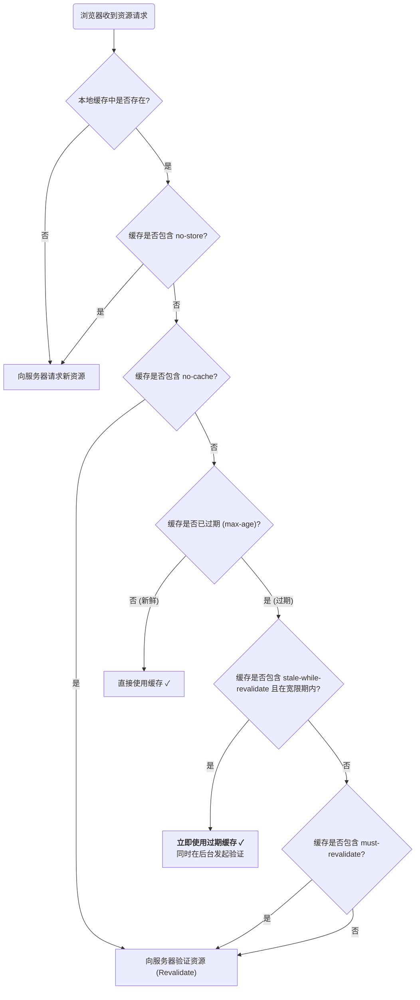

HTTP 缓存是构建高性能、高效率 Web 应用的基石。通过在 HTTP 响应头中设置 `Cache-Control` 字段，服务器可以向浏览器及所有中间缓存（如 CDN、代理服务器）下达关于如何存储、何时验证以及是否重用资源的精确指令。

# `no-store`

`no-store` 是最严格的缓存指令。它明确告知浏览器及所有中间缓存，**禁止**以任何形式（无论是内存还是磁盘）存储此响应的任何部分。每次对该资源的请求都必须发送到源服务器，以获取全新的、未经缓存的内容。

- **指令**: `Cache-Control: no-store`
- **适用场景**: 包含极其敏感的个人身份信息、银行数据或一次性操作凭证的页面。

# `private`

`private` 指令定义了缓存的共享范围。它表示响应内容是针对单个用户专有的，因此只能被**私有缓存 (private cache)**（即最终用户的浏览器缓存）存储。

- **指令**: `Cache-Control: private`
- **作用**: 防止**共享缓存 (shared cache)**（如公司或学校的代理服务器、CDN 的边缘节点）存储此响应。这确保了为用户 A 显示的个人信息，不会被错误地提供给用户 B。
- **适用场景**: 包含用户个人信息的页面，例如设置页面、个人账户主页、订单历史等。

# `no-cache`

`no-cache` 是最常被误解的指令之一。**它并不意味着“不缓存”**。恰恰相反，它允许浏览器和 CDN **可以缓存**这个响应。

- **指令**: `Cache-Control: no-cache`
- **精确定义**: 它强制缓存在**每一次**使用这个缓存副本之前，都**必须**返回源服务器进行**验证 (Revalidation)**。
- **工作流程**: 当浏览器再次请求该资源时，它会向服务器发送一个“条件请求”，通常包含 `If-None-Match` (ETag) 或 `If-Modified-Since` (Last-Modified) 请求头。服务器验证后，如果资源未变更，则返回一个极小的 `304 Not Modified` 响应，浏览器随即使用本地缓存的副本；如果资源已变更，则返回 `200 OK` 和全新的资源。
- **核心思想**: 保证用户总能看到最新版本的内容，但又希望能通过 `304` 响应来避免不必要的数据传输。适用于频繁更新且要求高时效性的资源，如动态生成的 HTML 页面。

# `must-revalidate`

该指令用于增强缓存过期后的行为可靠性。它通常与 `max-age` 配合使用。

- **指令**: `Cache-Control: max-age=3600, must-revalidate`
- **精确定义**: 它告诉缓存，在资源未过期（`max-age` 或 `Expires` 定义的时间内）时，可以自由使用，无需验证。**但是，一旦资源过期，就必须严格地向源服务器重新验证**，在任何情况下都**禁止**使用已过期的副本（例如，即使在网络断开或服务器无响应时）。
- **与 `no-cache` 的区别**: `no-cache` 是**每次都**要验证；`must-revalidate` 是**过期后才必须**严格验证。

# `stale-while-revalidate`

这是一个先进的性能优化指令，它允许在后台更新缓存的同时，立即向用户提供旧的、已过期的内容，以提升感知速度。

- **指令**: `Cache-Control: max-age=60, stale-while-revalidate=300`
- **工作流程**:
    1. **0-60秒**: 资源是新鲜的 (fresh)，浏览器直接使用缓存，不发送请求。
    2. **60-360秒**: 资源已过期 (stale)，但处于 `stale-while-revalidate` 的宽限期内。此时，当第一个请求到达时：
        - 浏览器会**立即返回过期的、旧的缓存内容**给用户，以实现瞬时加载。
        - **同时**，浏览器会在后台悄悄地向源服务器发起一个验证请求，以获取新版本的资源来更新缓存。
    3. **360秒后**: 宽限期结束。缓存行为将回退到标准的验证流程（类似于 `must-revalidate`）。
- **核心价值**: **“Stale on screen, fresh on refresh”**。它通过立即提供旧内容来极致优化用户的感知速度，同时在后台更新缓存，保证了后续访问的数据新鲜度。