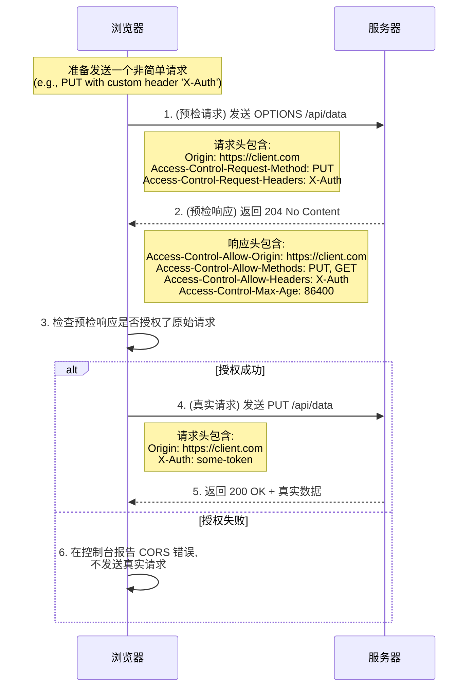

为了安全，浏览器强制执行**同源策略 (Same-Origin Policy, SOP)**。该策略规定，一个源（origin，由协议、域名、端口三者组合定义）的文档或脚本，只能与同源的资源进行交互。然而，现代 Web 应用（如前后端分离的架构）又需要频繁地进行跨源资源请求。**CORS (Cross-Origin Resource Sharing)** 就是 W3C 制定的一套官方标准，它允许服务器在返回响应时，通过特定的 HTTP 头来“放松”同源策略，授权来自不同源的客户端读取该响应。

# CORS 请求的分类

浏览器会自动将跨源请求分为两类：**简单请求 (Simple Requests)** 和需要**预检的请求 (Preflighted Requests)**。

- **简单请求**: 如果一个请求**同时满足**以下所有条件，它就被视为简单请求，浏览器会直接发送它，并在收到响应后检查 CORS 权限。
    1. **方法**为 `GET`, `HEAD`, 或 `POST` 之一。
    2. **HTTP 头**不超出 `Accept`, `Accept-Language`, `Content-Language`, `Content-Type` 等安全头部，且 `Content-Type` 的值仅限于 `application/x-www-form-urlencoded`, `multipart/form-data`, `text/plain`。
    3. 请求中没有使用 `ReadableStream` 对象。
- **预检请求**: 任何不满足上述条件的请求，都被视为非简单请求。在发送真实请求之前，浏览器必须先发送一个 `OPTIONS` 方法的**预检请求**，以“询问”服务器是否允许即将到来的真实请求。

# CORS 核心 HTTP 头详解

CORS 的整套机制是通过在客户端和服务器之间交换一系列特定的 HTTP 头来完成的。以下是由**服务器**在响应中发送，用以授权客户端行为的头部：

- **`Access-Control-Allow-Origin`**: **(必需)** 定义了允许访问此资源的源。值可以是单个具体的源（如 `https://example.com`）或通配符 `*`（表示允许任何源）。注意：当请求需要携带凭据时，此值**不能**为 `*`。
- **`Access-Control-Allow-Methods`**: **(预检响应中必需)** 定义了允许用于访问资源的 HTTP 方法，以逗号分隔（如 `GET, POST, PUT, DELETE`）。
- **`Access-Control-Allow-Headers`**: **(预检响应中必需)** 定义了除了默认的安全请求头外，允许客户端在真实请求中发送的**自定义请求头**列表，以逗号分隔。
- **`Access-Control-Expose-Headers`**: 定义了除了默认的安全响应头外，允许前端 JavaScript 代码**能够访问到**的响应头列表。默认情况下，前端 JS 只能获取到如 `Cache-Control`, `Content-Type` 等少数几个头部，如果后端在响应中设置了一个自定义头部（如 `X-Total-Count`），必须在这里声明，前端才能通过 `getResponseHeader()` 读取到。
- **`Access-Control-Max-Age`**: 定义了预检请求结果的**缓存时间**（以秒为单位）。在此时间内，对同一个已预检的请求，浏览器将不再发送新的预检请求，而是直接发送真实请求。
- **`Access-Control-Allow-Credentials`**: 定义了是否允许跨源请求**携带凭据**（如 Cookies, Authorization 头等）。
    - **`true`**: 允许。此时，前端的 `fetch` 或 `XMLHttpRequest` 也必须进行相应配置（如 `credentials: 'include'`）。
    - **`false`** (默认): 不允许。这是默认值，以防止潜在的 CSRF 攻击。

