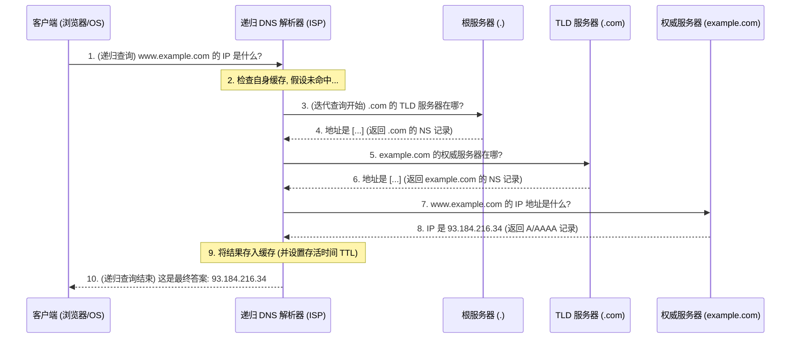

在互联网中，服务器之间通过 IP 地址（如 `93.184.216.34`）进行通信，而人类则更习惯于使用易于记忆的域名（如 `www.example.com`）。域名系统 **DNS (Domain Name System)** 的核心使命，就是充当“互联网的电话簿”，将这些域名“翻译”成机器可读的 IP 地址。这个看似瞬时完成的过程，背后是一套精密的、分层的、全球性的分布式数据库查询系统。

# DNS 解析的核心参与者

一次完整的 DNS 查询涉及多个关键角色的协同工作：- **客户端存根解析器 (Client Stub Resolver)**: 通常是操作系统的一部分，它接收来自应用程序（如浏览器）的查询请求，并将其转发给一个配置好的递归 DNS 解析器。

- **客户端存根解析器 (Client Stub Resolver)**: 通常是操作系统的一部分，它接收来自应用程序（如浏览器）的查询请求，并将其转发给一个配置好的递归 DNS 解析器。
- **递归 DNS 解析器 (Recursive DNS Resolver)**: 这是 DNS 查询的“主力军”。它通常由用户的网络服务提供商（ISP）或公共服务（如 Google 的 `8.8.8.8`）提供。它的任务是完整地、递归地回答客户端的查询，即使用户只问了一次，它也会负责完成后续所有必要的查询步骤。
- **根域名服务器 (Root Name Server)**: 位于 DNS 层次结构的顶端，全球仅有 13 组（由不同机构管理），管理**全部**顶级域名（如 `.com`, `.org`, `.cn`）。它不存储具体域名的 IP 地址，但它知道所有顶级域名（TLD）服务器的地址。
- **顶级域名 (TLD) 服务器 (Top-Level Domain Name Server)**: 负责管理**特定**顶级域名 (如 `.com`) 的服务器。它不知道 `example.com` 的 IP 地址，但它知道 `example.com` 的权威域名服务器在哪里。
- **权威域名服务器 (Authoritative Name Server)**: 负责管理特定域名（如 `example.com`）的最终记录。它对该域名的信息拥有最终解释权，存储着诸如 `www.example.com` 对应的 IP 地址等信息。

# 解析流程：缓存优先，迭代兜底

为了极致的效率，DNS 查询并非每次都从头开始。它遵循“缓存优先”的原则，只有当所有层级的缓存都未能命中时，才会启动一次完整的迭代查询。

**DNS 缓存的层次结构**：

1. **浏览器缓存**: 浏览器会缓存用户近期访问过的域名的 DNS 记录。
2. **操作系统缓存**: 操作系统（如 Windows, macOS）拥有自己的 DNS 缓存。
3. **路由器缓存**: 局域网内的路由器通常也会缓存 DNS 查询结果。
4. **递归解析器缓存**: ISP 的 DNS 服务器会对其处理过的所有查询结果进行大规模缓存。

只有当以上所有缓存都未命中（或已过期）时，递归解析器才会开始下面的流程：

> [!tip] 查询类型详解
> - **递归查询 (Recursive Query)**: 如图中步骤 1 和 10 所示。这是客户端对递归解析器的查询模式。客户端发出请求后，便等待最终答案，期间所有的复杂工作都由递归解析器代为完成。
> - **迭代查询 (Iterative Query)**: 如图中步骤 3-8 所示。这是递归解析器与其他域名服务器之间的查询模式。每次查询，被查询的服务器如果不知道最终答案，就会返回一个“更好的下一个查询对象”的地址。递归解析器需要“迭代地”、一步步地去询问，直到找到最终的权威服务器并获得答案。

> [!tip] 记录类型 (Record Type)
> - **NS 记录 (Name Server)**: 当向根服务器或 TLD 服务器查询时，它们返回的是 NS 记录，即下一级域名服务器的地址。
> - **A / AAAA 记录**: 当向权威服务器查询时，它返回的是主机记录。`A` 记录对应 IPv4 地址，`AAAA` 记录对应 IPv6 地址。

