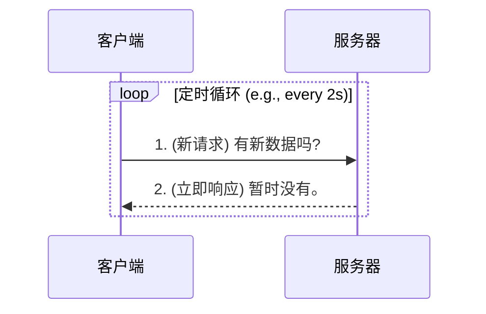
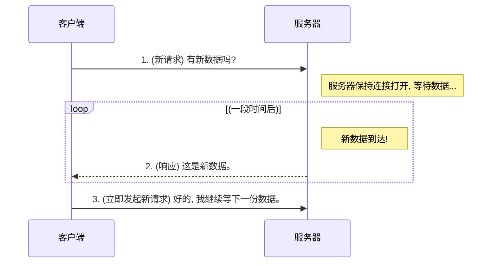
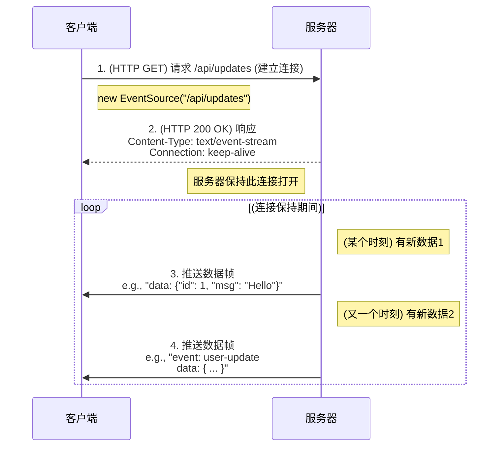
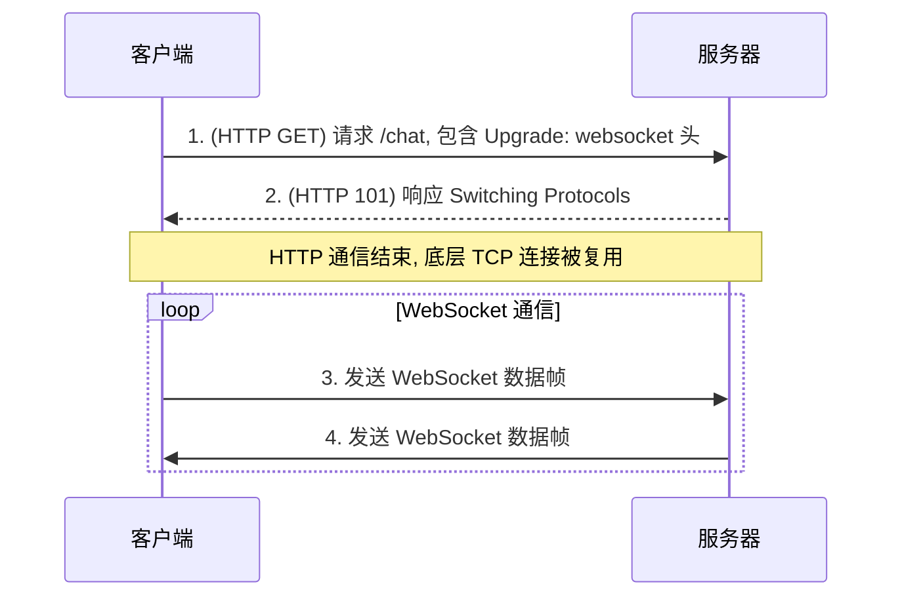

# 基于 HTTP 请求的模拟方案

## 短轮询 (Short Polling)

短轮询是最基础的实现方式，客户端通过 `setInterval` 等机制，以固定的时间间隔（如每 2 秒）向服务器发送 HTTP 请求，以查询是否有新数据。



> [!warning] 短轮询的缺陷
> - **高延迟与非实时**: 数据的更新最多会延迟一个轮询间隔的时间。
> - **高开销**: 每次请求都是一次完整的 HTTP 事务，包含了 DNS 查询、TCP 连接建立、HTTP 请求/响应的全部开销，这会大量消耗客户端（尤其是移动设备，因频繁唤醒无线模块而耗电）和服务器的资源。
> - **资源浪费**: 大部分请求可能是空轮询，没有返回有效数据。

## 长轮询 (Long Polling)

长轮询是对短轮询的一种优化，旨在降低延迟和减少空轮询。

- **机制**: 客户端发送一个请求到服务器，但服务器**不会立即响应**。它会保持这个连接打开，直到**有新的数据可用时**，才将数据作为响应返回给客户端。客户端在收到响应后，会立即**再次发起一个新的长轮询请求**，周而复始。



> [!note] 长轮询的权衡
> - **优点**: 相比短轮询，它显著降低了延迟，更接近“实时”。
> - **缺点**: 每次数据返回后，依然需要重新建立一次完整的 HTTP 连接，连接开销问题并未根除。对服务器的并发连接管理也提出了更高的要求。
> - **普适性**: 长轮询实现相对简单且几乎兼容所有浏览器，是一种可靠的“降级”方案。

# 现代持久连接方案

## Server-Sent Events (SSE)

SSE 是 HTML5 标准的一部分，专为**服务器向客户端的单向消息推送**而设计。

- **机制**: 客户端通过 `EventSource` API 与服务器建立一个**持久的 HTTP 连接**（通常利用 HTTP/2 的多路复用能力，与其他请求共享一个 TCP 连接）。一旦连接建立，服务器就可以随时通过这个连接向客户端**单向地推送数据**，而无需客户端再次发起请求。



> [!example] Server-Sent Events 客户端实现
> ```js
> // 1. 创建 EventSource 实例，连接到服务器端点
> const evtSource = new EventSource("/api/sse-updates");
> 
> // 2. 监听 message 事件
> evtSource.addEventListener('message', (event) => {
> 	// event.data 只支持字符串
> 	const data = JSON.parse(event.data);
> 	console.log("New update:", data);
> });
> 
> // 3. (可选) 监听自定义事件
> evtSource.addEventListener('user-login', (event) => {
> 	// ...
> });
> 
> // 4. 监听错误，EventSource 支持自动重连
> evtSource.onerror = (err) => {
> 	console.error("EventSource failed:", err);
> };
> ```

- **权衡**:
	- **优点**: 轻量、性能好、API 简单，且内置了**自动重连**机制。
	- **缺点**: 它是**单向**的（服务器→客户端），且规范规定其传输的数据**只能是字符串**。

## WebSocket

WebSocket 是解决**全双工、双向、实时通信**的终极方案。

- **机制**: 客户端首先发起一个特殊的 HTTP 请求，其中包含 `Upgrade: websocket` 请求头。如果服务器支持，会返回一个 `101 Switching Protocols` 响应，此后，这条底层的 **TCP 连接**就不再用于 HTTP 通信，而是被“升级”为一个 WebSocket 连接。在这个专用的、持久的 TCP 通道上，客户端和服务器可以随时、双向地发送数据帧。




- **权衡**:
	- **优点**: **真正意义上的全双工实时通信**，延迟极低，协议开销小，可以传输字符串和二进制数据。
	- **缺点**: 需要专门的服务器支持 WebSocket 协议；API 本身**没有内置自动重连和心跳检测机制**，在生产环境中需要应用层自己实现以保证连接的稳定性。

# 总结

Web 实时通信技术经历了从低效的 HTTP 模拟（轮询）到高效的持久连接（SSE, WebSocket）的演进。**轮询**作为兼容性最好的基础方案，适用于对实时性要求不高的场景。**Server-Sent Events** 是实现服务器到客户端单向推送（如新闻更新、状态通知）的轻量级、标准化首选。而 **WebSocket** 则是在需要进行高频率、低延迟的双向数据交换（如在线游戏、协同编辑、即时通讯）时，无可替代的终极解决方案。技术选型应基于具体的通信模型、实时性要求和实现复杂度进行综合权衡。