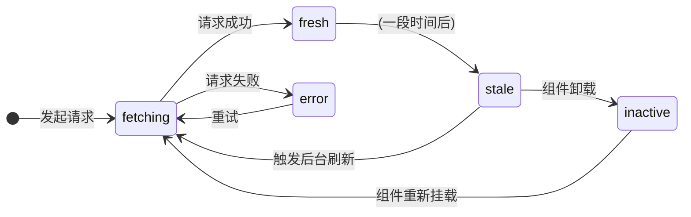

在 React 应用中，状态可以被清晰地划分为两大类：**客户端状态 (Client State)**（如 UI 控件的开关状态）和**服务端状态 (Server State)**（来自 API 的远程数据）。服务端状态具有其独特的生命周期和特性——它是异步的、被缓存在远端、可能被其他用户修改而变得“过时 (stale)”。长期以来，开发者习惯于使用 `useEffect` 和 `useState` 来管理服务端状态，但这是一种反模式。**TanStack Query** (前身为 React Query) 是一个专为此类状态设计的、强大的异步状态管理库。

# `useEffect` 数据请求的反模式

在深入 TanStack Query 之前，必须理解其旨在解决的问题。

> [!danger] `useEffect` + `useState` 的缺陷
> 使用 `useEffect` 触发数据请求，并用 `useState` 存储结果、加载和错误状态的模式，存在诸多固有缺陷：
> - **样板代码冗余**: 每个数据请求都需要重复编写 `isLoading`, `error`, `data` 等状态逻辑。
> - **竞争条件 (Race Conditions)**: 在快速切换依赖项（如用户 ID）时，无法保证旧的、较慢的请求结果不会覆盖新的请求结果。
> - **缺乏缓存与去重**: 组件每次挂载都会重新请求数据，且多个组件请求相同数据时会发出重复的网络请求，浪费资源。
> - **后台状态同步困难**: 无法轻松实现如“当用户重新聚焦窗口时自动刷新数据”等现代体验。

# TanStack Query 的核心概念

TanStack Query 并非一个传统的数据请求库（如 `axios`），而是一个**服务端状态的缓存和同步**工具。它将服务器数据视为一个**缓存 (cache)**，而非需要手动管理的 state。



- **`useQuery` Hook**: 这是获取、缓存和订阅服务器数据的核心 Hook。它接收一个配置对象，其中最重要的是：
    - **`queryKey`**: 一个数组，作为此项数据的**唯一标识符**。任何使用相同 `queryKey` 的 `useQuery` 调用都会共享同一份缓存数据。
    - **`queryFn`**: 一个返回 Promise 的异步函数，负责实际的数据请求逻辑。
- **[stale-while-revalidate](../network/cache-control-core-directives#stale-while-revalidate) 缓存策略**: 这是 TanStack Query 的默认行为。当数据被获取后，它在一段时间内是“新鲜的 (fresh)”。超过这个时间后，它会变为“过时的 (stale)”。当一个组件需要“过时”的数据时，TanStack Query 会**立即返回过时的缓存数据**（以保证 UI 的即时响应），**同时**在后台悄悄地发起一个新的请求来获取最新数据。

> [!example] `QueryClientProvider` 的设置
> 在使用 TanStack Query 时，需要在应用的根组件用 `QueryClientProvider` 包裹，提供全局的查询客户端实例。示例如下：
> 
> ```ts
> // main.tsx 或 App.tsx
> import { QueryClient, QueryClientProvider } from '@tanstack/react-query';
> 
> // 创建一个 QueryClient 实例，管理缓存和请求
> const queryClient = new QueryClient();
> 
> export function App() {
>   return (
>     <QueryClientProvider client={queryClient}>
>       {/* 应用其他部分 */}
>     </QueryClientProvider>
>   );
> }
> 
> ```

# TanStack Query 的关键优势

1. **缓存与请求去重**: 对相同 `queryKey` 的请求，在缓存有效期内只会发起一次网络请求。
2. **后台自动刷新**: 在多种情况下会自动重新获取数据，如窗口重新聚焦、网络重新连接、可配置的定时刷新等，确保数据尽可能保持最新。
3. **内置状态管理**: 自动管理 `isLoading`, `isError`, `isSuccess`, `data`, `error` 等派生状态，极大简化了组件的条件渲染逻辑。
4. **高级功能**: 内置支持乐观更新 (Optimistic Updates)、分页 (Pagination)、无限滚动 (Infinite Queries) 等复杂场景。

```js
import { useQuery } from '@tanstack/react-query';

// 假设的 API 请求函数
const fetchUserProfile = async (userId) => {
  const res = await fetch(`/api/users/${userId}`);
  if (!res.ok) {
    throw new Error('User not found');
  }
  return res.json();
};

function UserProfile({ userId }) {
  // TanStack Query 接管了所有加载、错误和缓存逻辑
  const { isLoading, error, data, isFetching } = useQuery({
    queryKey: ['user', userId], // 唯一键，当 userId 变化时会自动重新请求
    queryFn: () => fetchUserProfile(userId),
  });

  if (isLoading) return <span>Loading...</span>;
  if (error) return <span>Error: {error.message}</span>;

  return (
    <div>
      <h1>{data.name}</h1>
      {/* isFetching 为 true 表示正在后台刷新 */}
      {isFetching ? <span>(updating...)</span> : null}
    </div>
  );
}
```

> [!tip] 理解 TanStack Query 的状态标志
> - **`isLoading (旧版本称为 isPending)`**: 指查询**首次加载且无任何缓存数据**的“硬加载”状态。
> 	- **场景**: 用户首次请求数据，等待内容完全加载的过程。
> 	- **UI 用途**: 通常用于展示骨架屏（Skeleton）或全屏加载动画，突出加载感知。
> - **`isFetching`**: 指**任何**数据请求正在进行中，包括首次加载和所有后续的**后台刷新**。
> 	- **场景**: 可能是在后台自动刷新数据，此时用户界面上可能仍显示着旧（stale）数据。即使已有缓存数据，后台仍在刷新最新数据时也会为 `true`。
> 	- **UI 用途**: 适合显示不干扰用户的加载提示，如角落的小图标或细微加载条。
> 
> **核心区别**：`isLoading` 是 `isFetching` 的子集，即所有 `isLoading` 的状态同时也是 `isFetching`，但后台刷新时 `isLoading` 为 `false`，`isFetching` 为 `true`。

