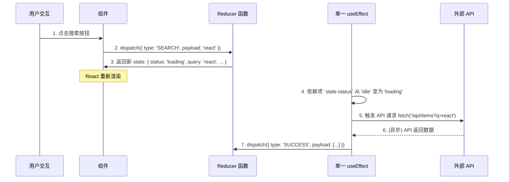

在 React 应用中，`useEffect` Hook 是处理副作用 (side effects) 的核心工具，它使得函数式组件能够与外部系统进行同步。然而，当组件逻辑变得复杂，多个状态之间相互依赖时，滥用 `useEffect` 来同步这些状态，会导致一种被称为**链式效应 (Cascading Effects)** 的反模式。这种模式会严重破坏组件的可预测性和可维护性。本笔记旨在解析此反模式的内在缺陷，并提出一种基于**事件驱动 (event-driven)** 设计和状态机模型的解决方案。

# 反模式：链式效应 (Cascading Effects)

当一个 `useEffect` 的执行结果会触发另一个 `useEffect` 的执行，就形成了一条 effect 链。这种模式通常源于将多个相关的 state 拆分管理，并试图通过 effect 来保持它们之间的同步。

> [!example] 链式效应代码示例 (反模式)
> ```js
> function SearchResults({ query }) {
>   const [items, setItems] = useState([]);
>   const [filteredItems, setFilteredItems] = useState([]);
>   const [log, setLog] = useState('');
>   
>   // Effect 1: 当 query 变化时，获取数据
>   useEffect(() => {
>     fetch(/api/items?q=${query}).then(res => res.json()).then(setItems);
>   }, [query]);
>   
>   // Effect 2: 当 items 变化时，进行过滤
>   useEffect(() => {
>     setFilteredItems(items.filter(item => item.isAvailable));
>   }, [items]);
>   
>   // Effect 3: 当 filteredItems 变化时，记录日志
>   useEffect(() => {
>     setLog(Filtered results count: ${filteredItems.length});
>   }, [filteredItems]);
> 
>   // ...
> }
> ```

> [!danger] 链式效应的危害
> - **逻辑流模糊**: 状态更新的逻辑被分散在多个 `useEffect` 中，很难追踪一次用户交互最终会触发哪些连锁反应。
> - **竞争条件 (Race Conditions)** 与**时序问题 (Timing Issues)**: 多个 effect 并发运行时，其执行顺序可能不符合预期。同时，由于 state 更新是异步的，effect 内部容易捕获到**过时的闭包 (stale closure)**，导致逻辑错误。
> - **调试困难**: 复现和调试因复杂的 effect 链引发的 bug 极其困难，因为问题的根源往往深埋在不可预测的渲染和执行时序中。

# 最佳实践：事件驱动的状态机

解决链式效应的根本在于**思想转变**：从响应“**数据何时变化 (when data changes)**”，转变为响应“**导致数据变化的事件是什么 (why data changes)**”。

这种**事件驱动 (event-driven)** 的方法，将所有状态转换的逻辑集中处理，并将副作用的触发与状态本身解耦。其在 React 中的最佳实现是 `useReducer` 与单一 `useEffect` 的组合。

## `useReducer`: 集中化的状态转换

`useReducer` Hook 允许我们将所有相关的 state 聚合到一个对象中，并定义一个 `reducer` 纯函数来统一管理所有状态转换的逻辑。用户的操作或业务逻辑被抽象为一个个**事件 (actions)**，通过 `dispatch` 函数发送给 `reducer`。

## 单一 `useEffect`: 独立的副作用执行器

在事件驱动模型中，我们通常只需要**一个** `useEffect`。它的职责不再是“同步”状态，而是作为状态机的“副作用执行器”。它订阅状态对象中代表当前“状态类型”的字段（如 `state.status`），并根据状态的变化来触发相应的副作用（如 API 请求）。



> [!example] 事件驱动代码示例 (最佳实践)
> ```js
> import { useReducer, useEffect } from 'react';
> 
> // 定义所有可能的状态
> const initialState = {
>   status: 'idle', // 'idle' | 'loading' | 'success' | 'error'
>   items: [],
>   filteredItems: [],
>   log: '',
>   query: '',
> };
> 
> // Reducer: 一个地方处理所有状态转换
> function reducer(state, action) {
>   switch (action.type) {
>     case 'SEARCH':
>       return { ...state, status: 'loading', query: action.payload };
>     case 'SUCCESS': {
>       const items = action.payload;
>       const filteredItems = items.filter(item => item.isAvailable);
>       return {
>         ...state,
>         status: 'success',
>         items,
>         filteredItems,
>         log: `Filtered results count: ${filteredItems.length}`,
>       };
>     }
>     // ... 其他 action, 如 'ERROR'
>     default:
>       return state;
>   }
> }
> 
> function SearchResults() {
>   const [state, dispatch] = useReducer(reducer, initialState);
> 
>   // 单一 Effect: 只负责处理副作用
>   useEffect(() => {
>     // 只在 'loading' 状态时触发 API 请求
>     if (state.status === 'loading') {
>       fetch(/api/items?q=${state.query})
>       .then(res => res.json())
>       .then(data => dispatch({ type: 'SUCCESS', payload: data }));
>     }
>   }, [state.status, state.query]); // 依赖项清晰
> 
>   const handleSearch = (query) => {
>     // 触发一个“事件”，而不是直接设置多个 state
>     dispatch({ type: 'SEARCH', payload: query });
>   };
> 
>   // ...
> }
> ```

> [!success] 事件驱动模型的优势
> - **逻辑清晰且集中**: 所有状态转换逻辑都在 `reducer` 中，一目了然。
> - **原子化更新**: 一次 `dispatch` 可以原子性地更新所有相关状态，避免了中间状态和不必要的渲染。
> - **消除竞争条件**: 单一的 `useEffect` 和明确的状态依赖，使得副作用的触发变得可预测，从根本上消除了 effect 链带来的时序问题。
> - **易于调试和测试**: `reducer` 是一个纯函数，极易进行单元测试。

