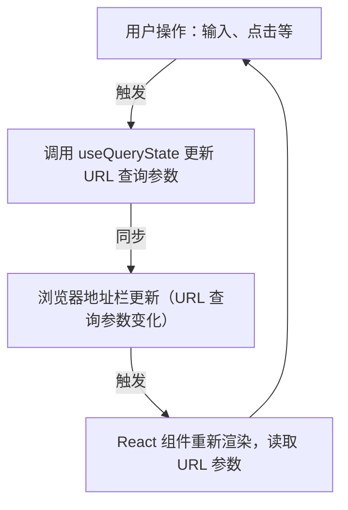

在复杂的单页应用（SPA）中，管理用户期望能够分享、收藏或在刷新后依然保持的界面状态，是前端开发的一大挑战。传统的状态管理方案，如组件内部的 `useState` 或全局状态库，往往只能管理短暂状态，难以满足这些需求。**将 URL 查询参数作为应用状态的唯一可信来源（Single Source of Truth）**，是一种符合 Web 原则且高效的设计模式。它充分利用浏览器的地址栏和历史记录机制，实现状态的持久化、共享和可追溯性。本文将深入解析这一模式的核心思想、优势，并结合现代 React 技术展示如何做到类型安全的状态同步。

# “URL 即状态”的核心原则

此模式的核心思想是，将那些描述**应用视图**状态、而非核心业务数据的变量，直接映射到 URL 的查询参数 (`?key=value`) 中。

> [!note] 适用于 URL 的状态类型
> 并非所有状态都适合放入 URL。此模式最适用于那些**非敏感的、用于重现特定 UI 视图**的瞬时状态，例如：
> 
> - 搜索框的查询词
> - 数据列表的筛选条件与排序规则
> - 分页组件的当前页码
> - 选项卡 (Tabs) 组件的当前激活项
> - 模态框 (Modal) 的打开/关闭状态

当状态存储在 URL 中时，组件的渲染逻辑便从读取内部 state 转变为读取 URL 参数，从而使 URL 成为驱动 UI 的“遥控器”。



# 关键优势

1. **可分享性与可书签化 (Shareability & Bookmarkability)**: 用户可以简单地复制和粘贴 URL，与他人分享一个包含了完整 UI 状态（如特定的搜索结果和筛选条件）的页面。
2. **浏览器历史集成 (History Integration)**: 状态的每一次变化都成为浏览器历史记录的一部分，用户可以无缝地使用“前进”和“后退”按钮在不同的 UI 状态间切换。
3. **刷新后状态持久化 (Persistence on Refresh)**: 用户刷新页面时，应用可以从 URL 中恢复之前的 UI 状态，提升了用户体验的连续性。
4. **与组件状态解耦 (Decoupling from Component State)**: 将全局性的 UI 状态从组件内部（或全局 store）中剥离，降低了组件间状态同步的复杂性。

# 实现：结合 `nuqs` 进行类型安全的状态同步

手写 URL 查询参数的解析和序列化既繁琐又容易出错。`nuqs` 是一个专门用于类型安全的 URL 查询状态管理库，它将查询参数的读写封装成 React Hook，自动完成类型转换和浏览器历史同步。

下面是一个简洁的搜索框示例，展示如何使用 `nuqs` 实现类型安全的 URL 状态绑定：

```tsx
'use client';

import { useQueryState } from 'nuqs';
import { parseAsString } from 'nuqs/parsers';

export default function SearchBox() {
  // 绑定 URL 查询参数 ?q 与组件状态，URL 是状态的单一可信来源
  // 比如访问：https://example.com/?q=react
  const [q, setQ] = useQueryState('q', parseAsString.withDefault(''));

  return (
    <input
      type="search"
      value={q} // 直接从 URL 查询参数读取状态，例如 q=react
      onChange={e => setQ(e.target.value)} // 改变状态即更新 URL 查询参数
      placeholder="请输入搜索内容"
    />
  );
}
```

此时，用户在输入框的操作会同步更新 URL 的查询参数，刷新页面或复制链接均能保持搜索状态。