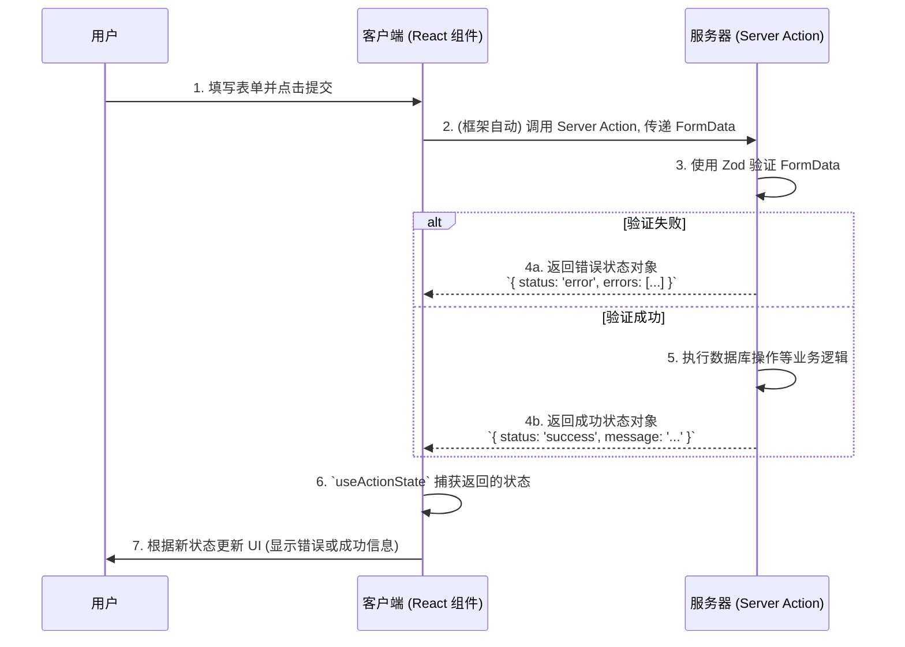

在 React 的发展历程中，表单处理始终是一个核心议题。传统的受控组件模式，虽然精确，但常常因需要为每个输入框创建独立的 `useState` 而导致代码冗余和复杂的事件处理。现代 React（尤其是在 Next.js 等元框架中）引入了一套全新的、以 **渐进增强 (Progressive Enhancement)** 为核心的表单处理范式。该模式通过结合平台原生的 `FormData` API、**React Server Actions** 以及 `useActionState` Hook，极大地简化了表单的开发流程，并天然地集成了加载、错误和响应状态的管理。

# 范式转变：从受控组件到 `FormData`

传统模式下，表单的每一个输入框都由一个 `useState` 控制，数据流为 `用户输入 -> onChange -> setState -> value 属性更新`。而现代模式则回归到更接近 HTML 标准的方式。

> [!note] 以 DOM 为数据源 (Source of Truth)
> 在新模式下，HTML `<form>` 元素本身被视为其状态的“权威来源 (source of truth)”。我们不再需要在 React state 中同步每一个按键输入，而是在表单提交时，一次性地从 DOM 中读取所有数据。
> 1. 为每个表单字段设置 `name` 属性。
> 2. 在提交事件中，通过 `new FormData(formElement)` 来自动捕获所有字段的值。

这种方式不仅显著减少了客户端的 state 和事件处理器样板代码，也为 Server Actions 的执行奠定了基础。

# 核心机制：React Server Actions

**Server Actions** 是一种允许在服务器端安全执行的函数，它可以被直接传递给 `<form>` 的 `action` 属性或 `<button>` 的 `formAction` 属性。

- **机制**: 当用户提交表单时，框架（如 Next.js）会自动序列化 `FormData`，并通过 RPC 调用（Remote Procedure Call）来执行指定的 Server Action。这个过程对开发者是透明的，无需手动创建 API 端点、编写 `fetch` 请求或处理序列化。
- **优势**:
    - **简化架构**: 无需为每个表单提交创建专门的 API 路由。
    - **渐进增强**: 即使用户的 JavaScript 被禁用或加载失败，标准的 HTML 表单提交依然能够正常工作。
    - **类型安全**: 结合 TypeScript，可以在客户端和服务器之间共享类型定义，确保数据的一致性。

> [!info] 什么是 RPC（Remote Procedure Call）  
> RPC（远程过程调用）是一种通信协议，允许在一个程序中调用远程服务器上的函数，就像调用本地函数一样。开发者不需要处理底层的网络请求细节，RPC 框架会自动完成参数的序列化、请求发送、响应接收与反序列化。React Server Actions 就是通过类似 RPC 的方式，让前端代码调用服务器上的函数。

# 客户端集成：`useActionState` Hook

为了在客户端优雅地处理 Server Action 的执行状态（如加载中、成功、失败），React 引入了 `useActionState` Hook（在早期版本中称为 `useFormState`）。

```jsx
const [state, formAction, isPending] = useActionState(action, initialState);
```

- **`state`**: Action 执行后返回的状态。它可以是一个包含成功信息或错误详情的对象。
- **`formAction`**: 一个新的、经过包装的 action，应将其传递给 `<form action={formAction}>`。
- **`isPending`**: 一个布尔值，当 action 正在执行时为 `true`，否则为 `false`。这可以直接用于在 UI 中显示加载状态（例如，禁用提交按钮）。

# 端到端实现流程

下面的流程图和代码示例展示了如何将所有概念结合起来，创建一个健壮、类型安全的表单。



> [!example] 结合 Zod 和 Type State 的完整示例
> **服务器端 Action (`actions.ts`)**：
> ```ts
> 'use server';
> 
> import { z } from 'zod';
> 
> // 1. 使用 Zod 定义表单字段的验证规则
> const schema = z.object({ 
>   email: z.string().email({ message: "请输入有效的电子邮件地址。" }),
>   password: z.string().min(8, { message: "密码长度不能少于8个字符。" }),
> });
> 
> // 2. 定义 Action 可能返回的各种状态类型
> type FormState = { 
>   status: 'error'; 
>   errors: Record<string, string[]>; 
> } | { 
>   status: 'success'; 
>   message: string; 
> } | {
>   status: 'idle'; // 初始状态
> }
> 
> export async function login(prevState: FormState, formData: FormData): Promise {
>   const validatedFields = schema.safeParse(Object.fromEntries(formData.entries()));
>   
>   if (!validatedFields.success) {
>     return {
>       status: 'error',
>       errors: validatedFields.error.flatten().fieldErrors,
>     };
>   }
>   
>   // ... 执行登录逻辑
>   
>   return { 
>     status: 'success', 
>     message: 'Login successful!',
>    };
> }
> ```
> **客户端组件 (`login-form.tsx`)**：
> ```tsx
> 'use client';
> 
> import { useActionState } from 'react'; 
> import { login } from './actions';
> 
> const initialState = { status: 'idle' };
> 
> export function LoginForm() {
>   const [state, formAction, isPending] = useActionState(login, initialState);
>   
>   return (
>     \<form action={formAction}>
>       <input type="email" name="email" placeholder="Email" required /> 
>       <input type="password" name="password" placeholder="Password" required /> 
>       
>       \<button type-="submit" disabled={isPending}>
>          {isPending ? 'Logging in...' : 'Log In'} 
>        </button>
>        
>        {state.status === 'error' && state.message && 
>          <p style={{ color: 'red' }}>{state.message}</p>}
>        {state.status === 'success' && <p style={{ color: 'green' }}>{state.message}</p>}
>     </form>
>   )
> }
> ```