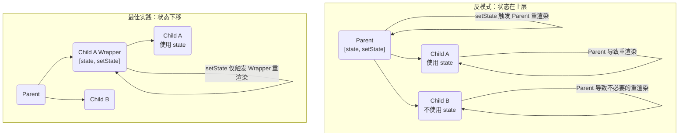

在 React 应用中，性能优化的核心在于**避免不必要的重新渲染 (re-render)**。虽然 `React.memo`、`useMemo` 和 `useCallback` 等记忆化 (memoization) API 广为人知，但它们并非解决渲染问题的首选方案。过度或不当的记忆化会使代码变得复杂、脆弱且难以推理。一个更根本、更健壮的优化范式根植于 React 的核心思想——**组件组合 (Component Composition)**。

# 优化的误区：`React.memo` 的脆弱性

`React.memo` 是一个高阶组件，它通过对 props 进行浅层比较（使用 `Object.is`）来决定是否跳过一个组件的重新渲染。

> [!danger] `memo` 易于失效
> `React.memo` 的效果非常容易被破坏。当一个被 `memo` 包裹的组件接收的 props 包含**非原始类型**（如对象、数组或函数）时，问题便会显现。在父组件的每次渲染中，这些内联定义的对象、数组或函数都会被**重新创建**，即使其内容完全相同，它们的**引用地址 (reference)** 也会发生变化。`Object.is` 在比较引用时会判定 props 已变更，从而导致 `memo` 的优化完全失效。

虽然可以使用 `useMemo` 和 `useCallback` 来稳定这些引用的地址，但这会引入新的问题：

- **代码复杂性**: 过多的 `useMemo` 和 `useCallback` 会使组件逻辑变得臃肿和难以理解。
- **依赖链脆弱性**: 如果一个被 `useMemo` 缓存的 prop，其自身的依赖项（来自更上层组件的 prop）是不稳定的，那么整个记忆化链条就会被打破。因此，`memo` 的有效性需要开发者向上追溯整个组件树，这是极其繁琐和脆弱的。

# 根本解法：组件组合

在诉诸于记忆化之前，应首先考虑通过调整组件结构来隔离渲染。

## 策略一：下移状态 (Moving State Down)

如果一个 state 仅被组件树的某个分支使用，就应将其尽可能地“下移”到一个更贴近使用它的、层级更低的共同祖先组件中。

**原理**: 将状态及其更新逻辑封装到一个更小的子组件中。当这个状态变化时，只有这个子组件会重新渲染，而其父组件和兄弟组件则完全不受影响。



## 策略二：上提内容 (Lifting Content Up)

当一个父组件因自身 state 变化而频繁重渲染，但其某个子组件树（通常是昂贵的）却不依赖该 state 时，可以通过**将子组件作为 `children` prop 传入**来避免其不必要的重渲染。

**原理**: React 在渲染时，如果发现 `children` prop 的引用没有变化，它会**跳过 (short-circuit)** 对整个 `children` 子树的重新渲染，直接复用上一次的结果。

> [!example] `children` 作为 Slot 的应用
> **反模式**:
> ```js
> function App() {
>   const [name, setName] = useState('');
>   return (
>     <div>
>       <input value={name} onChange={e => setName(e.target.value)} />
>       {/* ExpensiveTree 会在每次输入时都重新渲染 */}
>       <ExpensiveTree />
>     </div>
>   );
> }
> ```
> **最佳实践**:
> ```js
> // 1. 将 ExpensiveTree 定义在 App 的父组件中
> function Root() {
>   // ExpensiveTree 只在这里被创建一次
>   const expensiveChild = <ExpensiveTree />;
>   return <App>{expensiveChild}</App>;
> }
> 
> // 2. App 组件接收 children prop
> function App({ children }) {
>   const [name, setName] = useState('');
>   return (
>     <div>
>       <input value={name} onChange={e => setName(e.target.value)} />
>       {/* ExpensiveTree 在输入时不会重新渲染 */}
>       {children}
>     </div>
>   );
> }
> ```

# 当组合不足时：外部状态管理

如果状态确实需要在多个互不相关的组件分支之间共享，此时“下移状态”不再适用。在这种情况下，可以考虑将状态**移出 React 组件树**，交由专业的**状态管理库 (state management library)**（如 Zustand, Jotai, Redux）来管理。

**机制**: 这些库通常使用 [[09. React 外部状态同步方案|useSyncExternalStore]] Hook，当 store 中的状态发生变化时，它们能够**精准地只触发**那些订阅了该特定状态的组件进行重渲染，而不会影响整个组件树。

# 高级技巧：`useEffectEvent` 解耦依赖

在某些必须使用 `useEffect` 或 `useCallback` 的场景中，我们可能需要在一个拥有稳定依赖的 effect/callback 中，访问一个频繁变化的 prop 或 state，而又不希望将其加入依赖数组。

> [!note] `useRef` 模式 (传统技巧)
> 传统上，可以通过 `useRef` 来手动追踪最新值，但这需要编写额外的 `useEffect` 来同步 ref。

**`useEffectEvent`** 是 React 正在开发的一个新 Hook，它将上述 `useRef` 模式正式化、标准化。

- **机制**: `const onEvent = useEffectEvent(callback)` 会返回一个**引用地址永远稳定**的函数 `onEvent`。然而，当你调用 `onEvent` 时，它内部执行的永远是最新一次渲染时传入的 `callback` 函数。
- **作用**: 它允许你将一个事件处理函数从 `useEffect` 或 `useCallback` 的依赖数组中安全地移除，从而避免因该函数的变化而导致 effect/callback 的不必要重定义。

> [!example] 使用 `useEffectEvent` 避免 Effect 重置
> ```js
> function ChatRoom({ theme, onMessage }) {
>   // onMessage 是一个 prop，可能在每次父组件渲染时都变化
>   
>   // 将 onMessage 包装成一个稳定的事件函数
>   const onMessageEvent = useEffectEvent(onMessage);
>   
>   useEffect(() => {
>     const connection = createConnection();
>     connection.on('message', (msg) => {
>       // 调用稳定的 onMessageEvent, 它内部会执行最新的 onMessage
>       onMessageEvent(msg);
>     });
> 
>     return () => connection.disconnect();
>     // ✅ 现在 effect 的依赖中不再需要 onMessage
>   }, []); // 这个 effect 只会在组件挂载和卸载时执行一次
> }
> ```

