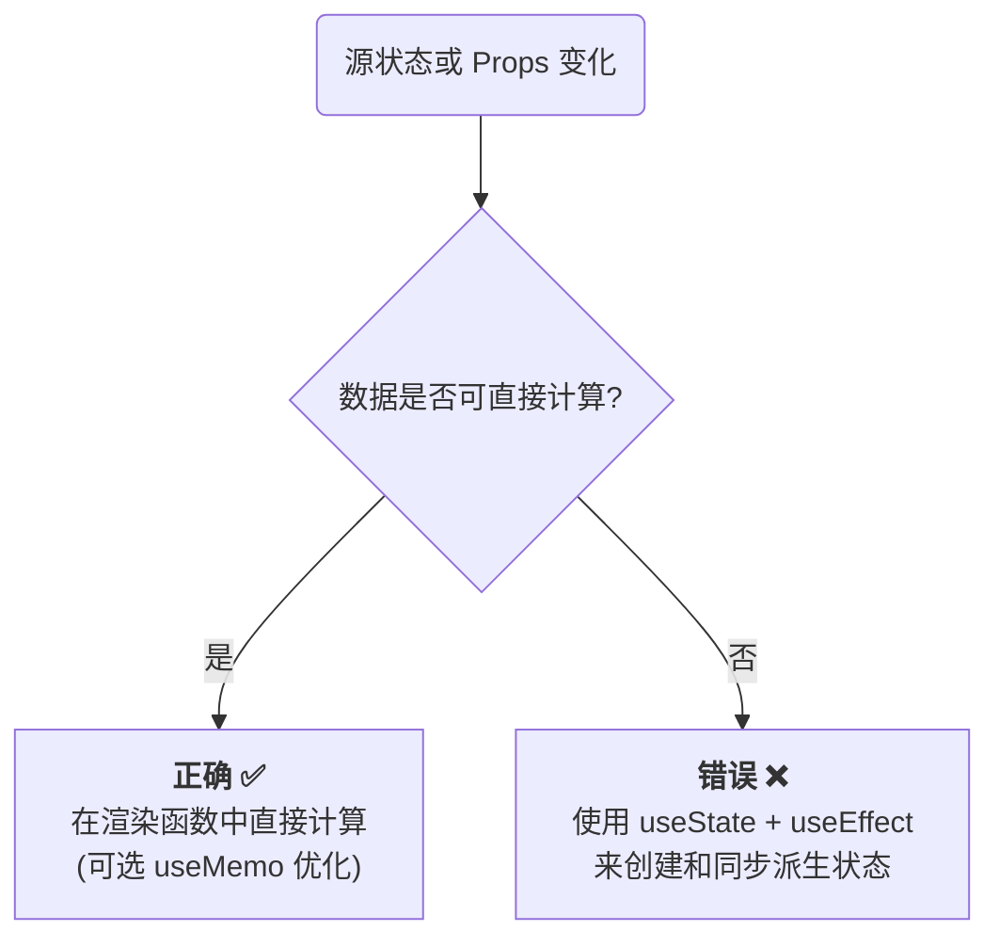
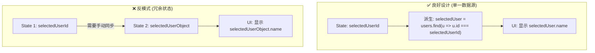

# 反模式一：存储可派生状态 (Storing Derived State)

这是最常见的反模式之一。当一个值可以完全通过现有的 state 或 props 计算得出时，将其额外存储在一个独立的状态变量中是冗余且危险的。

> [!warning] 派生状态的同步问题
> 使用 `useState` 和 `useEffect` 来手动同步派生数据是一种脆弱的模式。它引入了额外的渲染周期，并且在复杂的依赖关系中，极易导致状态不同步的缺陷。

- **核心原则**: **如果一个值可以被计算出来，就不要将其存储在状态中**。应在每次渲染时直接进行计算。
- **性能考量**: 如果派生计算的开销非常大，可以使用 `useMemo` Hook 来缓存计算结果，仅在依赖项变化时才重新计算。



> [!example] 案例：过滤列表
> **反模式**:
> ```jsx
> function FilterableProductList({ products }) {
>   const [filter, setFilter] = useState('');
>   // ❌ 错误：将过滤后的列表存储在独立的状态中
>   const [filteredProducts, setFilteredProducts] = useState(products);
>   
>   useEffect(() => {
>     setFilteredProducts(products.filter(p => p.name.includes(filter)));
>   }, [products, filter]); // 需要手动同步
> }
> ```
> **最佳实践**:
> ```jsx
> function FilterableProductList({ products }) {
>   const [filter, setFilter] = useState('');
>   // ✅ 正确：在每次渲染时直接计算派生值
>   // useMemo 用于缓存昂贵的计算，仅在 products 或 filter 变化时重新执行
>   const filteredProducts = useMemo(() => {
>     return products.filter(p => p.name.includes(filter));
>   }, [products, filter])
> }
> ```

# 反模式二：为不触发渲染的值使用 State

`useState` 的核心功能是通过其 `setter` 函数来触发组件的**重新渲染 (re-render)**。如果一个值在组件的生命周期内需要被持久化，但它的变化**不应直接触发 UI 更新**，那么使用 `useState` 来存储它就是一种性能上的浪费。

- **核心原则**: 对于不直接影响渲染输出的可变值，应使用 `useRef` Hook。
- **`useRef` 的特性**: `useRef` 返回一个可变的对象，其 `.current` 属性可以被任意修改。**修改 `.current` 属性不会触发组件的重新渲染**。

> [!tip] `useRef` 的适用场景
> - 存储定时器 ID（`setTimeout`, `setInterval`）。
> - 存储对 DOM 节点的直接引用。
> - 缓存先前渲染的 props 或 state 值。
> - 存储任何与渲染无关，但需要在多次渲染之间保持一致的可变数据。

```jsx
import { useState, useRef, useEffect } from 'react';

function TimerComponent() {
  const [count, setCount] = useState(0);
  
  // ✅ 正确：使用 useRef 存储与渲染无关的 interval ID
  const intervalIdRef = useRef(null);

  useEffect(() => {
    // 启动定时器，并将 ID 存储在 ref 中
    intervalIdRef.current = setInterval(() => {
      setCount(c => c + 1);
    }, 1000);

    // 组件卸载时，从 ref 中读取 ID 并清除定时器
    return () => clearInterval(intervalIdRef.current);
  }, []); // 空依赖数组，仅在挂载和卸载时执行

  return <div>Timer: {count}</div>;
}
```

# 反模式三：存储冗余或非最小化状态

这是“单一数据源 (Single Source of Truth)”原则在 React 中的具体体现。在组件的状态设计中，应始终追求**存储最小化的、必要的状态**，而其他所有数据都应从此最小状态派生而来。在多个状态变量中存储相同或重叠的数据，会导致：

- **同步缺陷 (Synchronization Bugs)**: 更新数据时，可能忘记同步更新所有相关的状态副本。
- **复杂的更新逻辑**: 需要编写额外的代码来保持多个状态之间的一致性。
- **性能开销**: 存储不必要的数据会增加内存占用。

> [!note] 常见的状态冗余模式
> - **在本地状态中存储 props 或 context 的副本**: 这会创建一个与外部数据源脱钩的“影子”状态，导致外部更新时，组件内部不会同步。
> - **同时存储原始数据和格式化后的数据**: 例如，同时存储一个 `Date` 对象和一个格式化后的日期字符串。应只存储 `Date` 对象，在渲染时进行格式化。
> - **存储整个对象而非其唯一标识符**: 当只需要一个 ID 来从一个全局 store 或 prop 列表中查找数据时，应只在 state 中存储这个 ID。



```jsx
function HotelSelection() {
  const [hotels] = useState([
    { id: 'h1', name: 'Grand Hotel', price: 200 },
    { id: 'h2', name: 'Budget Inn', price: 80 },
  ]);
  // const [selectedHotel, setSelectedHotel] = useState<Hotel | null>(null); // ❌ 存储整个 object
  const [selectedHotelId, setSelectedHotelId] = useState<string | null>(null); // ✅ 只存储 ID

  const handleSelect = (hotel: Hotel) => {
    // setSelectedHotel(hotel); // ❌ 从 hotels 数组中重复的数据
    setSelectedHotelId(hotelId); // ✅ 存储最小的数据
  };
  
  // ✅ 在需要时派生完整对象
  const selectedHotel = hotels.find((h) => h.id === selectedHotelId);

  return (
    <div>
      {selectedHotel && (
        <div>
          {selectedHotel.name} - ${selectedHotel.price}
        </div>
      )}
    </div>
  );
}
```