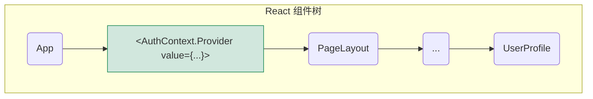

在 React 应用中，组件化是构建用户界面的基本范式。然而，当应用状态需要在组件树中跨越多个层级进行共享时（例如，UI 主题、用户认证信息、地区设置等），通过 props 将状态逐层向下传递（即“属性钻探 (prop drilling)”）会变得极其繁琐且难以维护。**React 上下文 (Context)** 提供了一种原生的解决方案，它允许数据在组件树中进行隐式传递，使得任何层级的子组件都能够直接订阅和访问这些全局或局部的共享状态，从而极大地简化了状态管理。

# React Context 的核心构成

Context API 的工作流程由三个核心部分组成：创建、提供和消费。

## `createContext()`: 创建上下文对象

一切始于调用 `React.createContext()`，它会创建一个包含 `Provider` 和 `Consumer` 组件的上下文对象。

```js
import { createContext } from 'react';

// 创建一个用于共享用户认证状态的 Context
// 'null' 是默认值，仅在组件树上方没有找到对应 Provider 时使用
export const AuthContext = createContext(null);
```

## `<Context.Provider>`: 提供状态

`Provider` 是一个 React 组件，用于将其 `value` 属性的值，提供给所有嵌套在其内部的后代组件。

- **机制**: `Provider` 将共享的状态注入到组件树的一个分支中。所有在该分支下的消费者都能访问到这个 `value`。
- **可嵌套**: 多个 `Provider` 可以嵌套使用，内层的 `Provider` 会覆盖外层同类型 `Provider` 的值。



如上图所示，`UserProfile` 组件及其所有父组件，都可以访问到 `AuthContext.Provider` 提供的 `value`。

## 消费状态

在函数式组件中，我们主要通过 Hooks 来“消费”或“订阅”由 `Provider` 提供的值。

# 消费上下文的 Hooks: `useContext` 与 `use`

## `useContext(Context)`: 传统的读取方式

`useContext` 是消费上下文的标准、稳定的 Hook。

- **机制**: 它接收一个由 `createContext` 创建的上下文对象作为参数，并返回该上下文当前的值。
- **订阅行为**: 任何调用了 `useContext(MyContext)` 的组件，都会在 `MyContext.Provider` 的 `value` 属性发生变化时自动重新渲染。

> [!example] `useContext` 实现主题切换
> **1. 创建上下文 (`theme-context.js`)**
> ```js
> import { createContext, useContext } from 'react';
> 
> const ThemeContext = createContext('light');
> 
> export const ThemeProvider = ThemeContext.Provider;
> 
> // 创建一个自定义 Hook 以简化消费过程
> export function useTheme() {
>   return useContext(ThemeContext);
> }
> ```
> **2. 在应用顶层提供上下文 (`App.jsx`)**
> ```jsx
> import { ThemeProvider } from './theme-context';
> 
> export default function App() {
>   const [theme, setTheme] = useState('light');
>   // ...
>   return (
>     \<ThemeProvider value={theme}>
>       {/* ... */}
>     </ThemeProvider>
>   );
> }
> ```
> **3. 在任意深度的子组件中消费上下文 (`Button.jsx`)**
> ```jsx
> import { useTheme } from './theme-context';
> 
> export function ThemedButton() {
>   const theme = useTheme(); // 直接获取 'light' 或 'dark'
>   return <button className={theme-${theme}}>I am a themed button;</button>
> }
> ```

## `use(Context | Promise)`: 新一代的读取方式

`use` 是 React 中一个较新的、功能更强大的 Hook，它可以用于消费多种类型的值，包括 Context 和 Promise。

> [!tip] `use` vs. `useContext`
> - **语义**: `useContext` 的语义非常明确，即“读取并订阅组件树上的上下文值”。而 `use` 的语义更宽泛，是“读取一个外部资源的值”。
> - **条件调用**: `use` 可以在**条件语句或循环中**被调用，而 `useContext` 和所有其他 Hooks 一样，必须在组件的顶层被无条件调用。
> - **Promise 支持**: `use` 最革命性的功能是它可以直接“解包”一个 Promise。当 `use` 接收到一个 Promise 时，它会与 **React Suspense** 集成，暂停当前组件的渲染，直到 Promise 完成，然后返回其结果。

# 性能考量与最佳实践

> [!warning] Context 的性能陷阱：过度渲染
> Context 的主要性能问题在于，只要 `Provider` 的 `value` 属性发生变化（即使是引用变化，内容未变），所有消费该 Context 的后代组件都将**无条件地重新渲染**。如果 `value` 是一个复杂的对象，且其中只有一小部分数据发生了变化，这可能会导致大量不必要的渲染。

**优化策略**:

1. **拆分上下文 (Splitting Contexts)**: 将一个庞大的、包含多种不相关数据的 Context，拆分为多个更小、更具针对性的 Context。例如，将 `AppContext` 拆分为 `ThemeContext` 和 `AuthContext`。
2. **使用 `useMemo` 稳定 `value` 值**: 当传递给 `Provider` 的 `value` 是一个在父组件渲染时创建的对象或数组时，应使用 `useMemo` 将其缓存，以防止因父组件不相关的重渲染而导致 `value` 的引用变化，从而触发所有消费者的不必要重渲染。

```jsx
// App.jsx
function App() {
  const [theme, setTheme] = useState('light');
  const [user, setUser] = useState(null);

  // 使用 useMemo 创建一个稳定的 context value 对象
  const authContextValue = useMemo(() => ({
    currentUser: user,
    login: () => { /* ... */ },
    logout: () => { /* ... */ },
  }), [user]); // 仅在 user 变化时，才创建新对象

  return (
    <ThemeProvider value={theme}>
      <AuthContext.Provider value={authContextValue}>
        {/* ... */}
      </AuthContext.Provider>
    </ThemeProvider>
  );
}
```