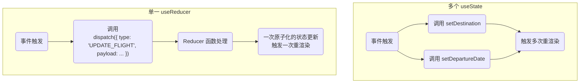
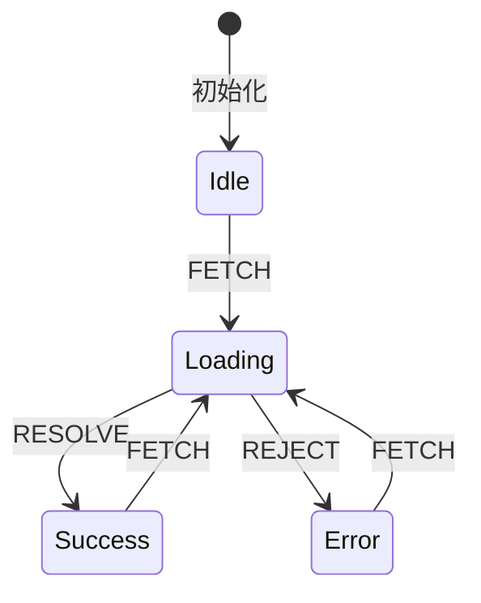

在 React 应用中，状态 (State) 是驱动 UI 渲染的核心。随着组件复杂度的增加，使用多个离散的 `useState` Hook 来管理状态，可能导致逻辑分散、更新繁琐，并产生潜在的同步缺陷。为了构建更具可预测性、可维护性和可扩展性的组件，开发者可以采用更结构化的状态设计模式。本笔记将深入探讨两种核心模式：**聚合相关状态 (Combining Related State)** 以实现原子化更新，以及**用类型状态建模 (Modeling with Type States)** 以消除无效状态。

# 模式一：聚合相关状态 (Combining Related State)

此模式的核心思想是将多个概念上相关的状态变量，组合成一个单一的状态对象。

> [!note] 核心优势
> - **简化状态管理**: 减少需要独立跟踪的状态变量数量。
> - **原子化更新 (Atomic Updates)**: 对相关数据的更新可以一次性完成，确保了状态的一致性，避免了因多次 `setState` 调用而引发的中间渲染状态。
> - **增强数据内聚性**: 将关联数据组织在一起，使得组件的数据结构更易于理解和推理。

## 使用 `useState` 与对象

对于简单的状态聚合，可以直接使用 `useState` 存储一个对象。进行更新时，必须传入一个全新的对象，通常使用展开语法 (`...`) 来合并旧状态。

```jsx
import { useState } from 'react';

function FlightBookingForm() {
  const [flightData, setFlightData] = useState({
    destination: 'Tokyo',
    departureDate: '2025-08-10',
    returnDate: '2025-08-20',
  });

  const handleDestinationChange = (e) => {
    // 必须创建新对象来触发更新
    setFlightData((prev) => ({
      ...prev,
      destination: e.target.value,
    }));
  };

  // ...
}
```

## 使用 `useReducer` (推荐用于复杂状态)

当状态对象的更新逻辑变得复杂时，`useReducer` Hook 是一个更强大、更具组织性的选择。它将更新逻辑从组件中分离出来，集中到 `reducer` 函数中管理。



> [!example] `useReducer` 实现航班数据管理
> ```jsx
> import { useReducer } from 'react';
> 
> const initialState = { destination: '', departureDate: null };
> 
> function flightReducer(state, action) {
>   switch (action.type) {
>     case 'SET_DESTINATION':
>       return { ...state, destination: action.payload };
>     case 'SET_DEPARTURE_DATE':
>       return { ...state, departureDate: action.payload };
>     default:
>       throw new Error();
>   }
> }
> 
> function FlightBookingForm() {
>   const [state, dispatch] = useReducer(flightReducer, initialState);
>   
>   return (
>     <input
>      type="text"
>      value={state.destination}
>      onChange={(e) => dispatch ({ type: 'SET_DESTINATION', payload: e.target.value })}
>      />
>   );
> }
> ```

# 模式二：用类型状态建模 (Modeling with Type States)

此模式旨在通过一个单一的“状态类型”变量，来管理一组互斥的状态，从而消除无效的状态组合。

## 问题：布尔值爆炸 (Boolean Explosion)

一个常见的反模式是使用多个独立的布尔值来表示异步操作的不同阶段。

```jsx
// ❌ 反模式：容易产生无效状态组合 (e.g., isLoading 和 isError 同时为 true)
const [isLoading, setIsLoading] = useState(true);
const [isError, setIsError] = useState(false);
const [data, setData] = useState(null);
```

## 解决方案：可辨识联合 (Discriminated Unions)

通过一个 `status` 字段来表示组件当前所处的唯一状态，并将相关数据与特定状态绑定。这在本质上是构建一个**有限状态机 (Finite State Machine)**。



这个模型确保了组件在任何时刻都只可能处于一个明确定义的状态中。

> [!tip] 结合 `useReducer` 实现状态机
> `useReducer` 是实现状态机的理想工具，它可以将状态转换的逻辑集中管理，使组件代码变得极为清晰。
> ```jsx
> import React, { useReducer } from 'react';
> 
> // 1. 定义 State 和 Action 类型 (使用可辨识联合)
> type State =
>   | { status: 'idle' }
>   | { status: 'loading' }
>   | { status: 'success'; data: string }
>   | { status: 'error'; error: Error };
> 
> type Action =
>   | { type: 'FETCH' }
>   | { type: 'RESOLVE'; payload: string }
>   | { type: 'REJECT'; payload: Error };
> 
> // 2. Reducer 函数现在可以处理带有 payload 的 action
> const reducer = (state: State, action: Action): State => {
>   switch (action.type) {
>     case 'FETCH':
>       return { status: 'loading' };
>     case 'RESOLVE':
>       // 只有在 RESOLVE action 时，我们才有 payload.data
>       return { status: 'success', data: action.payload };
>     case 'REJECT':
>       // 只有在 REJECT action 时，我们才有 payload.error
>       return { status: 'error', error: action.payload };
>     default:
>       return state;
>   }
> };
> 
> // 3. UI 组件实现
> function StateMachineComponent() {
>   const [state, dispatch] = useReducer(reducer, { status: 'idle' });
> 
>   const handleFetch = () => {
>     dispatch({ type: 'FETCH' });
>     // 模拟一个 API 请求
>     setTimeout(() => {
>       if (Math.random() > 0.5) {
>         dispatch({ type: 'RESOLVE', payload: 'Data fetched successfully!' });
>       } else {
>         dispatch({ type: 'REJECT', payload: new Error('Failed to fetch.') });
>       }
>     }, 1000);
>   };
>   
>   // 根据 state.status 进行清晰的条件渲染
>   switch (state.status) {
>     case 'loading':
>       return <p>Loading...</p>;
>     case 'success':
>       // TypeScript 现在知道 state 中必有 data 属性
>       return <p>Success: {state.data}</p>;
>     case 'error':
>       // TypeScript 现在知道 state 中必有 error 属性
>       return <p>Error: {state.error.message}</p>;
>     case 'idle':
>     default:
>       return <button onClick={handleFetch}>Fetch Data</button>;
>   }
> }
> ```