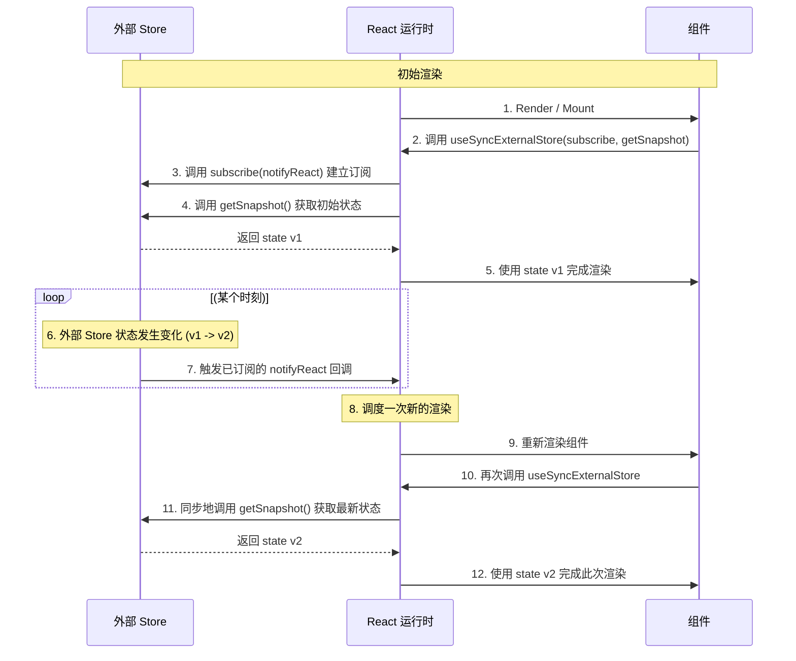

在 React 应用中，组件状态通常由 React 自身管理。然而，当组件需要订阅并响应存在于 React 组件树**外部**的数据源时——例如第三方状态管理库、浏览器 API 或实时的 WebSocket 数据流——状态同步的复杂性便会显著增加。传统的 `useEffect` 与 `useState` 组合模式在这种场景下存在固有的缺陷，可能导致渲染不一致和性能问题。为此，React 18 正式引入了 **`useSyncExternalStore`** Hook，为开发者提供了一个用于安全、高效地订阅外部数据源的权威解决方案。

# 传统模式的困境：`useEffect` 与 `useState`

在 `useSyncExternalStore` 出现之前，订阅外部数据源的典型模式如下：

```js
import { useState, useEffect } from 'react';
import { externalStore } from './myStore.js';

function MyComponent() {
  // 1. 使用 useState 存储外部 store 的一份副本
  const [state, setState] = useState(externalStore.getSnapshot());

  useEffect(() => {
    // 2. 订阅变更，并在变更时更新组件 state
    const unsubscribe = externalStore.subscribe(() => {
      setState(externalStore.getSnapshot());
    });
    
    // 3. 在组件卸载时取消订阅
    return () => unsubscribe();
  }, []); // 空依赖数组

  // ...
}
```

> [!danger] 传统模式的核心缺陷
> - **撕裂 (Tearing)**: 这是最严重的问题。在 React 的**并发渲染 (Concurrent Rendering)** 模式下，React 可能会在一次更新中，分步渲染多个组件。如果在两次组件渲染的间隙，外部 store 发生了变化，就可能导致一部分组件渲染的是旧状态，而另一部分渲染的是新状态，造成 UI 画面出现不一致的“撕裂”现象。
> - **服务端渲染 (SSR) 与水合 (Hydration) 不匹配**: 服务器渲染的 HTML 与客户端首次渲染的结果必须完全一致。如果外部 store 的初始状态在服务端和客户端之间存在差异，会导致水合失败并触发警告。
> - **冗余的渲染**: `setState` 的调用是异步的，可能会在 React 的渲染周期中引发额外的、不必要的渲染。
> - **手动订阅管理**: 开发者必须手动编写 `useEffect` 来处理订阅和清理逻辑，增加了代码的复杂度和出错的可能性。

# `useSyncExternalStore` 的工作原理

`useSyncExternalStore` Hook 被设计为从根本上解决上述所有问题。它通过强制同步读取，确保了在单次渲染中所有组件获取到的都是同一版本的状态。

## Hook 签名

`useSyncExternalStore` 接收三个函数作为参数： 

`const state = useSyncExternalStore(subscribe, getSnapshot, getServerSnapshot?)`

- **`subscribe(callback)`**: 此函数负责订阅外部 store。当 store 发生变化时，它必须调用传入的 `callback` 函数，以通知 React 需要进行重新渲染。它还必须返回一个用于取消订阅的清理函数。
- **`getSnapshot()`**: 此函数必须**同步地**返回外部 store 的当前状态快照。
- **`getServerSnapshot()` (可选)**: 此函数仅在服务端渲染 (SSR) 时被调用，用于返回在服务器上使用的初始状态快照。

> [!tip] 回调函数的职责分工
> 函数接收的 `callback` 是由 **React 在内部创建并传入的**。它的唯一作用是**通知 React 外部状态已发生变化**，需要调度一次重渲染。

## 核心机制：原子化的订阅与同步读取

`useSyncExternalStore` 的工作流程确保了状态读取的原子性和一致性。



> [!note] 解决“撕裂”的关键
> `useSyncExternalStore` 解决“撕裂”问题的关键在于，它**强制 `getSnapshot` 的调用是同步的，并且发生在 React 的渲染阶段**。这保证了在同一次渲染传递 (render pass) 中，所有订阅同一个 store 的组件，调用 `getSnapshot` 时得到的永远是同一个值，从而根除了状态不一致的可能性。

# `useSyncExternalStore` 的应用实践

## 订阅网络连接状态

```js
import { useSyncExternalStore } from 'react';

// 1. 订阅函数：监听 online 和 offline 事件
function subscribe(callback) {
  window.addEventListener('online', callback);
  window.addEventListener('offline', callback);
  return () => {
    window.removeEventListener('online', callback);
    window.removeEventListener('offline', callback);
  };
}

// 2. 快照函数：同步读取当前状态
function getSnapshot() {
  return navigator.onLine;
}

// 3. 自定义 Hook 封装
export function useOnlineStatus() {
  // getServerSnapshot 在客户端可以与 getSnapshot 相同
  return useSyncExternalStore(subscribe, getSnapshot, getSnapshot);
}

// 4. 在组件中使用
function ChatIndicator() {
  const isOnline = useOnlineStatus();
  return {isOnline ? '✅ Online' : '❌ Disconnected'};
}
```

## 监听页面可见性

```js
import { useSyncExternalStore } from 'react';

// 订阅页面可见性变化
function subscribe(callback) {
  document.addEventListener('visibilitychange', callback);
  return () => document.removeEventListener('visibilitychange', callback);
}

// 获取当前页面是否可见
function getSnapshot() {
  return document.visibilityState === 'visible';
}

// 自定义 Hook
export function usePageVisible() {
  return useSyncExternalStore(subscribe, getSnapshot, () => true);
}

// 组件示例
export function PageVisibilityIndicator() {
  const isVisible = usePageVisible();
  return <div>{isVisible ? '页面可见 👀' : '页面隐藏 💤'}</div>;
}
```