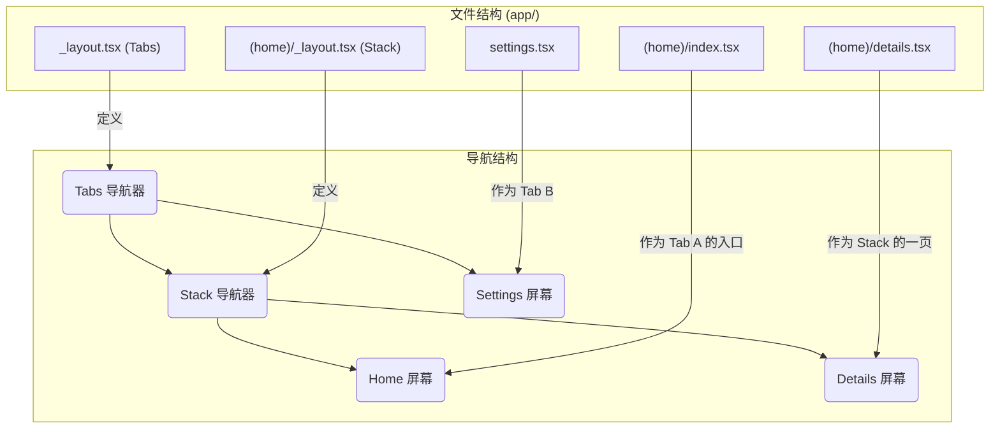

与 Web 应用中统一的 URL 导航模型不同，原生移动应用的导航范式更为多样，包含了层级堆叠 (Stack)、标签页 (Tabs)、模态框 (Modal) 等多种交互模式。React Native 本身不内置导航库，而 **Expo Router** 是目前社区中最流行、最强大的解决方案之一。它构建于 `React Navigation` 之上，独创性地引入了**基于文件的路由 (file-based routing)** 机制，将 Web 开发中直观的文件系统路由体验，与原生移动应用丰富的导航模式无缝结合，极大地简化了复杂导航逻辑的构建。

# 核心机制：文件系统驱动的路由

在 Expo Router 中，`app` 目录下的文件和文件夹结构，直接映射为应用的导航路径。而其核心创新在于 **`_layout.js` / `_layout.tsx`** 文件。

> [!note] `_layout` 文件的角色
> `_layout` 文件是一个特殊的组件，它充当其所在目录（及其子目录）的**布局定义**。在此文件中，可以导出一个 React 组件，用于渲染一个导航器（如 `Stack` 或 `Tabs`），从而决定该目录下的所有屏幕（文件）应如何被组织和呈现。每个目录中最多只能有一个 `_layout` 文件。



# 导航操作

Expo Router 提供了多种方式在不同屏幕间进行跳转。

## `<Link>` 组件

这是用于用户界面中声明式导航的主要方式，其用法类似于 Web 中的 `<a>` 标签。

```js
import { Link } from 'expo-router';

export default function HomeScreen() {
  return (
    <Link href="/details?id=123">
      Go to Details
    </Link>
  );
}
```

## `useRouter` Hook

`useRouter` Hook 提供了用于在组件逻辑中执行**程序化导航**的方法。

> [!tip] `push` vs. `Maps` vs. `replace`
> - **`router.push(path)`**: 始终在导航堆栈的顶部添加一条新记录，即使该页面已在堆栈中存在。适用于需要创建新历史记录的场景。
> - **`router.navigate(path)` (推荐)**: 行为更智能。如果目标路由已在堆栈中，它会执行“返回”操作，并弹出其上方的所有屏幕；如果不在堆栈中，则行为等同于 `push`。这是最符合原生 App 行为的导航方式。
> - **`router.replace(path)`**: 用新页面替换掉当前页面在堆栈中的位置，不增加历史记录。适用于登录后跳转到主页等场景。

## 导航器 UI 交互

导航器（如 `Stack` 和 `Tabs`）自身会渲染可交互的 UI 元素，例如 `Stack` 导航器头部的返回按钮，或 `Tabs` 导航器底部的标签按钮，用户可以直接点击这些元素进行导航。

# 导航器类型与布局

## `Stack` 导航器 (默认)

**`Stack`** 是最基础的导航模式，它将屏幕像数据结构中的“栈”一样进行管理 (后进先出)。当你导航到一个新屏幕时，该屏幕会被“压入”栈顶，覆盖在当前屏幕之上。用户可以通过返回手势或点击返回按钮来“弹出”栈顶屏幕，回到上一页。

> [!example] 配置一个 Stack 导航器
> ```ts
> // app/(main)/_layout.tsx
> import { Stack } from 'expo-router';
> 
> export default function MainLayout() {
>   // 此布局文件定义了 (main) 目录下所有屏幕都属于一个 Stack 导航器
>   return (
>     <Stack>
>       <Stack.Screen name="index" options={{ title: 'Home' }} />
>       <Stack.Screen name="profile" options={{ title: 'Profile' }} />
>     </Stack>
>   );
> }
> ```

## `Tabs` 导航器

**`Tabs`** 导航器会在屏幕底部（或顶部）渲染一个持久可见的标签栏，每个标签对应一个屏幕或一个独立的导航堆栈。

> [!example] 配置一个 Tabs 导航器
> ```ts
> // app/_layout.tsx
> import { Tabs } from 'expo-router';
> import { Feather } from "@expo/vector-icons";
> 
> export default function AppLayout() {
>   return (
>     <Tabs
>       screenOptions={{
>       tabBarActiveTintColor: 'blue',
>     }}>
>       <Tabs.Screen
>         name="(home)" // 指向 (home) 目录定义的 Stack
>         options={{
>           title: 'Home',
>           tabBarIcon: ({ color, size }) => (
>             <Feather name="zap" size={size} color={color} />
>           ),
>         }}
>       />
>       <Tabs.Screen
>         name="settings" // 指向 settings.tsx 文件
>         options={{
>           title: 'Settings',
>           tabBarIcon: ({ color, size }) => (
>             <Feather name="list" size={size} color={color} />
>           ),
>         }}
>       />
>     </Tabs>
>   );
> }
> ```

## `Modal` 呈现

`Modal` 并非一种独立的导航器，而是 `Stack` 导航器的一种**屏幕呈现方式**。

- **机制**: 通过在 `Stack.Screen` 的 `options` 中设置 `presentation: 'modal'`，可以使该屏幕从底部滑入，并覆盖在当前导航堆栈之上。
- **Android 兼容性**: 在 Android 上，默认的 `modal` 视觉效果与普通 `stack` 屏幕相似。为了获得更佳的跨平台体验，可以额外指定动画效果，如 `animation: 'fade_from_bottom'`。

> [!warning] Modal 布局的反模式
> **不应**在一个 `Tabs` 导航器内部，将某个 `Tabs.Screen` 设置为 `modal` 来试图覆盖整个标签栏。`Tabs` 导航器是一个独立的、封闭的容器。要实现全局覆盖的模态框，它必须被定义在一个更高层级的 `Stack` 导航器中，与 `Tabs` 导航器成为同级。

## 嵌套与层级转换

Expo Router 允许任意嵌套导航器（`Stack` in `Tabs`, `Tabs` in `Stack` 等），以构建复杂的导航层级。一个常见的实践是将一个原本独立的屏幕文件，重构为一个拥有自己内部导航的层级（通常是 `Stack`）。

> [!example] 实践：将独立屏幕文件转换为导航层级
> 这个过程根据屏幕文件是否为 `index` 文件而有所不同。
> 
> **情况一：转换一个非索引屏幕 (e.g., `profile.tsx`)**，假设你想让 `/profile` 路径成为一个可以内部跳转的 `Stack`。
> 1. 在 `app/` 目录下，创建一个与原屏幕文件同名的文件夹：`profile/`。
> 2. 将原 `profile.tsx` 文件**移入**该文件夹，并将其**重命名**为 `index.tsx`。现在的路径是 `app/profile/index.tsx`。
> 3. 在该 `profile/` 文件夹内，创建一个 `_layout.tsx` 文件，并在其中定义一个新的 `Stack` 导航器。
> 
> **情况二：转换一个索引屏幕 (e.g., `index.tsx`)**，假设你想让你应用的根路径 `/`（即 `app/index.tsx`）成为一个 `Stack`。你不能创建一个名为 `index/` 的文件夹。此时，你需要使用 **路由组 (Route Group)**。路由组是一个**用括号包裹**的文件夹，例如 `(main)`。它的特殊之处在于，它**不会影响 URL 路径**。
> 1. 在 `app/` 目录下，创建一个路由组文件夹，名称可以任意，例如 `(tabs)` 或 `(main)`。
> 2. 将原 `index.tsx` 文件**移入**该路由组文件夹。现在的路径是 `app/(main)/index.tsx`，但它的 URL 路径**依然是 `/`**。
> 3. 在该 `(main)/` 文件夹内，创建一个 `_layout.tsx` 文件，并定义 `Stack` 或 `Tabs` 导航器。这个布局将作用于根路径 `/`。

