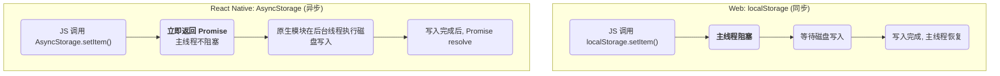

在移动应用开发中，**数据持久化 (Data Persistence)** 是一项基本需求，它使得应用能够在关闭和重启后，依然能恢复用户的设置、会话信息或其他关键数据。React Native 作为一个跨平台框架，提供了多种实现本地数据存储的方案。其中，`AsyncStorage` 是社区中最广为人知、最基础的解决方案。

# `AsyncStorage` 核心机制与历史演进

## 定义与实现

**syncStorage** 是一个简单的、**未加密的、异步的、持久化的键值 (key-value)** 存储系统，它在应用级别上对数据进行全局存储。

> [!info] 历史演进
> `AsyncStorage` 最初是 React Native 核心库的一部分。为了使核心库更加精简，它后来被剥离出来，现在由社区进行维护。在新的项目中，需要通过以下方式单独安装：
> ```bash
> npm install @react-native-async-storage/async-storage
> ```

## 与 `localStorage` 的关键区别：异步 vs. 同步

`AsyncStorage` 在概念上最接近 Web 开发中的 `Window.localStorage`，但它们之间存在一个**根本性的差异**：

- **`localStorage` (Web)**: 是一个**同步 (synchronous)** 的 API。当你调用 `localStorage.setItem()` 时，它会**阻塞**主线程，直到数据写入磁盘完成。对于小数据，这种阻塞微不足道，但对于大数据或频繁操作，则可能导致 UI 卡顿。
- **`AsyncStorage` (React Native)**: 是一个完全**异步 (asynchronous)** 的 API。所有的数据操作（读/写/删除）都会返回一个 **`Promise` 对象**。这种设计确保了磁盘 I/O 操作**不会阻塞** JavaScript 主线程，从而保证了应用 UI 的流畅响应。



# `AsyncStorage` 的核心 API 实践

## 存储与读取数据

由于 API 是异步的，最佳实践是结合 `async/await` 语法来使用。

> [!warning] 数据类型限制
> `AsyncStorage` 只能存储**字符串**数据。如果要存储对象或数组等复杂数据类型，必须在存入前通过 `JSON.stringify()` 将其序列化为字符串，在读取后通过 `JSON.parse()` 将其反序列化。

```js
import AsyncStorage from '@react-native-async-storage/async-storage';
import React from 'react';
import { View, Button } from 'react-native';

const USER_SETTINGS_KEY = '@user_settings';

const App = () => {
  const saveSettings = async () => {
    try {
      const settings = {
        theme: 'dark',
        notifications: true,
      };
      // 1. 将对象序列化为字符串
      const jsonValue = JSON.stringify(settings);
      // 2. 异步存储
      await AsyncStorage.setItem(USER_SETTINGS_KEY, jsonValue);
      console.log('Settings saved successfully.');
    } catch (e) {
      console.error('Failed to save settings.', e);
    }
  };

  const loadSettings = async () => {
    try {
      // 3. 异步读取
      const jsonValue = await AsyncStorage.getItem(USER_SETTINGS_KEY);
      // 4. 如果值存在，则反序列化
      const settings = jsonValue != null ? JSON.parse(jsonValue) : null;
      if (settings !== null) {
        console.log('Loaded settings:', settings);
      }
    } catch (e) {
      console.error('Failed to load settings.', e);
    }
  };

  return (
    <View>
      <Button title="Save Settings" onPress={saveSettings} />
      <Button title="Load Settings" onPress={loadSettings} />
    </View>
  );
};
```

## 其他常用方法

- **`removeItem(key)`**: 异步删除一个键值对。
- **`clear()`**: 异步清空所有存储的数据。
- **`getAllKeys()`**: 异步获取所有已存储的键名。
- **`multiGet(keys)` / `multiSet(keyValuePairs)`**: 用于一次性、批量地读取或写入多个键值对。

# 局限性与替代方案

`AsyncStorage` 虽然简单易用，但也存在一些局限性，使其不适用于所有场景。

> [!danger] 安全性警告
> `AsyncStorage` 是**未加密**的。数据以明文形式存储在设备上，任何能够访问设备文件系统的人（例如在越狱/root 过的设备上）都可能读取到这些数据。**绝对不要**用它来存储密码、私钥、API Tokens 等高度敏感的信息。

- **性能局限**: 对于大量或频繁的数据读写，`AsyncStorage` 的性能可能会成为瓶颈，因为它在底层可能依赖于序列化到一个大的 JSON 文件或多个小文件。
- **替代方案**:
    - **MMKV**: 一个由腾讯开发的高性能、持久化的键值存储框架。它通过内存映射 (memory mapping) 技术实现了极高的数据读写速度，并且其 API 是**同步**的（但由于其 C++ 底层实现极快，通常不会阻塞 UI）。
    - **SQLite**: 对于需要存储大量结构化、关系型数据的场景，应使用更专业的数据库解决方案。`react-native-sqlite-storage` 是一个常用的社区库。
    - **安全存储**: 对于需要加密存储的敏感凭据（如 API Token、密码），应使用专门的安全存储库，如 `react-native-keychain`，它利用了 iOS 的 Keychain 和 Android 的 Keystore 等平台级的安全特性。

