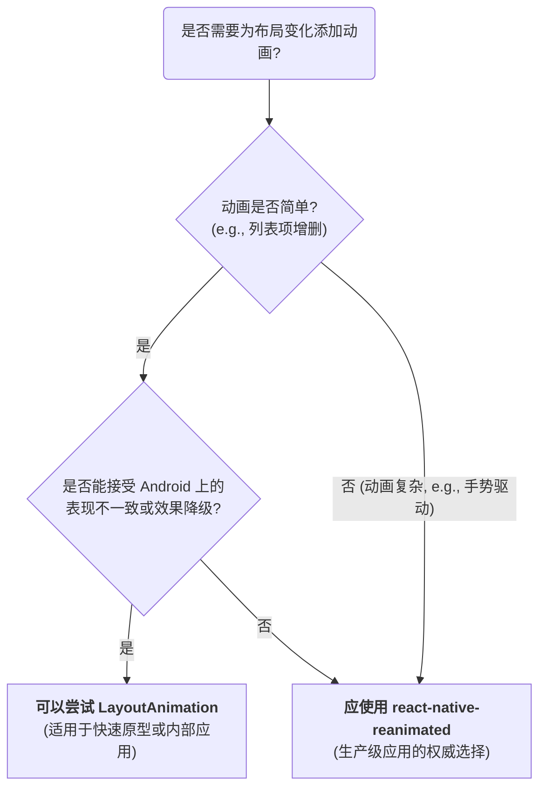

在移动应用中，流畅的动画是提升用户体验、引导用户注意力的关键元素。对于因状态变更而引发的布局变化（例如列表项的增删），React Native 提供了一个内置的、简单的 API—— `LayoutAnimation`，旨在以最小的代码成本，为这些过渡过程自动添加动画效果。然而，`LayoutAnimation` 的便捷性也伴随着显著的功能局限和平台差异。

# `LayoutAnimation` 的核心机制

`LayoutAnimation` 的工作模式是一种 **声明式的、“触发并忘记 (fire-and-forget)”** 的模式。开发者无需手动计算动画的起始/结束状态或管理动画的生命周期。

**核心 API**: `LayoutAnimation.configureNext(config)`

- **作用**: 此方法用于“宣告”，下一次 React 渲染周期中**所有**发生的布局变化，都应该自动应用指定的动画效果。
- **调用时机**: `configureNext` 必须在**即将触发布局变化的状态更新（如 `setState`）之前**被调用。

> [!note] 动画预设 (Animation Presets)
> `LayoutAnimation` 提供了一些内置的动画配置，可以通过 `LayoutAnimation.Presets` 对象访问，以快速实现常见的动画效果：
> - **`easeInEaseOut`**: 元素以缓入缓出的方式进入和离开。
> - **`linear`**: 元素以恒定的速度进行动画。
> - **`spring`**: 元素以类似弹簧的物理效果进行动画。

```js
import React, { useState } from 'react';
import {
  View,
  TouchableOpacity,
  Text,
  LayoutAnimation,
  UIManager,
  Platform,
} from 'react-native';

// 关键：在 Android 上使用 LayoutAnimation 必须显式开启
if (Platform.OS === 'android') {
  if (UIManager.setLayoutAnimationEnabledExperimental) {
    UIManager.setLayoutAnimationEnabledExperimental(true);
  }
}

function AnimatedList() {
  const [items, setItems] = useState([1, 2, 3]);

  const addItem = () => {
    // 1. 在状态更新前，配置下一次布局动画
    LayoutAnimation.configureNext(LayoutAnimation.Presets.spring);
    
    // 2. 更新 state，这将触发 UI 的重新渲染和布局变化
    setItems([...items, items.length + 1]);
  };

  const removeItem = (itemToRemove) => {
    LayoutAnimation.configureNext(LayoutAnimation.Presets.easeInEaseOut);
    setItems(items.filter(item => item !== itemToRemove));
  };

  return (
    <View>
      <Button title="Add Item" onPress={addItem} />
      <View>
        {items.map(item => (
          <TouchableOpacity key={item} onPress={() => removeItem(item)}>
            <Text>{item}</Text>
          </TouchableOpacity>
        ))}
      </View>
    </View>
  );
}
```

# 局限性与平台差异

尽管 `LayoutAnimation` 非常易于使用，但其固有的局限性使其不适用于所有场景。

## 功能限制

- **仅限布局属性**: `LayoutAnimation` **只能**为能够引起布局变化的属性创建动画，例如 `width`, `height`, `position` (`left`, `top`), `flexbox` 属性等。它**无法**为 `transform` (旋转、缩放), `opacity` (透明度), `backgroundColor` (背景色) 等非布局属性创建动画。
- **缺乏精细控制**: 开发者无法中断、暂停、反转或链式组合这些动画。其控制粒度非常粗糙。

## Android 平台的挑战

这是 `LayoutAnimation` 在生产环境中最大的不确定性因素。

> [!warning] Android 平台的兼容性与稳定性问题
> - **实验性支持**: 如代码示例所示，在 Android 上使用此 API 必须首先通过 `UIManager` 进行实验性开启。
> - **设备差异**: `LayoutAnimation` 依赖于 Android 底层的原生布局动画系统。由于不同设备制造商（如三星、摩托罗拉、小米等）对 Android 系统有不同程度的定制，**`LayoutAnimation` 在不同品牌的设备、甚至不同 Android 版本上的表现可能存在显著差异**。某些动画效果（如 `scaleX/Y`）可能在某些设备上完全不生效。这种不可预测性使其在需要高度跨平台一致性的项目中，成为一个有风险的选择。

# 决策流程与替代方案



> [!tip] 现代动画的权威方案：`react-native-reanimated`
> 对于任何复杂的、性能敏感的、或要求跨平台表现高度一致的动画需求，社区公认的最佳实践是使用 **`react-native-reanimated`** 库。
> 
> **核心优势**:
> - **UI 线程执行**: 它允许动画和手势的计算逻辑在原生的 **UI 线程**上执行，而不是在有性能瓶颈的 JavaScript 线程上。这使得动画即使在 JS 线程繁忙时也能保持 60 FPS 的流畅度。
> - **完全控制**: 提供了极其精细的动画控制能力，支持手势、物理模拟、动画中断与组合等所有高级功能。
> - **跨平台一致性**: 由于其底层机制不依赖于特定平台的布局动画系统，因此在 iOS 和 Android 上的表现高度一致和可靠。

