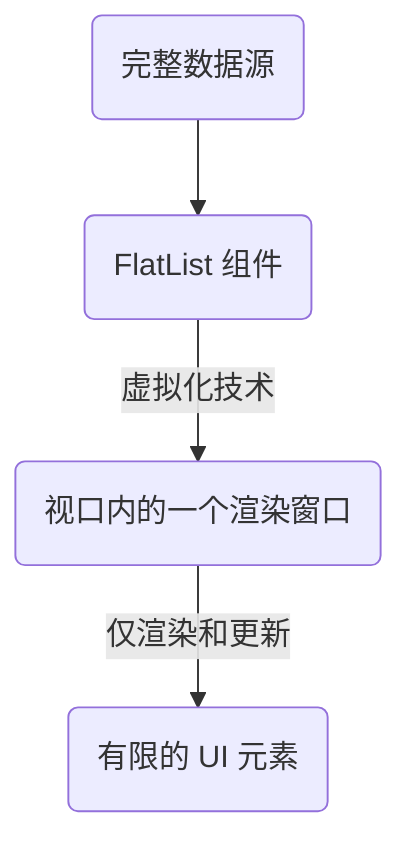
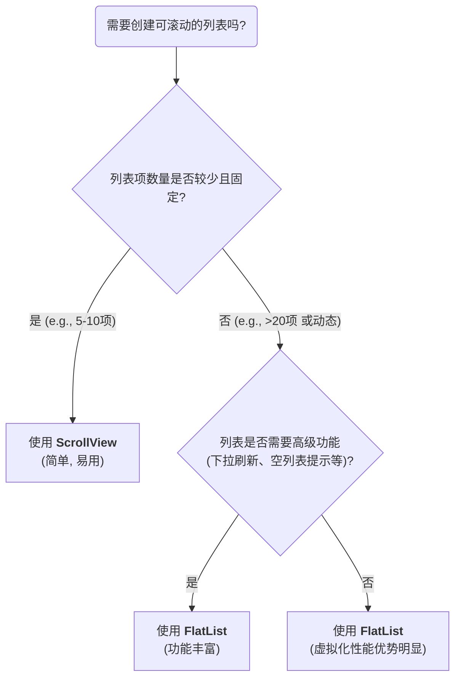

在 React Native 中，基础的 `View` 组件默认不具备滚动能力。为了在移动应用中展示超出屏幕高度的内容，开发者通常会使用 `ScrollView` 或 `FlatList` 这两个核心组件。尽管它们都能实现可滚动视图，但其底层机制和性能表现存在着根本性的差异。`ScrollView` 适用于内容固定且数量较少的场景，而 `FlatList` 则专为高效渲染大型列表而设计。理解它们之间的权衡，是构建高性能移动界面的关键。

# `ScrollView`：适用于短内容列表

`ScrollView` 是一个简单的可滚动容器。它将所有的子组件一次性全部渲染出来，然后通过一个原生的滚动视图来显示它们。

## 核心机制

- **一次性渲染**: `ScrollView` 会立即渲染其内部的**所有**子组件，无论它们是否在屏幕上可见。
- **性能影响**: 这种“全部渲染”的机制使得 `ScrollView` 在处理较长的列表时，会引发明显的性能问题：
    - **高内存占用**: 即使内容不可见，所有组件对象仍然驻留在内存中。
    - **启动延迟**: 渲染大量组件会阻塞 JavaScript 主线程，导致页面加载和首次绘制（FCP）变慢。
    - **滚动卡顿**: 在非常长的列表中，高密度的组件可能会导致滚动的流畅度下降。

## 关键属性

- **`style` vs. `contentContainerStyle`**:
    - `style` 属性用于定义 `ScrollView` **容器本身**的样式。
    - `contentContainerStyle` 是一个特殊的属性，用于定义包裹所有子组件的**内部内容容器**的样式。例如，`padding` 和 `margin` 等影响内容布局的样式应在此处设置。
- **`stickyHeaderIndices`**: 该属性接收一个索引数组，用于指定哪几个子元素应该在滚动时“吸顶”。
    - `stickyHeaderIndices={[0]}` 会使第一个子元素在滚动时保持在顶部。

```js
import { ScrollView, Text, View } from 'react-native';

const items = Array.from({ length: 5 }, (_, i) => `Item ${i + 1}`);

const MyScrollView = () => (
  <ScrollView style={{ height: 200 }} contentContainerStyle={{ padding: 10 }}>
    {items.map((item, index) => (
      <Text key={index} style={{ padding: 20 }}>{item}</Text>
    ))}
  </ScrollView>
);
```

# `FlatList`：长列表渲染的权威方案

`FlatList` 是 React Native 中用于高效渲染长列表的专门组件。其核心优势在于采用了**虚拟化 (Virtualization)** 技术。

## 核心机制：[[../JavaScript/17. 虚拟列表 (Virtual Scrolling) 的实现原理|虚拟化技术]]

- **原理**: `FlatList` 并不会渲染所有数据。它只渲染一个“窗口 (window)”内的列表项，这个“窗口”的大小通常略大于可视区域。
- **动态更新**: 当用户滚动时，`FlatList` 会动态地回收那些已经滑出窗口的组件，并创建新的组件来填充滑入窗口的区域，从而在维持流畅体验的同时，将渲染的组件数量保持在一个极低的水平。



## 核心属性

- **`data`**: 接收需要渲染的**完整**数组。
- **`renderItem`**: 一个回调函数，接收一个包含 `item`、`index` 等信息的对象作为参数，并返回用于渲染单个列表项的 React 元素。
- **`keyExtractor`**: 一个用于为每个列表项生成唯一键的函数。虽然 `FlatList` 会自动寻找 `item.key` 或 `item.id`，但为了性能和稳定性，仍然建议显式提供此属性。

> [!tip] 高级功能与优化
> `FlatList` 提供了比 `ScrollView` 丰富得多的内置功能，使我们能以声明式的方式处理复杂列表交互：
> - **`ListHeaderComponent`** 与 **`ListFooterComponent`**: 用于添加列表头和列表尾组件。为避免不必要的重渲染，应**优先直接传入组件实例 (`<MyHeader />`)**，而非内联函数 (`() => <MyHeader />`) 或内联 JSX (`<View />`)。这是因为在每次父组件渲染时，内联函数和 JSX 元素都会被重新创建，即使内容没变，也会导致 `FlatList` 认为他们发生了变化，从而重新渲染。
> - **`ListEmptyComponent`**: 当 `data` 数组为空时，显示的组件。
> - **`onRefresh`** 与 **`refreshing`**: 用于实现“下拉刷新”功能。
> - **`stickyHeaderIndices`**: 与 `ScrollView` 类似，支持将头部组件“吸顶”。

```js
import { FlatList, Text, View } from 'react-native';

const items = Array.from({ length: 1000 }, (_, i) => ({ id: String(i), value: `Item ${i + 1}` }));

// 将 Header 组件定义在外部，以保持稳定的引用
const MyListHeader = () => <Text style={{ fontSize: 24, padding: 20 }}>This is a Header</Text>;

const MyFlatList = () => (
  <FlatList
    data={items}
    renderItem={({ item }) => <Text style={{ padding: 20 }}>{item.value}</Text>}
    keyExtractor={item => item.id}
    ListHeaderComponent={<MyListHeader />} // 直接传入组件实例
  />
);
```

# 选型决策：`ScrollView` vs `FlatList`

`ScrollView` 和 `FlatList` 并非相互替代，而是为不同场景而设计的工具。



**结论**：`ScrollView` 的优势在于简单直观，适合展示短小的、固定数量的内容。`FlatList` 的核心优势在于其虚拟化技术，是渲染大型、动态列表的**标准和权威选择**，其丰富的 API 也使其成为处理复杂列表交互的首选。