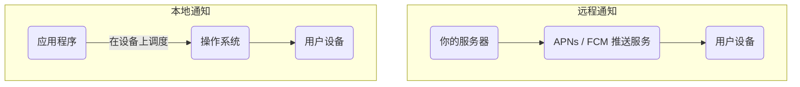

构建高质量的移动应用，不仅在于提供流畅的用户界面，更在于充分利用原生平台的设备能力，以创造沉浸式、高粘性的用户体验。在众多设备交互中，**触觉反馈 (Haptic Feedback)** 和**推送通知 (Push Notifications)** 是两种最直接、最有效的技术。触觉反馈通过精细的震动来增强操作的确认感，而推送通知则是在应用未处于前台时，维持用户参与度的关键渠道。

# 触觉反馈 (Haptic Feedback)

触觉反馈是对用户操作响应的一种轻微的、物理性的震动。恰当好处地使用它，可以显著提升应用的质感和用户操作的确定性。

## 使用 `expo-haptics` 实现

`expo-haptics` 库封装了 iOS 和 Android 平台的原生触觉反馈 API，提供了一个简单、跨平台的解决方案。

> [!example] Haptic Feedback 的主要类型
> - **`Haptics.impactAsync(style)`**: 用于模拟物理碰撞感，通常在用户完成一个明确的操作（如拖拽到位、开关切换）时触发。
> 	- `style`: `Haptics.ImpactFeedbackStyle.Light`, `Medium`, `Heavy` (iOS/Android), `Soft`, `Rigid` (iOS only).
> - **`Haptics.notificationAsync(type)`**: 用于向用户传达成功、警告或错误等通知类信息。
> 	- `type`: `Haptics.NotificationFeedbackType.Success`, `Warning`, `Error`.
> - **`Haptics.selectionAsync()`**: 一种非常轻微的反馈，用于当用户正在滚动选择器或在多个选项间切换时，模拟物理刻度感。

```js
import * as Haptics from 'expo-haptics';
import { Button, View } from 'react-native';

export default function HapticExample() {
  return (
    <View>
      <Button
        title="触发一个中等强度的冲击反馈"
        onPress={() => Haptics.impactAsync(Haptics.ImpactFeedbackStyle.Medium)}
      />
      <Button
        title="触发一个成功通知反馈"
        onPress={() => Haptics.notificationAsync(Haptics.NotificationFeedbackType.Success)}
      />
    </View>
  );
}
```

# 推送通知 (Push Notifications)

推送通知是一种由应用程序生成、即使用户未在使用该应用时也能在其设备上显示的系统级警报。它是提升用户留存和参与度的关键工具。

## 核心概念与分类

在移动应用中，通知主要分为两种类型：

- **远程通知 (Remote Notifications)**:
    - **来源**: 由你的**服务器**通过互联网推送。
    - **机制**: 服务器将通知内容，连同一个唯一的**设备推送令牌 (Device Push Token)**，发送给平台原生的推送服务（如 Apple Push Notification service (APNs) 或 Firebase Cloud Messaging (FCM)），再由平台服务将通知下发到具体的设备上。
    - **用途**: 新消息提醒、新闻更新、个性化营销等。
- **本地通知 (Local Notifications)**:
    - **来源**: 由**应用程序自身**在设备上进行调度。
    - **机制**: 应用在本地计算并设定一个未来的触发条件（如具体时间或时间间隔），操作系统会在满足该条件时，自动展示通知，无需任何网络连接。
    - **用途**: 闹钟、日历提醒、计时器完成通知等。



## 权限管理

在发送任何通知之前，应用**必须**首先向用户请求权限。

> [!warning] 权限请求的生命周期
> - **请求一次**: 根据 iOS 和 Android 的平台策略，你的应用**只能向用户展示一次**原生的权限请求弹窗。
> - **`requestPermissionsAsync()`**: `expo-notifications` 提供的此方法用于触发该弹窗。无论用户接受还是拒绝，后续再次调用此方法，都**不会**再次弹出原生对话框，而是直接返回用户之前的选择。
> - **引导至系统设置**: 如果用户初次拒绝了权限，唯一能再次开启的方式是引导用户手动前往**操作系统的“设置”应用**中为你的 App 开启通知权限。

## 调度本地通知

`expo-notifications` 库提供了强大的 API 来调度本地通知。

> [!note] 通知的内容与触发器
> - **`content`**: 一个对象，定义了通知的视觉内容，如 `title`, `body`, `sound` 等。
> - **`trigger`**: 一个对象，定义了通知何时被触发。可以是具体日期 (`date`)、时间间隔 (`seconds`) 或地理位置等。

```js
import * as Notifications from 'expo-notifications';
import { Button, View } from 'react-native';

// 配置通知处理器（当应用在前台时如何处理通知）
Notifications.setNotificationHandler({
  handleNotification: async () => ({
    shouldShowAlert: true,
    shouldPlaySound: false,
    shouldSetBadge: false,
  }),
});

export default function NotificationScheduler() {
  const scheduleNotification = async () => {
    // 1. 请求权限
    const { status } = await Notifications.requestPermissionsAsync();
    if (status !== 'granted') {
      alert('无法调度通知，因为未获得权限！');
      return;
    }

    // 2. 调度通知
    await Notifications.scheduleNotificationAsync({
      content: {
        title: "这是一个本地通知 📬",
        body: '这是通知的正文内容。',
        data: { customData: 'goes here' }, // 可附加任意数据
      },
      trigger: {
        seconds: 5, // 5秒后触发
      },
    });

    console.log('通知已在 5 秒后被调度。');
  };

  return (
    <View>
      <Button title="5秒后发送通知" onPress={scheduleNotification} />
    </View>
  );
}
```

