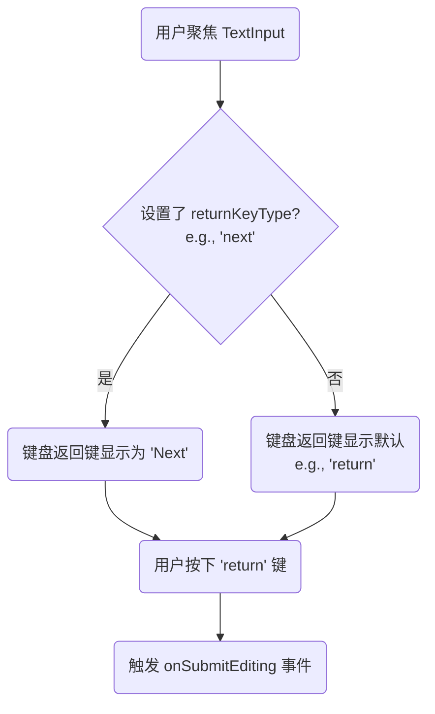

在 React Native 应用中，获取用户输入是构建交互式界面的核心环节。与 Web 不同，React Native **没有** `<form>` 标签的概念，所有输入都通过独立的、高度可定制化的原生组件来处理。其中，**`TextInput`** 是最基础也是最重要的输入组件。它作为一个桥梁，连接了 React 的声明式 UI 与 iOS/Android 平台的原生文本输入功能。

# `TextInput` 核心概念与状态管理

`TextInput` 是一个允许用户在应用中输入文本的基础组件。虽然其名称以 "Text" 开头，但它可同时用于处理文本和数字类型的输入。

## 受控组件模式 (Controlled Component)

在 React Native 中，处理 `TextInput` 的最佳实践是将其作为**受控组件**。这意味着组件的 `value` 由 React 的 `state` 来驱动，并且任何用户的输入都会通过 `onChangeText` 回调来更新这个 `state`。

> [!note] 核心属性：`value` 与 `onChangeText`
> - **`value`**: 一个字符串，用于指定输入框当前显示的文本。它的值应与组件 state 中的一个变量绑定。
> - **`onChangeText`**: 一个回调函数，当输入框的文本发生变化时被调用。它接收更新后的文本作为其唯一参数，是更新 state 的主要途径。

```js
import React, { useState } from 'react';
import { SafeAreaView, StyleSheet, TextInput, Text } from 'react-native';

const ControlledInputExample = () => {
  const [text, setText] = useState('');

  return (
    <SafeAreaView style={styles.container}>
      <TextInput
        style={styles.input}
        placeholder="在此输入..."
        // 当文本变化时，调用 setText 更新 state
        onChangeText={newText => setText(newText)}
        // value 属性直接绑定到 state
        value={text}
      />
      <Text style={styles.display}>
        当前输入: {text}
      </Text>
    </SafeAreaView>
  );
};

const styles = StyleSheet.create({
  // ... 样式定义
});
```

## 其他常用属性

- **`placeholder`**: 在输入框为空时显示的占位文本。
- **`autoFocus`**: `boolean`，如果为 `true`，组件挂载后会自动获得焦点。
- **`multiline`**: `boolean`，如果为 `true`，输入框可以输入多行文本（类似于 Web 的 `<textarea>`）。
- **`secureTextEntry`**: `boolean`，如果为 `true`，文本输入会以圆点的形式被遮盖，常用于密码输入框。

# 键盘行为定制

`TextInput` 提供了丰富的属性来直接控制原生键盘的外观和行为，以优化特定场景下的用户输入体验。

## `keyboardType`: 指定键盘类型

此属性用于指定当用户聚焦输入框时，弹出的键盘类型。

> [!example] `keyboardType` 的可选值
> - **跨平台通用**：`default`, `number-pad`, `decimal-pad`, `numeric`, `email-address`, `phone-pad`, `url`
> - **仅 iOS**：`ascii-capable`, `numbers-and-punctuation`, `name-phone-pad`, `twitter`, `web-search`
> - **仅 Android**：`visible-password`

## `returnKeyType` 与 `onSubmitEditing`: 控制提交行为

这两个属性协同工作，用于定义键盘右下角“返回键”的外观和功能。

- **`returnKeyType`**: 改变返回键的**文本标签**和语义。
- **`onSubmitEditing`**: 一个回调函数，当用户按下键盘的返回键时被**触发**。它的作用类似于 Web 表单的 `onSubmit` 事件。



> [!tip] 构建流畅的多输入框表单
> 在包含多个输入框的表单中，一个常见的最佳实践是：将前一个输入框的 `returnKeyType` 设置为 `'next'`，并在其 `onSubmitEditing` 回调中，以编程方式让下一个输入框获得焦点。最后一个输入框的 `returnKeyType` 则设置为 `'done'`。
> ```js
> import React, { useRef } from 'react';
> import { SafeAreaView, TextInput, StyleSheet } from 'react-native';
> 
> function LoginForm() {
>   // 创建一个 ref 来引用密码输入框
>   const passwordInputRef = useRef(null);
> 
>   return (
>     <SafeAreaView>
>       <TextInput
>         placeholder="Email"
>         returnKeyType="next" // 设置返回键为 "Next"
>         keyboardType="email-address"
>         autoCapitalize="none"
>         onSubmitEditing={() => {
>           // 当在 email 输入框按下 "next" 时，让密码输入框获得焦点
>           passwordInputRef.current?.focus();
>         }}
>         blurOnSubmit={false} // 关键：防止按下 "next" 后键盘自动收起
>       />
>       <TextInput
>         ref={passwordInputRef} // 将 ref 绑定到此输入框
>         placeholder="Password"
>         returnKeyType="done" // 设置返回键为 "Done"
>         secureTextEntry // 这是一个密码输入框
>         onSubmitEditing={() => {
>           // 在最后一个输入框按下 "done" 时，可以执行登录逻辑或收起键盘
>           console.log('Login action triggered');
>         }}
>       />
>     </SafeAreaView>
>   );
> }
> ```

