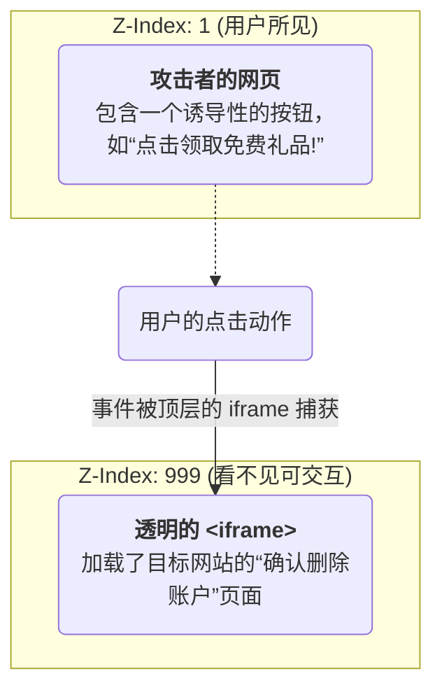

**点击劫持 (Clickjacking)**，其更正式的名称为**界面伪装 (UI Redressing)**，是一种通过视觉欺骗来劫持用户点击操作的恶意技术。攻击者诱使用户在一个看似无害的网页上进行点击，但这些点击实际上被秘密地传递到了另一个被隐藏的、合法的网页上，从而在用户不知情的情况下执行敏感操作（如关注、点赞、转账或删除账户）。这种攻击不依赖于代码注入，而是巧妙地利用了 HTML `<iframe>` 的特性和用户的视觉感知误差。

# 攻击解剖学：透明 `iframe` 叠加

Clickjacking 的核心机制是在一个攻击者控制的页面上，通过 CSS 精心构建一个视觉陷阱。

1. **嵌入目标**: 攻击者在其恶意网站上，通过一个 `<iframe>` 标签嵌入目标网站的某个功能页面（例如，银行的转账确认页面）。
2. **视觉隐藏**: 使用 CSS 将这个 `<iframe>` 设置为**完全透明** (`opacity: 0`)，并通过 `z-index` 将其置于页面的最顶层。
3. **UI 诱导**: 在 `<iframe>` 的下方，攻击者放置一个看似无害、诱人的 UI 元素（如“领取奖励”按钮或“播放视频”链接）。
4. **精确对齐**: 攻击者会通过 CSS 定位，将被隐藏的 `<iframe>` 中需要被点击的关键按钮（如“确认转账”）**精确地叠加**在下方可见的诱导按钮之上。
5. **劫持点击**: 当用户点击可见的诱导按钮时，由于透明的 `<iframe>` 位于最顶层，用户的点击事件实际上“穿透”了下方的伪装，被 `<iframe>` 中的目标网站所捕获并执行。



> [!example] 攻击者页面的 CSS 实现
> ```css
> /* 攻击者网站的样式 */
> #deceptive-button {
>   /* 一个看起来很诱人的按钮 */
>   position: relative;
>   z-index: 1;
> }
> 
> #victim-iframe { 
>   /* 覆盖在按钮之上的透明 iframe */ 
>   position: absolute; 
>   top: 0; 
>   left: 0; 
>   width: 100%; 
>   height: 100%; 
>   opacity: 0; /* 完全透明 */ 
>   z-index: 2; /* 确保在按钮之上 */ 
> }
> ```

# 核心防御策略：限制页面被嵌入

防御 Clickjacking 的核心思想非常直接：**不允许不受信任的网站通过 `<iframe>` 等方式嵌入你的页面**。这需要通过配置服务器，使其在 HTTP 响应中下发特定的安全头部，由浏览器来强制执行。

## `X-Frame-Options` HTTP 头 (Legacy Defense)

这是原始的、被广泛支持的防御机制。它通过一个 HTTP 响应头告诉浏览器页面是否允许被 `<iframe>`, `<frame>`, `<embed>` 或 `<object>` 加载。

> [!note] `X-Frame-Options` 的三个指令
> - **`DENY`**: 最严格的设置。表示该页面**完全不允许**在任何 frame 中显示。
> - **`SAMEORIGIN`**: 表示该页面只允许在**同源 (same-origin)** 的 frame 中显示。
> - **`ALLOW-FROM uri`**: 允许页面在指定的 `uri` 的 frame 中显示。**此指令已废弃，且兼容性不佳，不应使用。**
> ```http
> # HTTP 响应头示例
> X-Frame-Options: SAMEORIGIN
> ```

## `Content-Security-Policy: frame-ancestors` (现代推荐)

这是 `X-Frame-Options` 的现代替代品，是内容安全策略 (CSP) 的一部分，功能更强大、更灵活。如果浏览器同时接收到这两个头部，会**优先处理 `frame-ancestors`**。

> [!tip] `frame-ancestors` 的优势
> - 它允许你提供一个包含多个来源的白名单。
> - 它是 CSP 标准的一部分，便于进行统一的安全策略管理。

**指令示例**:

- `frame-ancestors 'none'`: 效果同 `X-Frame-Options: DENY`。
- `frame-ancestors 'self'`: 效果同 `X-Frame-Options: SAMEORIGIN`。
- `frame-ancestors https://trusted-partner.com https://another-domain.com`: 允许多个指定的来源嵌入。

```http
# HTTP 响应头示例 (推荐)
Content-Security-Policy: frame-ancestors 'self' https://trusted-partner.com;
```

## 不被推荐的客户端防御：Frame Busting

这是一种通过 JavaScript 在客户端进行防御的传统技术。其基本思想是在页面中加入一段脚本，判断当前窗口是否为顶层窗口 (`window.top`)，如果不是，则强制将顶层窗口重定向到当前页面 (`window.location`)，从而“打破”外层的 frame。

```js
// 简单的 Frame Busting 脚本
if (window.top !== window.self) {
  window.top.location = window.self.location;
}
```

> [!warning] Frame Busting 的不可靠性
> Frame Busting 是一种**不被推荐**的防御方式。攻击者可以通过多种技术手段（例如，在 `<iframe>` 上设置 `sandbox` 属性，或利用 `beforeunload` 事件）来阻止或绕过 Frame Busting 脚本的执行。因此，它不能作为一种可靠的安全保障。

